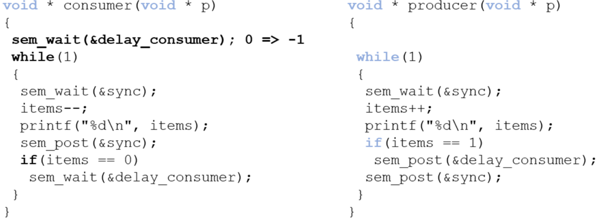

# 25. Revision

## Quick Definitions
- **Internal Fragmentation** - When a small process is assigned to a larger memory block, it creates free space in that assigned memory block. The difference between allotted and requested memory is called this. **Inside the block**
- **External fragmentation** - outside the block

## Computer Design
### Registers
- **Data Registers** - Any sort of data for special functions. 
- **Program Counter-** Holds the next instruction.
- **Program status word**  - admin, stores the mode bit. Which mode the CPU is in, kernel mode or user mode.
- **User Mode** - Direct access to a subset of instructions the CPU can carry out
- **Kernel mode** - Access to the full set of instructions. Including privileged memory locations. 
- Normally compiler decides which mode to use

### Memory Management Unit
*Location of an address*
Doesn't know where in memory an executable will run. Variables require memory, they need to have a memory space
- **Logic Address Space** -  Used by the processor and the compiler (starts at 0). What you use when you write code. Every process has one [0,MAX^64] 
- **Physical Address Space** - Seen by the hardware/OS [0,MAX] (Determined by the amount of physical memory)
Also responsible for address translation `physical = locgical + x`

### Moors Law
> **Moore's law** - The number of transistors on an integrated circuit doubles roughly every two years. 

Closely linked but necessarily related to performance. 
Still continuing but the power wall slows performance improvements of single core
Can extract parallelism automatically, can implement it at the lowest level

### Multi-core, hyper-threaded processors
Evolution in hardware has implications on OS design
The process scheduling needs to account for load balancing and CPU affinity. Need to decide **when** and **where** it is going to run

### Micro Kernels
All non-essential functionality is extracted from the kernel. These are easier to extend, more portable and more reliable.
Frequent system calls cause mode switches/overhead

**Monolithic Systems** - All procedures into one single executable running in kernel mode. However, they are difficult to maintain. Current versions of Windows, and Linux are implemented as this.

## Introduction to processes
Running instance of a program. This has 'control structures' - they store all the necessary information related to the management of the process

### Context Switching
Process control box contains:
- **Process identification** (PID, UID, Parent PID)
- **Process control information** (process state, scheduling information)
- **Process state information** (user registers, program counter, stack pointer, program status word, memory management information, files)
The **process control block** is **necessary** for **context switching** in **multi-programmed systems**
Process control blocks are kernel data structures, which are stored in the **process table** and are accessible in the **kernel mode** only (system calls), otherwise this would compromise their integrity.

#### Multi-Programming
Achieved by alternating processes and context switching
- Single processor systems results in concurrent execution
- True parallelism requires multiple processors

Slow time slices - good response times, low utilisation
Long time slices - poor response times, better utilisation

#### Process
Memory image contains: the program (shared) code, data segment (stack/heap)
Every process has own logical address space
Some OS address space layout are randomised 

### Process implementation
Information about the status of "resources" is maintained in tables. These are in kernel space and cross referenced
- **Process tables** - process control blocks
- **Memory tables** - memory allocation, protection, virtual memory 
- **I/O tables** - Availability, status, transfer information
- **File tables** - Location, status

### States and Transitions

- **New** process has just been created and is waiting to be admitted
- **Ready** process is waiting for the CPU to become available
- **Running** process 'owns' the CPU
- **Blocked** process cannot continue (waiting for IO)
- **Terminated** process is no longer executable
- **Suspended** process is swapped out

### System Calls
- True system calls are "wrapped" in the OS libraries following a well defined interface
- These are necessary to notify the OS that the process has terminated
- `fork()` - creates an exact copy of the current process

## Process Scheduling
- New -> ready: when to admit processes to the system
- Ready -> running: decide which process to run next
- Running -> ready: when to interrupt process
- **Scheduler** - decides which process to run next
- **Type of operating system** - determines which algorithms are appropriate

### Time Horizon
- **Long term** - admits new processes and controls the degree of multi programming. Good mix of CPU and IO bound processes. Usually absent in popular modern 
- **Medium term** - controls swapping. Looks to see how busy the system currently is. 
- **Short term** - which process to run next. Manages the ready queue, runs frequently (must be fast). Called following clock interrupts or blocking system calls.

### Process Schedulers
- **Non-Preemptive** - Processes are interrupted voluntarily
- **Preemptive** - Processes are interrupted forcefully or voluntarily. Requires context switches. Prevents process from monopolising the CPU. Most popular OS are preemptive

### Performance Assessment
- User Oriented Criteria
	- **Response time**: time between creating the job and its first execution
	- **Turnaround time**: time between creating the job and finishing it
	- **Predictability**: variance in processing times
- System oriented criteria:
	- Throughput: number of jobs processed per hour
	- Fairness: Equally distributed processing.

### Scheduling Algorithms
| Algorithm                                  | Concept                                                                                                                                                                | Advantage                                                                              | Disadvantage                                                                                                      |
| ------------------------------------------ | ---------------------------------------------------------------------------------------------------------------------------------------------------------------------- | -------------------------------------------------------------------------------------- | ----------------------------------------------------------------------------------------------------------------- |
| First Come First Served/First in First out | Non-preemptive algorithm that operates as a strict queuing mechanism.                                                                                                  | Positional fairness an easy to implement                                               | Favours long processes over short ones. Could compromise resource utilisation.                                    |
| Shortest Job First                         | A non-preemptive algorithm that starts processes in order of ascending processing time                                                                                 | Always result in the optimal turnaround time                                           | Starvation might occur. Fairness and predictability are compromised. Processing times have to be known beforehand |
| Round Robin                                | A preemptive version of FCFS. Processes run in the order they were added but they only get a max amount of time at once. Forces context switches at periodic intervals | Improved response time. Effective for general purpose interactive/time sharing systems | Increased context switching and overhead. Favours CPU bound processes over IO. Can reduce to FCFS.                |
| Priority Queue                             | A preemptive algorithm that schedules processes by priority. Round robin is used within the same priority levels. Saved by the process control block                   | Can priorities IO bound jobs                                                           | Low priority may suffer from starvation                                                                           |

## Threads
- **Resources** - All related resources are grouped together
- **Execution trace** - entity that gets executed
- A process can share its resources between multiple execution traces/threads

Every thread has its own execution context & thread control block, however they all have access to the processes shared resources.
Execution of a process has states (new, running, blocked, read, terminated)

| Shared Resources (Processes) | Private Resources (Threads) |
| ---------------------------- | --------------------------- |
| Address space                | Program Counter             |
| Global variables             | Registers                   |
| Open files                   | Stack                       |
| Child processes              | State                       |
| Pending alarms               | Local vars                  |
| Signals and signal handling  |                             |
| Accounting information       |                             |

Threads incur less overhead to create/terminate/switch
Hyper threaded cores have hardware support for multi-threading

- **Inter-thread communication**: Easier/faster than **interprocess** communication (memory is shared)
- **No protection boundaries**: Required in the address space (threads are cooperating, belong to the same user, and have a common goal)
- **Synchronisation**: Has to be considered carefully

### Reason to use threads
- Processes will often contain multiple blocking tasks (IO operations & memory access page faults)
- Some activities should be carried out in parallel/concurrently such as webservers, msoffice etc

### User Threads
*Many-to-One*
- Thread management is executed in user space with the help of a user library
- Process maintains a thread table, managed by the runtime system without the kernels knowledge.
- Kernel can see 1 process, but user space can see multiple
- Advantages - Full control over the thread scheduler, OS independent and in user space
- Disadvantages - Blocking system calls suspend the entire process (can be cause by page faults), no true parallelism, clock interrupts don't exist.

### Kernel Threads
*One-to-One*
- Kernel manages threads, user access them through system calls. Thread table is maintained by the kernel. If a thread blocks, the kernel chooses thread
- Advantages - True parallelism, no run-time needed
- Frequent mode switches take place (performance)

### Performance
- **Null fork** - the overhead is creating, scheduling, running and terminating a null process/thread
- **Signal wait** - overhead is synchronising threads

### Hybrid Implementations
- User threads are multiplexed onto kernel threads
- Kernel sees and schedules the kernel threads
- User applications sees user threads and creates/schedules these

### Thread Management
- Libraries are either user space or based on system calls

## Process Scheduling
Characteristics of feedback queues include; number of queues, scheduling algorithms, migration policy and initial access. These queues are highly configurable.
- **Real time** - processes/threads have a fixed priority level
- **Variable** - processes/threads can have their priorities boosted temporarily 
Priorities are based on the process base priority(0-15) and thread base priority (+-2 relative to the process priority)
Threads priority dynamically changes during execution. (between base and max priority)

### Completely fair scheduler
Linux has Real time tasks, FIFO and Round Robin, and Time sharing tasks using a preemptive approach.
Real time FIFO takes highest priority, and preemption if a higher priority shows up
Real time round robin tasks are preemptable by clock interrupts and have a time slice associated with them. 

#### Equal priority
CFS divides the CPU time between all processes/threads. If all *N* have same priority, they will be allocated a time slice. The length of the time slice are based on the targeted latency. If *N* is very large, the context switch time will be dominant, and a lower bound on the time slice.

#### Different priority
A weighing scheme is used to take different priorities into account. If different priority,  then every *i* is allocated a weight *w* that reflects its priority. The tasks with the lowest proportional amount of used CPU time are selected first

### Multi-processor scheduling
- **Single Processor** machine - Which process(thread) to run next
- **Shared Queues** - Single or multi-level shared between all CPUs. + Automatic load balancing. - Contention for the queues (locking if needed), does not account for processor affinity
- **Private Queues** - Each CPU has a private set of queues. + CPU affinity is automatically satisfied, contention for shared queues minimised. - Less load balancing, push and pull migration between CPUs is required
- **Related Threads** - Multiple threads that communicate with one another and ideally run together (search algorithm)
- **Unrelated Threads** - Processes threads that are independent, possibly started by different users running different programs
- Working together - Aim is to get threads running, as much as possible, at same time across multiple CPUs
- **Space Scheduling** - Number *N* can be dynamically adjusted to match processor capacity
- **Gang Scheduling** - Time slices are synchronised and the scheduler groups threads together to run simultaneously. Preemptive algorithm, blocking threads result in idle CPUs

------------
*This is where Dan the retard compresses his notes instead of 'shortening' them*

## Concurrency
- Threads/processes execute concurrently and share resources. These can be interrupted at any point. Process state is saved in the process control block.
- Outcomes of programs are unpredictable. Sharing data leads to inconsistencies. 

### Race Conditions
- Occurs when multiple threads/processes access shared data and same time.
- Mechanisms such as semaphores and mutexes can prevent this.
- OS must make sure that interactions within the OS do not result in race conditions
	- Must provide locking mechanisms to implement/support mutual exclusions and prevent starvation/deadlocks

**Critical Section** - Set of instructions in which shared resources between processes/threads are changed. Only one can access it at once, so need to ensure it gets locked whilst in use. Solutions must allow process to enter it as some point, and ensure there is fairness within the program.

**Mutual Exclusion** - Must be enforced for critical sections. Processes need to get permissions before entering critical section. Solutions can be software based (Peterson solution), hardware, mutexes/semaphores, monitors. Deadlocks also need to be prevented

### Deadlocks 
> Set of p/t is deadlocked if each p/t in the set is waiting for an event that only the other p/t in the set can access

Mutexes can cause deadlocks. **All** four conditions must hold for deadlocks to occur
1. **Mutual exclusion**: a resource can be assigned to at most one process at a time
2. **Hold and wait condition**: a resource can be held whilst requesting new resources
3. **No preemption**: resources cannot be forcefully taken away from a process
4. **Circular wait**: there is a circular chain of two or more processes, waiting for a resource held by the other processes.

### Peterson's Solution
- **Software Solution** - Worked well on older machines. Two shared variables are used `turn` (next in critical section) and `boolean flag[2]`(process is read to enter the critical section.[Code](07.md#Peterson's_Solution)
- **Mutual Exclusion Requirement** - Satisfies all critical section requirements. Only want one process on the thread accessing the critical section at once
- **Progress Requirement** - Any process must be able to enter its critical section at some point in time.
- **Fairness/bound waiting** - Fairly distributed waiting times/processes cannot be made to wait indefinitely

**Disabling Interrupts** - Disable whilst executing a critical section and prevent interrupts. May be appropriate on single CPU machine. Insufficient on modern machines

**Atomic Instructions** - Implement `test_and_set()` and `swap_and_compare()` instructions as a set of atomic (= uninterruptible) instructions. Reading and setting is done as one complete instruction. If called simultaneously, they will be executed sequentially.

**Mutual Exclusion** - `test_and_set()` and `swap_and_compare()` are hardware instructions and not directly accessible to the user. Other disadvantages include busy waiting, and deadlocks

### Mutexs & Semaphores
#### Mutexes
- Mutexes are an approach for mutual exclusion provided by the operating system. Contains boolean lock variable to indicate. Lock is set to **true** if **available**. **false** if **unavailable**
- Two functions are used, must be atomic instructions;
	- `acquire()` - called before a critical selection, sets bool to false. Results in busy wait and bad for performance on single CPU systems
	- `release()` - called after the critical section, sets bool to true
- Advantages - Context switches can be avoided, efficient on multi-core/processor system.
- Can be implemented as sempahore

#### Sempahores
- Does the opposite, puts the process on the execution and puts it to sleep
- Contains an integer variable, well distinguished between binary and counting sempahores, force mutual exclusion. Positive values indicate its available, negative means how many are waiting
- Two atomic functions
	- `wait()` - called when a resource is acquired, the counter is decremented
	- `signal()`/`post()` - is called when a resource is released
- Different queuing strategies can be employed to remove p/t, queues as FIFO

**Efficiency** - Performance penalty, only synchronise whats necessary and as few as possible

**Caveats** 
- Starvation - Poorly designed queuing approaches (LIFO)
- Deadlocks - Every thread in a set is waiting
- Priority Inversion - High priority process waits for a resources held by a low priority process. This can happen in chains, prevented by inheritance/boosting

### The Producer/Consumer Problem
- Producers and consumers share *N* buffers that are capable of holding one item each.
- Producer(s) add items and goes to sleep if buffer is full
- Consumer(s) removes items and goes to sleep if the buffer is empty

#### First Version
- 1 of each, unbounded buffer. Counter(index) represents the number of items in the buffer
- Solution consists of two binary semaphores
	- `sync`: synchronises access to the buffer (counter) - initialised to 1
	- `delay_consumer`: puts the consumer to sleep when the buffer is empty - initialised to 0

**Race condition** - When the consumer has exhausted the buffer, should have gone to sleep, but the producer increments `items` before the consumer checks it

#### Second Version
Other variant of the problem has *n* consumers, *m* producers, and a fixed buffer size *N*. Solution is based on 3 semaphores
- `sync` - enforce the mutual exclusion for the buffer
- `empty` - keeps track of the number of empty buffers, initialised to *N*
- `full` - keeps track of the number of full buffers, initialised to 0

### The Dining Philosophers Problem
- 5 Philosophers sitting around table, and require two forks, but there are only 5.
- When hungry (in between thinking) they try to acquire the fork on his left and right, these are represented by semaphores
	- 1 - fork is available
	- 0 - fork is not available

#### Solution 1 - Deadlock
- Every philosopher picks up one fork and waits for the second one to become available (without putting the first one down)
- Fixed this by having random wait time, or an additional fork.

#### Solution 2 - Global Mutex/Semaphore
- Could have global mutex when they want to eat, but this results into only one being able to eat

#### Solution 3 - Maximum Parallelism 
- `state[n]` - one state variable for every philosopher
- `phil[n]` - one semaphore per philosopher. (Sleeps if neighbour is eating, wakes up once finished eating)
- `sync` - one semaphore/mutex to enforce mutual exclusion of the section (updating states)
- [Code](10.md#solution_3_-_maximum_parallelism)

### Reader/Writers Problem
- Concurrent database processes are readers/writers, files etc
- Reading a record can happen in parallel, writing needs synchronisation
- Different solutions, naive implementation (one at a time) (limited parallelism), readers receive priority, writing is performed asap

## Memory Management
OS Responsibilities - (de)allocate memory between process when required and keep track. Control access when multi-programming is applied

### Partitioning
- **Contiguous memory management models** - allocate memory in one single block without any holes or gaps
- **Non-contiguous memory management models** - capable of allocating memory in multiple blocks, or segments, which may be placed anywhere in physical memory
#### Contiguous Approaches
- **Mono-programming** - one single partition for user processes
- **Multi-programming** with fixed (non)equal partitions
- **Multi-programming** with dynamic partitions

### Mono-Programming
- One process at a time, and a fixed region of memory is allocated to the OS, remaining memory is reserved for a single process.
- Process has direct access to its allocated contiguous block of memory
- One process is allocated the entire memory space, and the process is always located in the same address space. Overlays allow the program to control the memory.
- Shortcomings
	- Direct access to the physical memory means it has access to OS memory.
	- OS can be seen as a process, and low utilisation of hardware resources
- Simulating - Multi-programming through swap process out to the disk and load a new one, apply threads within the same process

### Multi-Programming
$n$ - process in memory
$p$ - processor spends percent of its time waiting for I/O
$1-p$ - CPU utilisation 
$p^2$ - Probability that all $n$ processes are waiting for I/O

This model assumes that all processes are independent, not true
More complex models could be build queuing theory, can still use simplistic models to make predictions 

## Partitioning 
**Fixed partitions of equal size** - Divide memory into static, contiguous, and equal sized partitions that have fixed size and location.
- Disadvantages - Low memory utilisation and internal fragmentation: partition may be unnecessarily large. Overlays must be used if a program does not fit into a partition

**Fixed partitions of non-equal size** - Divide memory into static, non-equal sized partitions that have a fixed size and location. This reduces internal fragmentation, but the allocation of process to to partitions must be carefully considered

**Fixed Partitions (Allocation Methods)** - One private queue per partition. Assigns each process to the smallest partition that it would fit in. Reduces internal fragmentation and can reduce memory utilisation and result in starvation.

A single shared queue for all partitions can allocate small process to large partitions but result in increased internal fragmentation

### Relocation & Protection
- **Relocation** - When a program is run, it does not know in advance which partition/addresses it will occupy. Program cannot simply generate static addresses that are absolute, and they should be relative to where the process has been located
- **Protection** - Once you can have two programs in memory at the same time, protection must be enforced
- **Logical Address** - Memory address seen by the process. Must be mapped onto the machines physical address space
- **Physical address** - Refers to an actual location in main memory

#### Approaches 
1. Static relocation at compile time - Process located at the same location every single time
2. Dynamic relocation at load time - Offset added to every logical address to account for its physical location in memory. Slows down the loading of a process.
3. Dynamic relocation at runtime

**Base Address/Register** - Stores the start address of the partition. At runtime, its added to the logical(relative) address to generate the physical address
**Limit Register** - Holds the size of the partition. At runtime this is compared against the result address
This approach requires hardware support, and they are maintained in the CPU (the MMU)

### Dynamic Partitioning
- **Fixed partitioning** results in internal fragmentation due to partitions not being entirely used or the exact requirements are available in the partitions
- **Dynamic partitioning** has a variable number of partitions of which the size/address change over time. Processes are allocated the exact amount of contiguous memory it requires. Prevents internal fragmentation
- Swapping - Holds some of processes on drive and moves them between that and main memory
	- Reasons - Some processes only run occasionally and have more processes than partitions.
- Difficulties - Exact memory may not be known in advanced. Overhead of memory compaction requires dynamic relocation
	- External fragmentation - Swapping a process out of memory will create a hole, and may not require entire hole. New processes may be too large for this hole

### Allocation Structures
**Bitmaps** - Simplest data structure, memory is split into blocks. To find holes, need to find adjacent bits set to 0. Size may make searching for the bitmap slower. Larger blocks increase internal fragmentation. Size of bitmaps can be problematic for small blocks and make searching the bitmap slower. 

**Linked List** - Each link contains data items, e.g. start of memory block, size, free/allocated flag. Allocation of processes to unused blocks become non-trivial

### Allocating Available Memory
- **First Fit** - Starts scanning from the start of the linked list until a link is found which represents free space of sufficient size. If it doesn't find one, it'll be split into two. First entry set to the size requested and marked *used*, second entry set to remaining size and marked as *free*.
	- Summary - Fast allocation which looks for first available hole. Can breaks up big holes
- **Next Fit** - Maintains a record of where it got to. Restarts from when it last stopped. Even chance of all memory to get allocated. Sims show this gives worse performance than first fit
	- Summary - No improvements on model
- **Best Fit** - Always searches the entire linked list to find smallest hole. Slower than first fit and results in more wasted memory
- **Worst Fit** - Finds the largest available empty partition and splits it. 
- **Quick Fit** - Maintains a list of commonly used sizes. Much faster to find required size hole. But creates many tiny holes. Finding neighbours for coalescing becomes difficult/time consuming

### Managing available memory
**Coalescing** - When two adjacent entries in the linked list become free. Joined together to increase block size
**Compacting** - Can be used to join free and used memory together. Compacting is more difficult and time consuming to implement than coalescing.

### Contiguous Allocation Schemes
- Mono-programming - Easy but does result in low resource utilisation
- Fixed partitioning facilitates multi-programming but results in internal fragmentation
- Dynamic partitioning facilitates multi-programming, reduces internal fragmentation, but results in external fragmentation

## Paging
Principles of fixed partitioning and core relocation to devise a new non-contiguous management scheme. Memory split into multiple blocks and allocated to a process. These don't have to be contiguous in main memory, but will be perceived to be.
**Benefits** - Internal fragmentation is reduced to the last block only and there is no external fragmentation, since physical blocks are stacked directly onto each other in main memory

- **Frame** - Small contiguous block in physical memory. These have the same size as pages

Logical address need ti be translated into a physical address. Multiple 'base registers' will be required, which are stored in the page table. Bigger it gets, the slower it is.

### Address Translation
- Logical (physical) address is relative to the start of the program(memory) and consists of two parts
	- The right most *m* bits that represent the offset within the page (frame)
	- The left most *n* bits that represent the page (frame number)
- Offset remain the same.

### Relocation
1. Extract the page number form logical address
2. Use page number as an index to retrieve the frame number in the page table
3. Add the "logical offset within the page" to the start of the physical frame
Hardware implementation of address translation
1. The CPUs MMU intercept logical addresses
2. MMU uses a page table as above
3. The resulting physical address is put on the memory bus

**Benefits** - Ability to maintain more processes in memory through the use of virtual memory improves CPU utilisation

### Page Tables
- **Present/absent bit** - set if the page/frame is in memory
- **Modified bit/dirty bit** - set if the page/frame has been modified 
- **Referenced bit** - Set if the page is or has been in use
- **Protection and sharing bits** - read, write, execute etc

#### Multi-level
- Large page tables cannot be store in registers, have to be in (virtual) main memory.
- Able to page the page table, keep tree-like structures to hold page tables, no need to keep all page tables in memory all the time
- **Access Speed** - Root page table is always stored in memory, rest is VM

### Summary
- Paging splits logical and physical address spaces into small pages/frames to reduce internal and external fragmentation
- Virtual memory exploits the principle of locality and allows for processes to be loaded only partially into memory, large logical address space require 'different' approaches e.g paging a page table

## Virtual Memory
- Memory organisation of multi-level page tables. 
- **Translation look aside buffers(TLBs)**  - Cache the most used page table entries, and searched in parallel. Associative memory.  Locality states that processes make a large number of references to a small number of pages.

### Inverted Page Tables
**Normal** - Proportional to the number of pages in virtual address space - can be prohibitive for modern machines
**Inverted** - Size is proportional to the size of main memory. Contains only one entry for every frame. Uses a hash function that transforms page numbers into frame numbers so its quicker.
- **Frame Number** - Index of the inverted page table
- **Process Identifier(PID)** - The process that owns this page
- **Virtual Page Number (VPN)** - We don't know if its in memory
- **Protection Bits** -  Read/Write/Execution
- **Chaining Pointer** - The field points toward the next frame that has exactly the same VPN. Need to solve collisions 

| Advantages                                                  | Disadvantages                                                                                    |
| ----------------------------------------------------------- | ------------------------------------------------------------------------------------------------ |
| OS maintains a single inverted page table for all processes | Virtual-to-physical translation becomes much harder/slower                                       |
| Saves lots of space                                         | Hash tables eliminates the need of searching the whole inverted table, need to handle collisions |

TLBs are particularly necessary to improve their performance. Pages are shuttled between primary and secondary memory.

#### Implementation Details
Avoid unnecessary pages and page replacement is important

$ma$ = denote the memory access time
$p$ = page fault rate
$pft$ = page fault time
Effective access time is given by:
$$T_a = (1-p)\times ma+pft\times p$$
*Not considering TLBs here*

**Demand Paging** - Starts process with no pages in memory. First instruction will immediately cause a page fault. Will keep occurring, but will stabilise over time until moving to the next locality. Pages only loaded when needed
	**Working/Resident Set** - Set of pages that are currently being used
**Pre-Paging** - Once process is started, all expected pages loaded into memory. This reduce page fault rate and reduce time (multiple contiguously stored)
### **Page Replacement** 
OS decides which page to remove when new one loaded. Done by page replacement algorithms. Have to save time/prevent thrashing. (When the page is last used/modified etc)

**Optimal Page Replacement** - Optimal world is labelled with number of instructions/length of time, therefore remove longest time. Not possible to implement but can be used for post execution analysis.

#### FIFO
Maintains a linked list and new pages are added at end of list, oldest page at the head gets evicted when page fault. This makes it easy to implement, but it performs poorly. Heavily used pages are likely to be evicted

#### Second Chance FIFO
If page at the front of line have not been referenced, gets evicted. If it has, page is placed at the end of the list and reference bit reset. Works better than FIFO, simple but costly to implement. Can degrade FIFO if all pages were initially referenced. 

#### Clock Replacement Algorithm
Like Second Chance FIFO but in a circle. A pointer points to the last view page, faster but slow if list is long.

#### Not Recently Used (NRU)
Referenced and modified bits are kept in the page table. Provides reasonable performance. Four different page 'types' exist
- class 0: not referenced recently, not modified
- class 1: not referenced recently, modified
- class 2: referenced recently, not modified
- class 3: referenced recently, modified

Page table entries are inspected upon every page fault
1. Find a page from class 0 to be removed
2. If step 1 fails, scan again looking for class 1. During this scan, set the reference bit to 0 on **each page that is bypassed**
3. If step 2 fails, start again from step 1 (Now we should find elements from class 2 and  3 that have been moved to class 0 or 1)

#### Least-Recently-Used
Evicts the page that has not been used the longest. Can be implemented in hardware using a counter that is incremented after each instruction

#### Summary
- **Optimal Page Replacement** - Optimal but not realisable
- **FIFO** page replacement - Poor performance, but easy to implement
	- **Second Change Replacement** - Better than FIFO, not great implementation
	- **Clock Replacement** - Easy maintenance of the list, can still be slow
- **Not Recently Used (NRU)** - Easy to understand, moderately efficient
- **Least recently used (LRU)** - Good approx. To optimal. More difficult to implement (hardware may help)

### Resident Set
- Small resident sets enable to store more process in memory but cause more page faults
- Larger ones may no longer reduce the page fault rate
- For variable sized sets, replacement policies can be either local(Page of same process is replaced) or global (page taken away from different process)
- Variable sized sets require careful evaluation of their size
- Comprises the set of pages of the process that are in memory

Global replacement policies can select frame from the entire set. Can be taken from another process
Local replacement policies can only select frames that are allocated to the current process

### Working Sets
- The working set $W(t,k)$ comprises the set referenced pages in the last $k$ (= working set window) virtual time units for the process <- Needs monitoring
- $k$ can be defined as memory references or actual process time. Need to choose the right value
- Can be used as a guide for the number frames that should be allocated to the process

**Page fault frequency (PFF)** - can be use as an approximation. If this changes, then so does $k$

### Paging Daemon
Good to keep a number of free pages for future page faults. Many systems have background process to deal with that (this)

Paging daemons can be combined with buffering, write the modified pages but keep them in main memory when possible.

### Thrashing
When pages are swapped out and loaded again immediately. CPU utilisation is low -> scheduler increases degree of multi-programming
- Add more processes $(1-p^n)$
	- $p = I/O$ wait time, $n$ is the number of processes
- Frames are allocated to new processes and taken away from existing processes.
- CPU utilisation drops further

**Causes** - Degree of multi-programming is too high. Individual process is allocated too few pages
**Prevention** - Good page replacement policies reducing the degree of multi-programming or adding more memory. Page fault frequency can detect when system is thrashing.

## Disk Scheduling
### Hard Disks
Constructed as multiple aluminium/glass platters covered with magnetisable material

Disks are organised in
- **Cylinders** - Collection of tracks in the same relative position to the spindle
- **Tracks** - Concentric circle on a single platter side
- **Sectors** - Segments of a track, usually have an equal number of bytes in them. Increases from the inner side of the disk to the outside

Organisation - Usually have a cylinder skew. In the past consecutive disk sectors were interleaved to account for transfer time, yet this reduced the disk capacity.

#### Access Time
Access time = seek time + rotational delay + transfer time
- **Seek time** - time needed to move the arm to the cylinder
- **Rotational latency** - time before the sector appears under the head
- **Transfer time** - time to transfer the data
Multiple requests may happen concurrently, increases queuing time.

The estimated seek time (move the arm from one track to another) is approximated by 
$$T_S = n \times m + s$$
- $T_s$ - estimated seek time
- $n$ - the number of tracks to be crossed
- $m$ - crossing time per track
- $s$ - additional startup delay

### Disk Scheduling
Request may be queued if drive/controller is not free. In a dynamic situation, several I/O requests will be made over time that are kept in a table of requested sectors per cylinder. Algorithms determine the order in which disk events are processed. 
**FIFO** - Process the requests in the order they arrive. Causes the most amount of movement
**SSFO (Shortest Seek Time First)** - Selects the request that is closest to the current head position to reduce head movement. Could cause disk starvation. Edges are poorly served in this situation

**SCAN** - Keep moving in the same direction until it reaches the end. Serves all pending requests on the way.. The upper limit of the waiting time is 2 $\times$ number of cylinders. Middle cylinders are favoured if the disk is heavily used

**C-Scan (Circular Scan)** - Once it reaches the end, it goes back to the beginning without reading the processes, ensures there's fairness

**Look-SCAN** - Moves to the cylinder containing the first/last request (not cylinder).

**N-step-SCAN** - Only serves *N* requests every single sweep. Reasonable choices for the algorithms.

### Driver Caching
- Time required to seek a new cylinder is more than the rotational time. Read more sectors than actually required and store them in cache.

SSD negates these issues. FCFS is generally used for this purpose.

## File Systems
User view that defines a file system in terms of the abstraction that the operating system provides

### User View
- **File abstraction** which hides away implementation details to the user
- File **naming policies**, user file attributes (size, protection, owner, dates)
	- Also system attributes for tiles
- **Directory structures** and organisation
- **System calls** to interact with the file system

### Files
- **Regular files** - Contains user data in ASCII or binary format
- **Directories** - Group of files together
- **Character Special Files** - Used to model serial I/O devices (Unix)
- **Block Special Files** - Used to model (Unix)

### System Calls
File Control Block (FCB) - Kernel data structures (Only accessible in kernel mode)
File manipulation - `open()`, `close()`, `read()`, `write()`
Directory manipulation - `create()`, `delete()`, `rename()`

### File System Structures
- **Single level** - all files in the same directory
- **Two or multiple level directories** - tree structures
	- Absolute path name - from root of the file system
	- Relative path name - current working directory is used as the starting point
- **Directed acrylic graph (DAG)** - Allows files to be shared but cycles are forbidden
- **Generic graph structure** in which links and cycles can exist

Use of DAG which can cause complication in the implementation such as searching file system, absolute file names, deleting files and garbage collection

**Directories** - List of human readable file names which are mapped onto unique identifiers and disk locations. Finding a file comes down to how fast it can search a directory. Indexes or hashes are best used. (Windows) store all file related attributes, (Unix) can contain a pointer to the data structure that contains the details of the file.

### Implementation View
Other considerations need to be considered such as disk partitions, space management and system wide/per process file tables. 

**Hard Disk Structures** - Master boot record is located at start of the entire drive. Used to boot computer, and contains partition table. One partition is listed as active containing a boot block to load the operating system

#### Partition Layouts
- Unix partition boot block contains a code to boot the OS, every partition has boot block.
- **Super block** contains the partitions details (size, number of blocks etc)
- **Free space management** contains bitmap or linked list that indicates the free block
- **I-nodes** - an array of data structures, one per file, telling all about the files
- **Root directory** - the top of the file-system tree
- **Data** files and directories

#### Disk Space Management
Bitmaps and linked lists are commonly used to keep track of free disk space.
Bitmap - Size grows with the size of the disk but is constant for a given disk. Take comparably less space than linked lists.
Linked List (Grouping) - Use free blocks to hold number of the free blocks. Linked together. Size of the list alters based on disk size.

##### Summary
Bitmaps
- Require extra space. 
- Keeping it in main memory is possible only for small disks
Linked lists
- No waste of disk space
- Only need to keep in memory one block of pointers

### File Tables
- Number of key data structures stored in memory. All in-memory mount table & directory access cache.
- System-wide open file table, list of currently open FCB
- Per-process open file table, containing a pointer to the system open file table

### Contiguous Allocation
Similar to dynamic partitioning memory allocation. Each file is stored in a single group of adjacent blocks on the hard disk. Done using first fit, best fit, next fit etc
**Advantages** - Simple to implement (only location of first block and length of the file stored), optimal r/w performance (located nearby one another)
**Disadvantages** - Exact size of a file is not always known beforehand, allocation algorithm required to see which free blocks to be allocated, deleting a file results in external fragmentation

### Linked Lists
Avoid external fragmentation, files are stored in separate blocks that are linked to one another. Each block contains a data pointer to the next block
**Advantages** - Easy to maintain, and file sizes can grow dynamically. Similar to paging in memory, every possible block/sector of disk can be used
**Disadvantages** - Random access is very slow. Some internal fragmentation, on average the last half of the block is left unused. May result in random disk access which is very slow. Space is also lost within the blocks due to the pointer.
	**Diminished reliability** - If one block is corrupt/lost, access to the rest of the file is lost

### File Allocation Table (FAT)
Store the linked-list pointer in a separate index table, called a File Allocation Table in memory
**Advantages** - Block size remains power of 2, no space is lost due to the pointer. Index table can be kept in memory allowing fast non-sequential random access
**Disadvantages** - Size of the file allocation table grows with the number of blocks, size of disk

### I-nodes (lookups)
- Each file has a small data structure called i-node(index node) that contains its attributes and block pointers. Only located when the file is open.
	- If every I-node consists of n bytes, and at most k files can be open at any point in time, at most $n\times k$ bytes of main memory are required
- Usually composed of direct block pointers, indirect block pointers, or a combination thereof

**Directories** - In UNIX, all information about the file is stored in its i-node. Directory tables are very simple data structures composed of file name and a pointer to the i-node.

**Lookups** - Opening a file requires the disk blocks to be located
	- **Absolute file names** are located relative to the root directory
	- **Relative file names** are located based on the current working directory

### I-nodes
Two approaches to share a file
- **Hard Links** - Maintain two+ references to the same i-node in B and C. Fastest way of linking files.
	- **Disadvantages** - I-node deleted, hard link will point to an invalid i-node. If it gets recycled, will point to the wrong address.
	- **Solution** - delete the file, and leave the i-node intact.
- **Symbolic/soft links** - Owner maintains a reference to the i-node. This is a small file that contains the location. 
	- **Advantage** - No problem deleting the original file. Linked file can be located on a different machine
	- **Disadvantage** - They result in an extra file lookup. Require an extra i-node for the link file

## Log Structured File System (LSFS)
Corresponding blocks are not necessarily in adjacent locations. Also in linked lists/FAT file systems blocks can be distributed all over the disk. 
**Aims** - To improve the speed of a file system on a traditional hard disk by minimising head movements and rotational delays using the entire disk as a great big log
**Concept** - LSFS buffer r/w operations (i-nodes) in memory, enabling us to write 'larger volumes' in one go. Once full it is 'flushed' to the disk and written as one contiguous segment and the end of a log. [More Info](21.md#concept)
**Advantages** - Greatly increases disk performance. Writes are more robust as they are done as a single operation.
**Disadvantages** - Not been widely used because it is highly incompatible with existing file systems. Cleaner thread takes additional CPU time

## File System Implementations
**Deleting file** consists of; remove the files directory entry, add the files i-node to the pool of free i-nodes, add the files disk blocks to the free list.
**Deleting goes wrong** - Crash occurs whilst deleting, i-nodes and disk blocks become inaccessible
Journaling (ext3/4) file systems aims at increasing the resilience of file systems against crashes by recording each update to the file system as a transaction.

### Concept
- Key ideas behind a journaling files system is to log all events(transactions) before they take place; write actions, carry them out, remove entries
- If a crash occurs in the middle of an action the entry in the log file will remain present after the crash

### Virtual File Systems
- Multiple file systems usually coexists on the same computer
- These file systems can be seamlessly integrated by the operating, usually achieved by using virtual file systems (vfs). VFS relies on standard oop (polymorphism)
- Unix and Linux unify different file systems and present them as a single hierarchy and hides away/abstracts the implementation specific details to the user
- File system specific code is dealt with in an **implementation layer** that is **clearly separated from the interface**
- Each file system that meets the VFS requirements provides an implementation for the system calls contained in the interface. Implementation can be for remote file systems

### Summary
- Logs - store everything as close as possible
- Journaling - apply the transaction principle
- VFS - apply good software design

## File System Consistency 
Checking Consistency - Journaling heavily reduces the probability of having inconsistencies in a file systems. Can still be possible to get some inconsistencies. Can be problematic, especially for structural blocks such as i-nods

### Block Consistency
- Checks whether blocks are assigned/used the correct way. Checked by building two tables, occurrence in a file (i-nodes), how often present in the free list. 
- Consistent file system has 1 in either of the tables for each block
- Typically, this is a very slow process, can take hours

### Restore Block Consistency
- Missing block - Does not exist in any of the tables (add to free list)
- Double counted - Block counted twice in the free list (re-build the free list)
- Block present in two or more files
	- Removing one file results in the adding the block to the free list
	- Remove both files will result in a double entry in the free lost
	- Solution - Use new free block and copy the content(file likely to be damaged)

### Restore I-node Consistency
- Checking the directory system
- I-node counter is higher than the number of directories containing the file
	- Removing the file will reduce the i-node counter by 1.
	- Since counter is greater than 1, the i-node will not be released for future use
- I-node counter is less than the number of directories containing the file
	- Removing the file will (eventually) set the i-node counter to 0 whilst the file is still referenced
	- The file/i-node will be released, even though the file was still in use

### File System De-fragmentation
- At the start, all free disk space is in a single contiguous unit.
- Altering files can cause a disk to be fragmented
- Defrag utilities make file blocks contiguous, but can be 

### Linux File System
- **Minix File System** - Max: 64MB, file names limited to 14 char
- **Extended File System (extfs)** - file names were 255 char, max file size 2GB
- **ext2** - larger files, names, better performance
- **ext3-4** - journaling

### Directory Entries
- Superblock contains file system information.
- Group descriptor contains bitmap locations and other information
- Data block bitmap and i-node bitmap
- Table of i-nodes containing file and disk block info

### Ext2 
Partition is split into several block groups
- Reduce fragmentation by storing i-nodes and files etc in same block group
- Reduce seek time and improve performance
All groups have the same size and stored sequentially 

## Virtualisation
- Abstract hardware of a single computer into several different execution environments. A failure in a particular VM does not result in bringing down any others.
- **Host** - Underlying hardware system
- **Hypervisor/Virtual machine manager (VMM)** - Create and runs virtual machines by providing an interface that is identical to the host
- **Guest** - Process provided with virtual copy of the host

### Main properties
- **Isolation** - Each VM is independent, so failures do not affect the host
- **Encapsulation** - State can be captured into a file. Easy to move the memory image that contains OS tables
- **Interposition** - All guest actions go through the monitor which can inspect, modify, deny operations
- Fewer physical machines save money on hardware and electricity

### Requirements for Virtualisation
- **Safety** - Hypervisor should have full control of the visualised resources
- **Fidelity** - The behaviour of a program on a VM should be exact same as running on normal.
- **Efficiency** - Much of the code in VM should run without intervention by the hypervisor (overheads)

### Approaches
- **Full Virtualisation** - Tries to trick the guest into believing that it has the entire system
- **Paravirtualisation**  - Does not simulate, offers set of hyper calls which allows the guest to send requests to hypervisor
- **Process-level virtualisation** - Allow process to run on different hardware. (exe on linux) (wine)

### Types of hypervisors
- **Natives (Type 1)** - Like an OS, since it is the only programming running in the most privileged mode. Its job is to support multiple copies of the actual hardware
- **Hosted (Type 2)** - Relies on a OS to allocate a schedule resources, very much like a regular process

### VMM (Virtual Machine Management)
#### Type 1
- Hypervisor installed directly on hardware and is the real kernel. OS runs in user mode
- Preferred architecture for high-end servers
- Paravirtualised-based VMs are typically based on type 1 hypervisors
#### Type 2
- Installs and runs VMs as an application on an existing OS
- Relies on host scheduling, may not be suitable for intensive VM workloads. I/O path is slow because it required world switch

Hypervisor must visualise:
- **Privileged Instructions** - Not safe to let guest kernel run in kernel mode. Need both virtual mode. When guest OS executes an instruction that is allowed only when the CPU is in kernel mode;
	- Type-1 - CPU without Virtual Technology the instruction fails, and the OS crashes
	- Type-2 - Could work without VT, privileged instructions are emulated
- **Trap-and-emulate** - When attempting a privileged instruction in user mode causes an error(trap). VMM gains control and executes it. Returns control to guest in user mode
- **CPU** - Need to multiplex VMs on CPU, can do this with time-slice.
	- Type-1 - Need a relatively simple scheduler
- **Memory** - Partitions memory among VMs, assigns hardware pages to VM. Need to control mappings for isolation. OS manages page tables, but not used by MMU. For each VM, hypervisor creates a shadow page table that maps virtual pages used by the VM onto the actual pages the hypervisor gave it.
- **I/O Devices** - Guest OS cannot directly interact with I/O devices,  but thinks it owns the device. VMM receives interrupts and exceptions
	- Type-1 - run the drivers
	- Type-2 - Driver knows about hypervisor/VMM and cooperates to pass the buck to a real device

