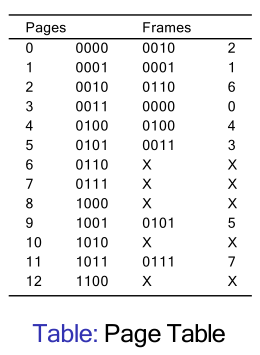
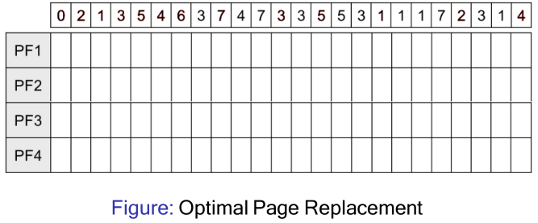
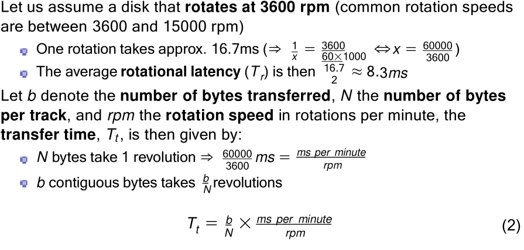
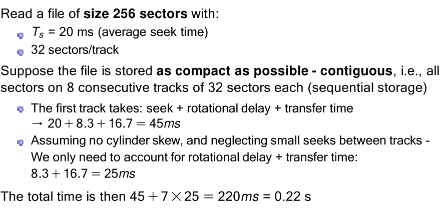
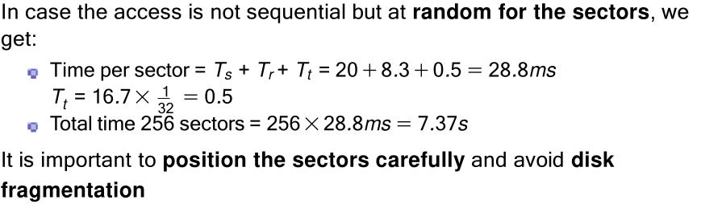
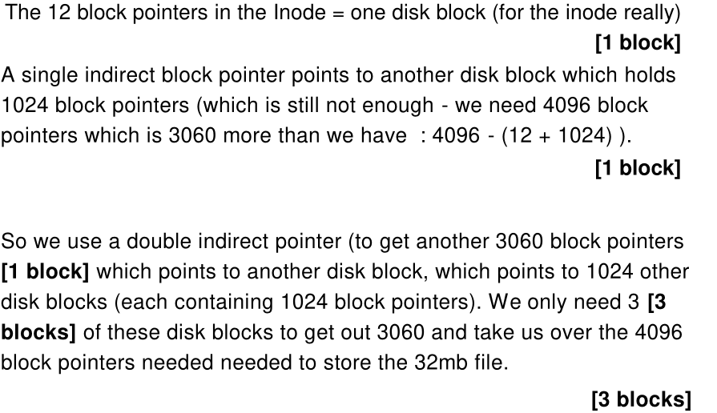

# Exam Practise Questions

## Lecture 10

- Mutexes in some operating systems will put the tread to sleep after it has been spinning for a while? why?
- Does one need mututal exclusion when using user threads?
- Does the implementation with counting semaphores work for a single producer and single consumer (bounded/unbounded)

## Lecture 11
> Can I initialise the value of the `eating` semaphore to 2 to create maximum parallelism
- Would it deadlock?
- Do we get maximum parallelism?

## Lecture 14
> Compare the storage needed to keep track of free memory using bitmap vs. linked list with a main memory of 8 gygabytes, and a block size of 1 megabyte. For the linked list, assume that exactly half of the memory is in use, and that memory contains an alternating sequence of occupied blocks and free blocks. We will only keep track of free blocks with this list, assuming that each node needs a 32-bit memory address, a 16-bit length, and a 16-bit next-node field.

- How many bytes of storage are required for each method?

## Lecture 15

> Given a 64-bit machine that uses paging, and a page/frame size of 4096 bytes

- What would be the maximum number of frames?
Hint: First compute the maximum number of bytes you can address with a 64-bit machine

- How many pages do we have in a 17 kilobytes process? How much
memory are we wasting in the last partition?

## Lecture 16
- Given a 4KB page/frame size, and a 16-bit address space, calculate:
	- Number M of bits for offset within a page.
	- Number N of bits for representing pages. So, number of pages?
- What is the physical address for 0, 8192, 20500 using this page table?

## Lecture 17
- Compare FIFO with the optimal page replacement algorithm. The process starts up with none of its pages in memory.
- What would be the minimum number of page faults that would be generated by the optimal approach?

## Hard Disk Example Questions

## Lecture 19
> Disk requests come in to the disk driver for cylinders 10, 22, 20, 2, 40, 6 and 38, in that order. A seek takes 6ms per cylinder.
- How much seek time is needed for: FCFS, SSTF and Look-SCAN (initially moving upward)
- In all cases, the arm is initially at cylinder 20.

## Lecture 21
> We have seen that with i-nodes, the maximum file size that we can have depends on the block size and the number of indirections.

- Assuming a 32-bit disk address space, what would be the maximum (theoretical) file size for the FAT file system with a drive of 500GB and a block size of 1KB? (without accounting for directory metadata)
- The most used implementation of FAT is known as FAT-32. Investigate why there is a theoretical limitation of 4GB per file (and sometimes even less than 2GB).

## Lecture 22
> Following up the previous question on FAT-32, we mentioned that FAT-32 has severe limitations (e.g. the file allocation table could be too big).

- Why do you think that this file system is still in use in most of flash drives, cameras or MP3 players?
- When would you consider formatting your flash drive with NTFS or ext3? 
- If you format your flash drive with (Windows) NTFS, will it work (directly) in Unix systems?

## Lecture 23
Exercise 1: Using the ext2 file system (i.e. 12 direct block addresses are
contained in the i-node, and up to triple indirect), and assuming a block
size of 4 kilobytes, and a 32-bits disk address space.
- Could we store a file of 18 gigabytes?
- How many disk blocks we spend for the i-node of a file of 16 megabytes?
Exercise 2: In Linux, how many lookups are necessary to find (and load)
the file: /opt/spark/bin/spark-shell?

Ex 1 a
>! We have blocks of 4 kilobytes, and we need 32 bits (4 bytes) to represent a disk address ⇒ in one single block, we could store up to 1024 block pointers:
>4KB = 4*210 / 4 bytes each = 210 = 1024 block pointers.
>Using the 12 direct block pointers, we could have a file of with 12 blocks.
>Using the single indirect: 1024 extra block pointers.
>Using the double indirect: 1024*1024 block pointers (1048576).
>Using the triple indirect, 1024*1024*1024 block pointers (1073741824).
>If we aggregate all of them => 1,074,791,436 blocks of 4KBs which is approx 4TB

Ex 1 a
> For a file of 16 megabytes, we need: 16*220/4*210 = 212 = 4096 blocks
pointers!
We will use fully all direct block pointers (12) [1 block]
With the single indirect we have 1024 extra block pointers [1 block]
With the double indirect we can address 1048576 block pointer... so we
won’t go further than this level.
With direct pointer and single indirect we have covered 1024+12 block
pointers... we still need 3060
Each block will handle 1024 pointers. So, 3060/1024 = 2.9882
We need three blocks + the “first level” block.
Total: 6 blocks of 4 kilobytes => 24KB

## Lecture 24
- Why do type 2 hypervisors exist? After all, there is nothing they can do that type 1 hypervisors cannot do and the type 1 hypervisors are generally more efficient as well.
- Can a virtualised OS (e.g. Cent OS 7) use a paging system with virtual
memory to manage its own memory? If yes, will this be using TLBs?