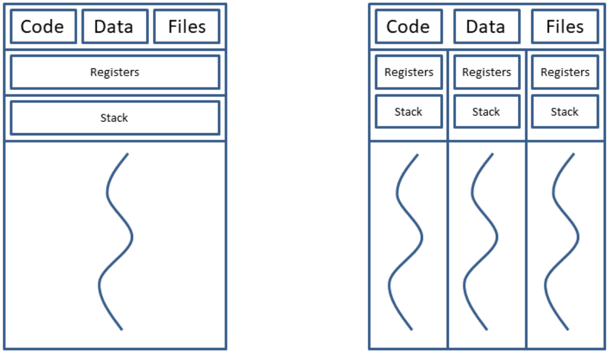

# 4. Threads
_11/10/22_
## OS perspective
- A process consists of two **fundamental units**
	- **Resources**: All related resources are grouped together
	- **Execution trace**: an entity that gets executed
- A process can share its resources between multiple execution traces/threads

*Single threaded process(left), multi-threaded process(Right)*

- Every thread has its own execution context (program counter, stack registers)
- All threads have access to the process shared resources. Global variables, memory etc
- The execution of a process has states. **States** and **transitions** (new, running, blocked, ready, terminated). Multiple threads can be in different states. They relate to the process of the execution
- Every thread has a **thread control block**
- Threads incur less overhead to create/terminate/switch. They have shared resources (address space etc)
- Hyper threaded cores have hardware support for multi-threading. Don't need to save each thread when switching 
- Threading is easier than having multiple processes. Due to threads sharing the same physical memory address, can interact with one another.

- **Inter-thread communication**: Easier/faster than interprocess communication (memory is shared)
- **No protection boundaries**: Required in the address space )threads are cooperating, belong to the same user, and have a common goal
- **Synchronisation**: Has to be considered carefully

## Why use threads
- Multiple **related activities** apply to the same resources, these resources should be accessible/shared
- Processes will often contain multiple blocking tasks
	- IO operations
	- Memory access: page faults
- Such activities should be carried out in parallel/concurrently
- **Application examples**: webservers, make program etc interprocess
- Benefit of using threads rather than putting everything sequential has to do with blocking system calls. Can do save whilst reading in user input instead of skipping it

## User Threads
*Many-to-One*
- **Thread management** (creating, destroying, scheduling, thread control block manipulation) is carried out in user space with the help of a user library
- The process maintains a thread table managed by the runtime system without the kernels knowledge.
- Application itself and the library that you're using is responsible for implementing the practice completely.
- Kernel can see 1 process, but user space can see multiple threads
- Advantages:
	- Threads are in user space (cannot switch to kernel space)
	- Full control over the thread scheduler
	- OS independent (run on OS that doesn't support it)
- Disadvantages:
	- Blocking system calls suspend the entire process (user threads are mapped onto a single process, managed by the kernel)
	- No true parallelism (process is scheduled on a single CPU)
	- Clock interrupts are non-existent (non-preemptive)
	- Page faults result in blocking the process

## Kernel Threads
*One-to-One*
- The kernel manages threads - user applications access threading through system calls
	- Thread table is maintained by the kernel
	- If a thread blocks, the kernel chooses thread from same or different process
- Advantages:
	- True parallelism can be achieved
	- No run-time needed
- Frequent mode switches take place
- Scheduling of kernel threads is all done by the OS

## Performance
- Null fork: the overhead is creating, scheduling, running and terminating a null process/thread
- Signal wait: overhead is synchronising threads

## Hybrid Implementations
- User threads are multiplexed onto kernel threads
- Kernel sees and schedules the kernel threads
- User application sees user threads and creates/schedules these
- Implements best of both worlds.

## Thread Management
- Thread libraries provide an API/interface for managing threads
- Thread libraries can be implemented:
	- Entirely in user space
	- Based on system calls
- Examples of thread APIs include POSIX's PThreads, Windows Threads, and Java threads
- API - table of contents which tells you what functions can be executed. Can be executed as user or kernel threads. Linux will create kernel threads.

## POSIX Threads
- POSIX threads are a specification that anyone can implement.
- Core functions of PThreads:

| Function Call          | Summary                      |
| ---------------------- | ---------------------------- |
| `pthread_create`       | Create new thread            |
| `pthread_exit`         | Exit existing thread         |
| `pthread_join`         | Wait for thread with ID      |
| `pthread_yield`        | Release CPU                  |
| `pthread_attr_init`    | Thread attributes (priority) |
| `pthread_attr_destory` | Release attributes           | 

