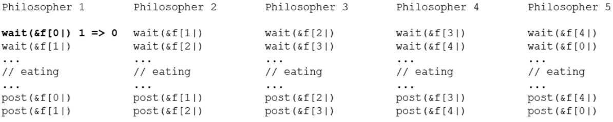
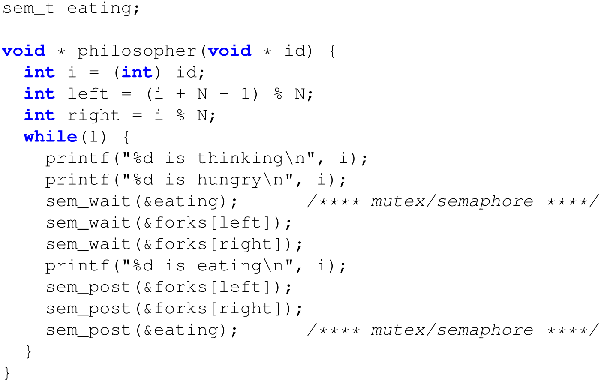
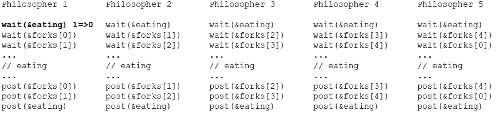

# 9. Bounded buffer & dining philosophers problem
_24/10/22_

Temporary variables: Copies the value of items inside the critical section. Decrements the delay_consumer semaphore to make it consistent

## The Producer/Consumer Problem - First Attempt 
[continued](8.md#first-version)
*One Consumer, One Producer, Unbounded Buffer: solution*
Any manipulations of count will have to be synchronised. 
- Race conditions still exist
	- When the consumer has exhausted the buffer, should have gone to sleep, but the producer increments `items` before the consumer checks it

Race condition:
- Consumer has removed the last element
- Producer adds a new element
- Consumer should have gone to sleep, but no longer will
- Consumer 'consumes' non existing elements

A different variant of the problem has *n* consumers, *m* producers, and a fixed buffer size *N*. The solution is based on 3 semaphores:
	- `sync`: used to enforce mutual exclusion for the buffer
	- `empty`: keeps track of the number of empty buffers, initialised to *N*
	- *full*: keeps track of the number of full buffers, initialised to 0
- `empty` and `full` are counting semaphores and represent resources

## The Dining Philosophers Problem
The Problem:
- 5 Philosophers are sitting on a round table
- Each one has a plate of spaghetti
- The spaghetti is too slippery, and each philosopher needs 2 forks to be able to each
- When hungry (in between thinking), the philosopher tried to acquire the fork on his left and right.
Forks are represented by semaphores (initialised to 1)
- 1 if the fork is available: philosopher can continue
- 0 if the fork is not available: the philosopher goes to sleep if trying to acquire it 
### Solution 1 - *Deadlock*
First approach: Every philosopher picks up one fork and waits for the second one to become available(without putting the first one down)

This causes a deadlock. This can be prevented by:
- Putting the forks down and waiting a random time (Ethernet networks)
- Putting one additional fork on the table
- One global mutex/lock set by the philosopher when they want to eat. *Solution does not result in maximum parallelism (only one eats at a time)*
### Solution 2: Global Mutex/Semaphore
Dan Terms: Global mutex, if enabled, no one else can eat, therefore only one person can eat at a time?

