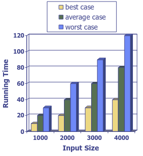

# 1. Analysis of Algorithms
_03/02/23_

Running Time - Running time of an algorithm typically grows with the input size. Even at given size the runtime is usually not fixed. Can depend on whether the input is already 'nearly sorted'. Usually focus on the worst case running time at given size.

## Limitations of Experiments
- Implementing algorithm may be time consuming
- Have to select inputs and this might be bias. Worse case might only happen a few times. Results may not be indicative of the running time on other inputs not included in the experiment 
- If using raw runtime, best to use same hardware/software

## Limitations of Theory
- It is necessary to implement the theory, which may be difficult or time-consuming
- Results may not be indicative of the typical running time on inputs encountered in real world.

For complex systems a mix of theory and experiment can be useful.

## Theoretical Analysis
- Characterise running time as a function of the input size, *n*
- Use a high-level description of algorithms instead of raw implementation

## Pseudocode
- High-level description of an algorithm. 
- Less detailed than a program
- Doesn't matter what language/syntax, but normally similar to procedural/C

## Primitive Operations
To do analysis need to break down algorithm into sequence of primitive operations and count them. Going to count how many we do
**Primitive Operations**
- Basic computations performed by an algorithm. 
	- Identifiable in pseudocode.  
	- Largely independent from the programming language. 
	- Exact definition not important
- Assumed to take a constant amount of time in the *RAM model*. 
	- Tend to be close to assembly language
	- No hidden expenses
- Example - Indexing into an array, comparing two numbers, assigning value to a variables, operation on two numbers etc

## Random Access Machine (RAM) Model
- A CPU
- Potentially-unbounded bank of memory cells, each of which can hold an arbitrary number of character (Programmed with one big array)
- Memory cells are numbered and accessing any cell in memory takes unit time
- Abstraction ignores the true cost of accessing memory 

### Limitations
- Ignore big number issues. They are equal size
- All numbers are small enough to fit in one cell
- Adding numbers take the same constant time
- When counting, do not need to account for the sizes, or digit sizes

## Counting
- Is under specified. 
- Can be multiple right answers
- Most important to be able to know what is happening in the underlying process and to be able to use this to give a reasonably consistent justification of your answers

## Estimating Running Time
- Not all primitive operations take the same actual runtime. Cannot directly get the runtime
- There's some slower, some faster options. 

Details of the counting and timing would probably depend on the compiler, CPU architecture etc

## Growth Rate of Running Time
- Changing the hardware/software environment
	- Affects T(n) by a constant factor, but does not alter the growth rate of T(n)
- The linear growth rate of the running time T(n) is an intrinsic property of algorithm `arrayMax`