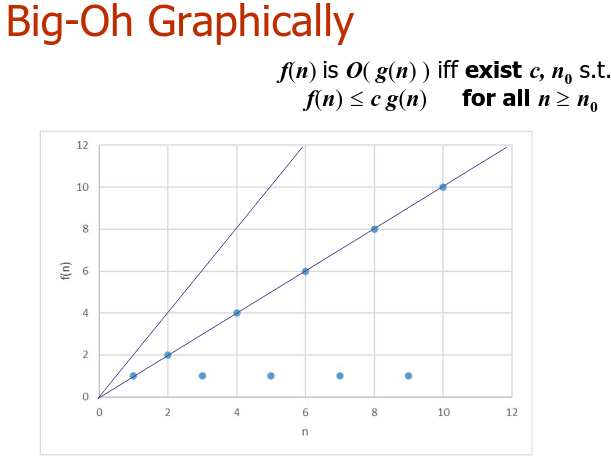

# 3. Big-O (2)
_10/02/23_

## Classification of Functions
Often need a way to group together functions by their scaling behaviour, and the classification should
- Remove unnecessary details
- Be (relatively) quick and easy
- Be able to deal with weird functions that can happen to runtime
- Still be mathematically well-defined

## Ratios vs. big-Oh
- $f(n)$ can be $O(g(n))$ even if the ratio $f(n)/g(n)$ does not exist
- Therefore, big-Oh can be used in situations that ratios cannot
- The possibility of 'weird functions' means that big-Oh is more suitable than ratios for doing analysis of efficiency of programs

Binary relations, R, are characterised by potential properties:
- Reflexive - $xRx$
- Symmetric - $xRy$ iff $Rx$
- Transitive - $xRy$ & $yRz \to xRz$

### Reflexive
- Trivial for any function
-  $f(n)$ is $O(f(n))$
- as just take $c=1$, and use $\forall n.f(n)\le f(n)$

### Symmetric
- Big-Oh is **NOT** symmetric
- $1$ is $O(n)$ but $n$ is not $O(1)$
- Only takes one counterexample to show that we cannot say it is symmetric

### Transitive
- Given $f$ is $O(g)$ and $g$ is $O(h)$ we can show $f$ is $O(h)$

### Set
- Big Oh as a binary relation is reflexive and transitive but not symmetric
- May help to thing of $O(n)$ as a set of functions with each function f in the set, $f\in O(n)$ satisfying $f$ is $O(n)$
- Behaves like $\subseteq,\in,\le$ but not $=$         

## Rules for quick big-Oh proofs
- Reverting the definition each time is time-consuming and error prone
- Better to develop a set of rules that allow us to very quickly find big-Oh

### Multiplication Rule
- 