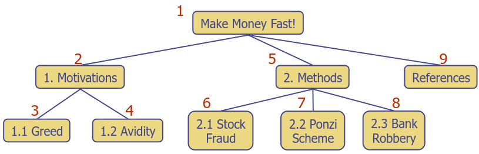
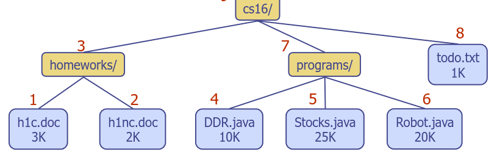
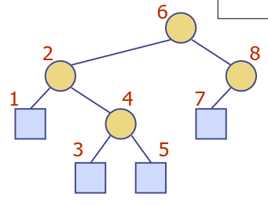
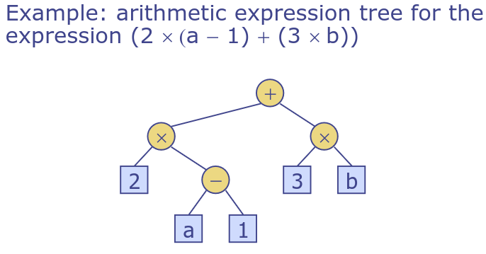
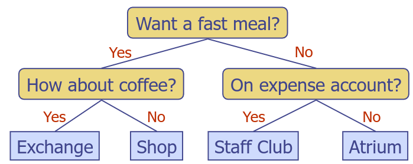

# 7.  Trees: Terminology, Traversals, Representations, and Properties
_24/02/23_

**(Rooted) Tree** - Tree is an abstract model of a hierarchical structure. Consists of nodes with parent-child relation.

## Terminology
- **Root** - Node without parent
- **Internal** node - node with at least one child
- **External** node (leaf) - node without children
- **Ancestors** of a node - parent, grandparent etc
- **Depth** of a node - Number of ancestors (not counting itself)
- **Height** of a tree - Maximum depth of any node = length of longest path from root to a leaf
- **Descendant** of a node - Child, grandchild etc
- **Subtree** - Tree consisting of a node and its descendants

## Traversals
- Visit each element precisely once, visit in some systematic and meaningful order
- For an array the natural way is a forwards scan

### Preorder Traversal
- A node is visited before its descendants
- Application - Print a structured document

### Postorder Traversal
- Visited after its descendants
- Application - Compute space used by files in a directory and its subdirectories
- (Used to evaluate arithmetic expressions)

### Inorder Tranversal
- A node is visited after its left subtree and before its right subtree
- Application - Draw a binary tree by (x,y) coords
- (Used to print arithmetic expressions)

## Tree types
### Binary Trees
- Each internal node has at most two children 
- The children of a done are an ordered pair - though one might be missing
- Call the children of an internal node left child and right child
- A proper binary tree has either two children or no children. 

### Arithmetic Expression Tree
- Binary tree associated with an arithmetic expression
	- Internal nodes - (binary) operators
	- external nodes - operands

### Decision Tree
- Binary tree associated with a decision process
	- Internal nodes - questions with yes/no answers
	- external nodes - decisions

## Abstract Data Types (ADTs)
- Abstraction of a data structure
- Specifies - data stored, operations on the data, error conditions associated with operations
- An ADT does not specify the implementation itself

### Concrete Data Types (CDTs)
- Actual data structure that we use
- ADT might be implemented using different choices for the CDT
	- Choice of CDT will not be apparent from the interface (data hiding/ encapsulation)
	- Choice of CDT will affect the runtime and space usage - and so is a major topic of this module

### ADT & Efficiency
- Often the ADT comes with efficiency requirements expressed in big-Oh notation, yes some do not automatically force a particular CDT
- Typical of many library functions
- Such efficiency specifications rely on using the big-Oh family

## Properties of perfect binary trees
- Said to be proper (full) if every internal node has exactly 2 children
- It is perfect if it is proper and all leaves are at the same depth; hence all levels are full

## Height (h) is logarithmic in size (n)
- Very important property of a perfect binary tree
- 