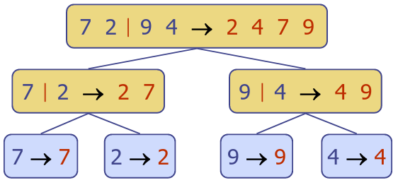
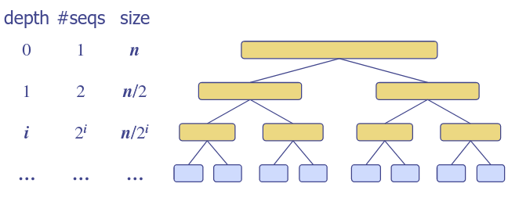
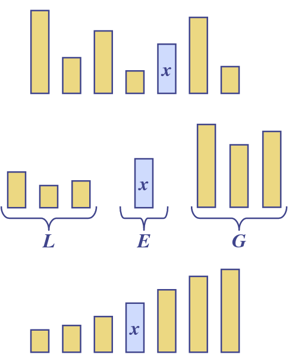
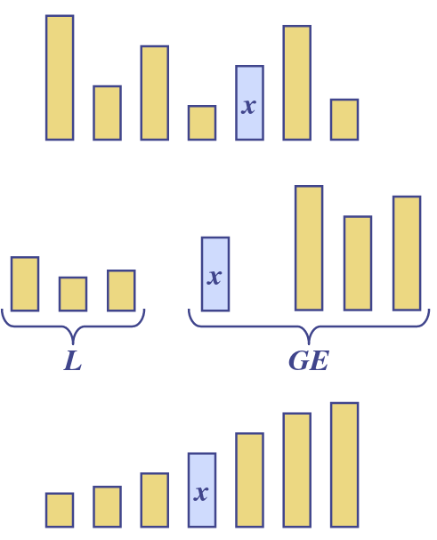

# 8. Mergesort & Quicksort
_27/02/23_

## Divide-and-Conquer
- General algorithm design paradigm
	- Divide - Divide the input data $S$ in two disjoint subsets $S_1$ and $S_2$
	- Recur - Solve the subproblems associated with $S_1$ and $S_2$
	- Conquer - Combine the solutions for $S_1$ and $S_2$ into a solution for $S$
- Base case is either size 0 or 1

### Merge Sort
- On an input sequence (array/list) $S$ with $n$ elements consists of three steps:
	- Divide - Partition $S$ into two sequences $S_1$ and $S_2$ of about $n/2$ elements each
	- Recur -  Recursively sort $S_1$ and $S_2$
	- Conquer - Merge $S_1$ and $S_2$ into a unique sorted sequence

## Merge-Sort Tree
- An execution of merge-sort is depicted by a binary tree
	- each node represents a recursive call of merge-sort and stores
		- unsorted sequences before the execution and its partition
		- sorted sequence at the end of the execution
	- the root is the initial call
	- the leaves are calls on sub sequences of size 0 or 1

## Analysis of Merge-Sort
- The height $h$ of the merge-sort tree is $O(\log n$) 
- The overall amount of work done at all the nodes at depth $i$ is $O(n)$
	- partition and merge $2^i$ sequences of size $n/2^i$
	- make $2^{i+1}$ recursive calls
	- numbers all occur and are used at each depth
- Thus, the total running time of the merge sort is $O(n\log n)$

## Quick-sort
- In mergesort the divide is simple but the merge is complicated. Quicksort replaces the merge part
- When the lists A and B are sorted and known to be in disjoin ordered ranges
- If A and B are stored as consecutive sub-arrays, then merge actually needs no work at all, just forget the boundary

### 3-way split
- Quick-sort is a randomised sorting algorithm based on the divide-and-conquer paradigm
	- Divide - pick a random element $x$ (pivot) and partition $S$ into 
		- $L$ elements less than $x$
		- $E$ elements equal to $x$
		- $G$ elements greater than $x$
	- Recur - sort $L$ and $G$
	- Conquer - join $L,E,G$

### 2-way split
- Divide - pick a random element $x$ (pivot) and partition $S$ into 
		- $L$ elements less than $x$
		- $GE$ elements greater than or equal to$x$
- Recur - sort $L$ and $GE$
- Conquer - join $L,GE$

