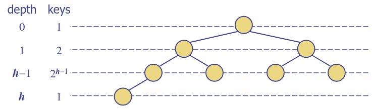
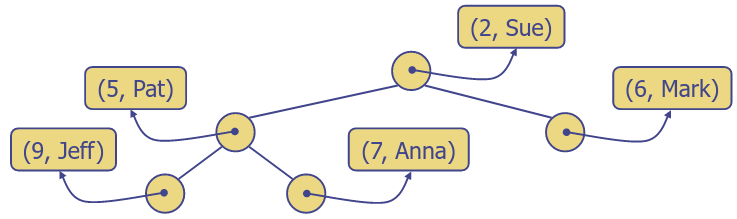

# 12. Abstract Data Types - Stacks & Queues
_13/02/23_

**ADT - Abstract Data Type**
- Only concerned with specifying the interface
- *Behaviour* as seen from the outside
- Specifies the methods provided - and possibly requirements on their complexity

**CDT - Concrete Data Type (CDT)**
- Some structure and algorithm used for an actual implementation
- *Behaviour as seen form the inside*

## The Stack ADT
- The Stack ADT stores arbitrary (references to) objects
- Insertions and deletions follow **last-in first-out (LIFO)**

### Applications
**Direct applications**
- Page-visited history in a Web browser
- Undo sequence in a text editor
- Chain of method calls in the JVM

**Indirect applications**
- Auxiliary data structure for algorithms
- Components of other data structures

## The Queue ADT
- Stores arbitrary objects
- Insertions and deletions follow the **first-in first-out FIFO** scheme
- Insertions are at the rear of the queue and removals are at the front of the queue

### Applications of Queues
**Direct applications**
- Waiting lists
- Access to shared resources
- Event queues in GUIs and simulations
**Indirect applications**
- Auxiliary data structure for algorithms
- Components of other data structures

### Queue using Array as the CDT
- Use an array of size $N$ in a circular fashion
- Two variables keep track of the front and rear
	- $f$ index of the front element
	- $r$ index immediately past the rear element
- Array location $r$ is kept empty

### Why not just use an Array instead of a Queue ADT?
- Conceptual Clarity
- Self-Documentation
- Safety of coding - prevents kludges
- Potential Compiler Optimisations
- Easier to change to a dynamically sizeable data structure

### Narrow Vs. Wide ADT
**Narrow** - small set of methods
- Stack ADT
- less flexible to use
- more flexible to implement, hence maybe more efficient

**Wide** - Large set of methods
- Java Stack
- more flexible to use
- Possibly more difficult to implement efficiently

Finding a good balance is a difficult design decision

## Stacks and Queues by using linked lists
### Usage of Simplest linked list
- Could use them for any ADT
- Observe that insertion and removal at head are very efficient, O(1)
- If insert two elements then remove two elements, get LIFO
.....

## Priority Queues
- Stores a collection of entries
- Each entry is a pair (key, value)

### Total Order Relations
- Keys in a priority queue can be arbitrary objects on which an order is defined (between all different pairs)
- Two distinct entries in a priority queue can have the same key

### Comparator
- A comparator encapsulates the action of comparing two objects according to a given total order relation
- A generic priority queue uses an auxiliary comparator
- The comparator is external to the keys being compared
- When the priority queue needs to compare two keys, it uses its comparator

## Heaps
- A heap is a binary tree, storing key-value pairs at its nodes and satisfying the following properties:
	- **Heap order** - for every internal node v other than the root
	- **Complete Binary Tree** - Let $h$ be the height of the heap
- The last node of a heap is the rightmost node of depth $h$

### Height of a Heap
**Theorem**: A heap storing $n$ keys has a height $O(\log n)$
**Proof**: This uses just the complete binary tree property
- Let $h$ be the height of a heap storing $n$ keys
- The perfect binary tree of height $h-1$ and $2^h-1$ nodes
- Our trees has at least more

### Heaps and Priority Queues
- Can use a heap to implement a priority queue
- Store a (key, element) item at each node
- Keep track of the position of the last node

