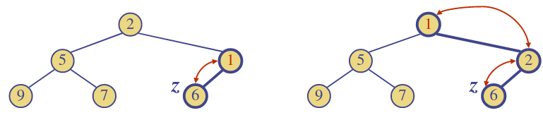
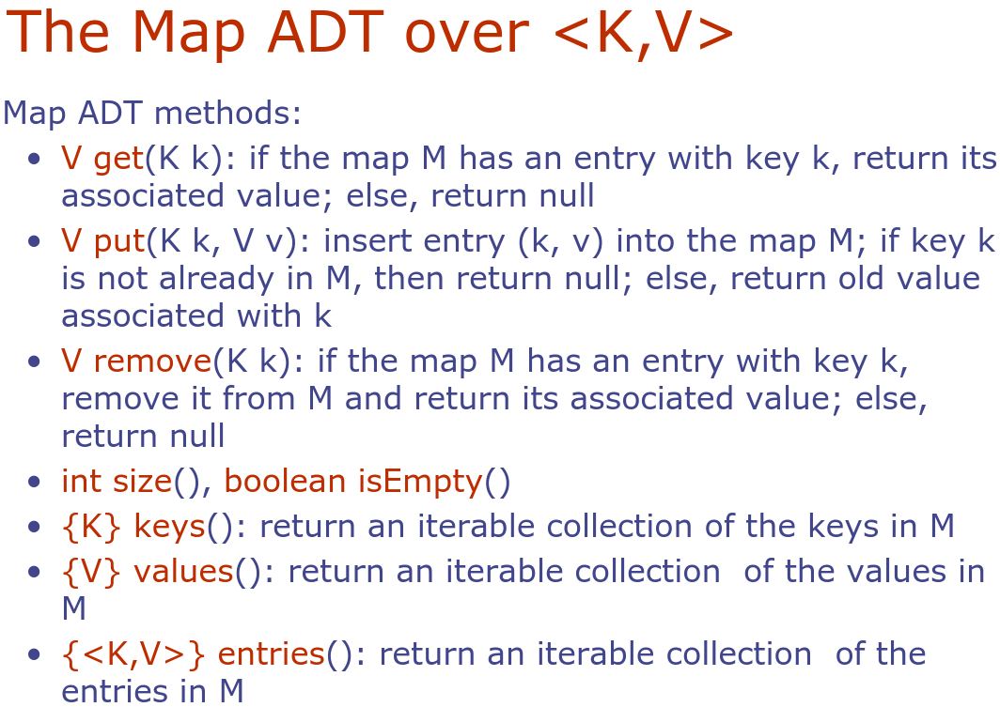

# 13. Heaps & Maps
_17/03/23_

## Heap
### Insertion
- Method `insertItem` of the priority queue ADT corresponds to the insertion of a key $k$ to the heap
- The insertion algorithm consists of three steps
	- Find the insertion node $z$
	- Store $k$ at $z$
	- Restore the heap-order property

### Upheap
- After the insertion of a new key $k$, the heap-order property may be violated
- Algorithm up heap restores the heap-order property by swapping $k$ along an upward path from the insertion node
- Upheap terminates when the key $k$ reaches the root or a node whose parent has a key smaller than or equal to $k$
- Since a heap has a height $O(\log n)$, upheap runs in $O(\log n)$ time.

### Removal
- Method `removeMin` of the priority queue ADT corresponds to the removal of the root key from the heap
- The removal algorithm consists of three steps
	- Replace the root key with the key of the last node $w$
	- Remove $w$
	- Restore the heap-order property (discussed next)

### Downheap
- After replacing the root key with the key $k$ of the last node, the heap-order property may be violated
- Algorithm downheap restores the heap-order property by swapping key $k$ along a particular downward path from the root
- Downheap terminates when key $k$ reaches a leaf or a node whose children have keys greater than or equal to $k$
- Since a heap has height $O(\log n)$ downheap runs in $O(\log n)$ time

## Array Heap Implementation
*Similar to trees*
- Can represent a heap with $n$ keys by means of an Array (or vector) of length $n+1$
- Links between nodes are not explicitly stored, instead for the node at index $i$:
	- the left child is at index $2i$
	- the right child is at index $2i+1$
	- the parent is at index $i/2$
- The cell at index 0 is not used
- No gaps when storing a heap
- Upheap and downheap just swap elements within the array

### Heap sort
- Using a heap-based priority queue, can sort a sequence of n elements in $O(n\log n)$ time. Resulting algorithm is called heap-sort
- Heap-sort is much faster than quadratic sorting algorithms, such as insertion-sort and selection-sort

Has two stages:
1. Insert all elements into the heap one by one. Takes $n$ insertions with $O(\log n)$ each for a total of $O(n\log n)$
2. Remove all elements one by one, using `removeMin()`, hence obtaining them in sorted order. This takes $n$ removals with $O(\log n)$ each for a total of $O(n\log n)$

> Do **NOT** confuse binary tree implementations of heaps with binary search trees!!

## Maps ADT : Using lists
- A map models a collection of key-value entries that is searchable 'by the key'
- The main operations of a map are for searching, inserting, and deleting items
- Multiple entries with the same key are **not** allowed

MAP: Access any key
PQ: Access only the minimum key

Can implement a map using unsorted list
- Store the items of the map in a list S (doubly-linked list) in arbitrary order
- and a size counter n, so `getSize()` is $O(1)$

### Performance of a List-Based Map
- `put` would have taken $O(1)$ time if we could just insert the new item at the beginning (or end) of the sequence
- `get` and `remove` take $O(n)$ time since in the worse case (item not found) we traverse the entire sequence to look for an item with the given key
- The unsorted list implementation is suitable only for maps of small size, sorted list still $O(n)$