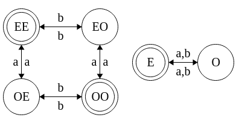

# 2. Finite Automata
_06/02/23_

This content is basically state machines from Y1S1 (Bagley)
## Deterministic Finite Automata (DFA)
A *deterministic finite automaton* (DFA) $A = (Q,\Sigma,δ,q_0,F)$
1. A finite set of states $Q$
2. A finite set of input symbols, the alphabet, $\Sigma$
3. A transition function $δ\in Q \times \Sigma \to Q$
4. An initial state $q_0 \in Q$
5. A set of final states $F\subseteq Q$
An example is the following automaton
$$D=(\{q_0,q_1,q_2\},\{0,1\},δ_D,q_0,\{q_2\})$$

Initial state are sometimes called start states, and final states are sometimes called accepting states

Initial state is identified by putting an arrow $\to$ to the left of it and the final state are identified by a star $*$ . Initial states can also be final

Can also represent a DFA through a transition diagram

## Language of a DFA
- The words accepted by a DFA is called the *language* $L(A)$ of the DFA.
- Once all symbols in the input word have been read, the word is *accepted* if the state is final, otherwise the word is *rejected*

