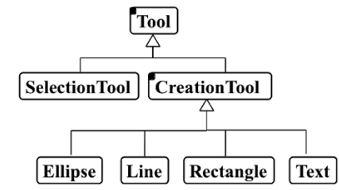
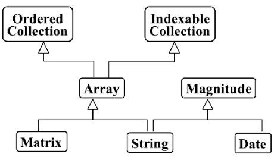
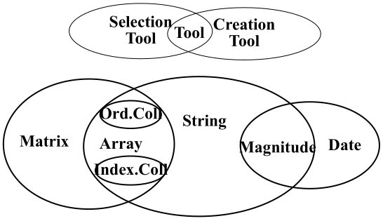
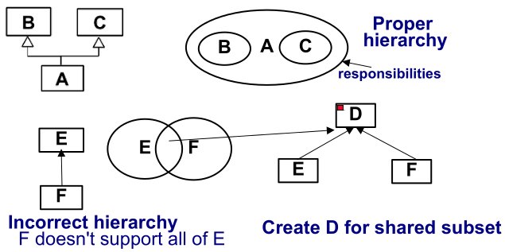

# 9. Software Hierarchies
_31/10/22_

## Class Hierarchies
- Represent essence of approach
- Provide most potential benefits

### Hierarchy Graphs
Extend notation slightly to explicitly identify abstract classes
- Fill in top left corner of a box of an abstract class

### Multiple Inheritance
Multiple inheritance can also be included in a hierarchy graph

### Venn Diagrams
Can represent responsibilities of a class as a set, so shared responsibilities show up in a venn diagram

## Guidelines on Building Good Class Hierarchies
1. Model *is-kind-of* (or is-type-of) hierarchies
2. Factor common responsibilities as high as possible
3. Don't allow abstract classes to inherit from concrete ones
4. Eliminate non-functional classes
### Is-kind-of Hierarchy
Class A is derived from B, only if supports all its responsibilities

### Move Common Responsibilities up Hierarchy
Factor common responsibilities as high up as possible
Design as many abstract classes as possible
- Likely to result in maximal design simplification, design sharing, and code sharing
- Likely to make system more extensible -- later improvements are likely to be more easily integrated
- Decision criteria for creating abstract classes can involve speculation on possible future extensions/modifications
- One responsibility is enough to justify an abstract class
- Need at least two children, otherwise difficult to identify good generic definition of responsibilities 

## Abstract Classes in Hierarchy
- Should not inherit from concrete classes
- Abstract class behaviour - implementation-independent
- Concrete class behaviour - implementation-dependent
- Characterisation is violated if an abstract class inherits from a concrete one

## Eliminate Classes
- Classes that add no new functionality are normally eliminated
- Could have no new responsibilities, but still add functionality.
- Responsibilities are inherited by children but assigned to parent