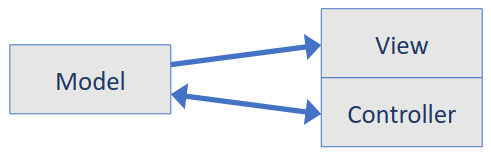

# 12. Software Design Patterns
_07/11/22_

## Design Patterns
- A solution that addresses problem which repeatedly occurs, describes the core of the solution to that problem in such a way that it can use the pattern repeatedly
- Pattern provides an abstract description of a design problem and how a general arrangement of elements solves it
- Identifies the participating classes and instances, their roles and collaborations, and the distribution of responsibilities.

Pattern specification has four essential elements:
1. Name: Usable handle to describe a design problem
2. Problem: When to apply a pattern
3. Solution: Describes the elements that make up the design and the relationship
4. Consequences: Describes the results and trade-offs of applying the pattern

Organised into two separate ways:
- Purpose - Reflects what the pattern does
	- Creational: Concern the process of object creation
	- Structural: Deal with the composition of class and objects
	- Behavioural: Characterise the way in which classes and objects interact and distribute responsibility
- Scope - Specifies whether the pattern applies to classes or objects
	- Class: These patterns deal with relationships between lasses and sub-classes
	- Object: Deal with object relationships

### Creational Patterns
- Abstract factory  - Interface to create related objects without declaring the concrete class
- Builder - The same construction process can create different representations
- Factory Method - Defers instantiation to sub classes
- Prototype - Create new objects by copying the prototype
- Singleton - Ensures that one and only one instance of a class is created

### Structural Patterns
- Adaptor - Provides compatible interfaces for classes that couldn't work together otherwise
- Bridge - Decoupling of abstraction and implementation so that the two can be independent
- Composite - Put objects into a tree structure to represent the hierarchies
- Decorator - Lets individual instances have addition of dynamically adding new function
- Facade - Providing a unified interface to a set of interfaces
- Flyweight - Use sharing to support large numbers of complex objects
- Proxy - Provide a placeholder for another object to access its controls

### Behavioural Patterns
- Chain of responsibility - Give more than one object the change to handle a request
- Command - Encapsulate a request as an object
- Interpreter - Convert problems expressed in natural langue into a representation
- Iterator - Access to objects without exposing underlying representation
- Mediator - Promotes loose coupling by preventing objects from referring to each other
- Memento - Capture and display an objects internal state
- Observer - Define a one to many relationship so that when one object changes state, all its dependants are notified.
- State - Allow an object to alter its behaviour when its internal state changes
- Strategy - Define and encapsulate a family of algorithm. Let the algorithm vary independently of who is using it
- Template Method - Define the skeleton of an algorithm, and let sub classes redefine certain steps without changing the structure of the algorithm
- Visitor - Define a new operation without changing the classes

## Singleton
- Single instance of a class to exist in the system
- Ensure a class only has one instance, and provide a single point of access to it.
- Need to have one instance easily accessible and we need to ensure additional instances of the class can not be created

### Benefits
- Controlled access to sole instance 
- Reduced namespace
- Can easily transform into concrete factory by permitting a variable number of instances

### Challenges
- Concurrent requests
- Threading
- Might not have all the information needed at the point of static initialisation 

## The Factory Patterns
- Creational patterns which abstract and encapsulate the object instantiation process
- Hide how objects are created and service the system independent of how its objects are created
- Class creational patterns, focus on use of inheritance
- Factory method pattern can save you from awkward dependencies in OOD by letting you define an interface for creating an object.
- Used when the class does not know precisely which class of objects it must create

### Abstract Factories
- What we just discussed were concrete factories
- Go one step further with the abstract factory
- An abstract factory is a factory of factories
- Used when you need an interface for creating related objects without specifying their classes

### Participants in the Factory
- Abstract Factory - declares an interface for operations that create abstract products
- Concrete Factory - Implements operations to create concrete products
- Abstract Product - Declares an interface for a type of product objects
- Product - Defines a product to be create by the corresponding Concrete Factory ; implements the abstract product interface
- Client - uses the interfaces declared by the abstract factory and abstract product classes
### *Notes*
- Abstract Factory class determines the actual type of the concrete object and creates it, it returns an abstract pointer to the concrete object just created
- This prevents the client from knowing anything about the actual creation of the object
- The objects of the concrete type, created by the factory, are accessed by the client only through the abstract interface
### Scope of use
- When the system needs to be independent from the way the products it works with are created
- If the system is or should be configured to work with multiple families of products
- If a family of products is designed to work only all together
- When the creation of a library of products is needed, for which is relevant only the interface and not the implementation 
## Adaptor Pattern (Structural)
- Pattern involves a single class which is responsible to join functionalities of independent or incompatible interfaces
	- Class adaptor - Relies on multiple inheritance
	- Object adaptor - Relies on object composition

## Observer Pattern
Used when there is one-to-many relationship between objects such as if one object is modified, its dependent objects are to be notified automatically. 

Loose Coupling - Two objects are loosely coupled if they interact but have very little knowledge of each other

## MVC - Model-View-Controller
- The classic design pattern
- Used for data-driven user applications, and tasks can be organised into sub-systems
- Model (Data Interface) - Communicates with data source to read and write data
- View (Visual Representation of Data) - Requests model for data and prevents it in a user-friendly visual display
- Controller (User Interface) - Listens to the user in order to request data or state in the GUI and notify the model or view accordingly

### Benefits
- Organisation of code - Maintainable, easy to find what you need
- Ease of development - Build and test components/subsystems independently
- Flexibility - Swap out views for different presentations of the same data. Swap out models to change data storage without affecting user

