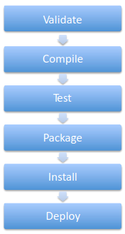

# 13. Introduction to Maven & Gradle
_11/11/21_
## Maven
- Maven builds follows a lifecycle, using phases
	- Each life cycle phase includes the ones above it
	- Plugins can customise or hook-in to the phases

Key Maven lifecyles:
- **Default** - your normal life-cycle
- **Clean** - issued during the mvn cleanup command
- **Site** - issued during the mvn site command

### POM file
- Project Object Model (POM)
- Contains configuration information about your project

### Useful Maven Commands
- `mvn clean` - removes file in target
- `mvn compile` - compiles a project
- `mvn test` - Runs all tests in the src/test directory
- `mvn package` - builds the final target artefact
- `mvn install` - Installs the target artefact in your local repository
- `mvn deploy` - deploys the artefact

## Gradle
- Replaces XML in favour of a domain specific language 'groovy'
- Based on a programming language therefore can implement control flow
- Even tho it uses groovy, can act as a build manager for any language
- Has plugin ability
- More cleanly accomplishes required tasks of a typical development project, from compilation through testing and development 

### Build Cycle
- Launches a new JVM process
- Creates a settings instance for the build
- Evaluates the *settings.gradle* file against the settings object
- Creates a hierarchy of projects based on the config settings object
- Executes each build.gradle file against its project