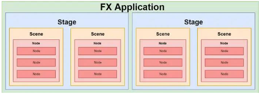
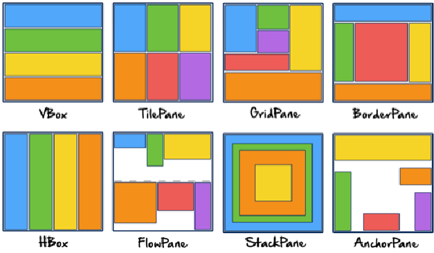

# 14. GUIs
_14/11/22_

## GUIs
GUIs are a form of user interface that allow users to interact with electronic devices through graphical icons as primary notation, instead of text-based user interfaces, typed etc.

## Peers GUI guidance
1. Keep it simple
2. Create consistency and use common elements
3. Be purposeful in page layout
4. Strategically use colour and texture
5. Use typography to create hierarchy and clarity
6. Make sure that the system communicates whats happening
7. Think about the defaults

Under the hood GUIs are event-driven. The user decides the order of execution depending whether they interact with the program. The system is waiting for something to happen

## Java FX
- Can deploy GUIs to table, phone, desktop
- Able to separate GUI code from program code using an XML description file (FXML)
- Supports idea of properties (variables that represent the state of an instantiated object)
- Can use CSS
- Special effects/animations supported
- Comes with media player

### Stage and Scene
Stage:
- Think of it as an application windows
- Depending on OS, there may be only one
- Equivalent to Swing's JFrame
Scene:
- Equivalent to a content pane
- Holds other objects

Summary:
- If the OS allows each application can have multiple stages - windows. Each stage can switch between multiple scenes. Scenes contain nodes - layout and regular components
- 
### Properties & Binding
- JavaFX properties (observable containers) are often used in conjunction with binding, a powerful mechanism for expressing direct relationships between variables
- When objects participate in bindings, changes made to one object will automatically be reflected in another object
- Can also change listeners to be notified when the property value has changed

## Lambda Expressions
Short blocks of code which take in parameters and return a value
From:
```java
btn.setOnAction(new EventHandler<ActionEvent>() {
	@Override
	public void handle(ActionEvent event) {
		System.out.println("Bye!");
		System.exit(0);
	}
})
```
To:
```java
btn.setOnAction(e->{
	System.out.println("Bye!");
	System.exit(0);
})
```

## Node Class
- Fundamental to JavaFX
- Used to represent controls, layouts, shapes. 
- Can apply effects to nodes

## Built-in Layout Panes
- `Vbox`: Provides an easy way for arranging a series of nodes in a single row
- `TilePane`: Places all of the nodes in a grid in which each cell, or tile, is the same size. Nodes can be laid out horizontally (in rows) or vertically (in columns)
- `GridPane`: Allows to create a flexible grid of rows and columns in which to lay out nodes; nodes can be placed in any cell in the grid and can span cells as needed
- `BorderPane`: Provides fine regions in which to place nodes; top, bottom, left, right, and centre
- `HBox`: Provides an easy way for arranging a series of nodes in a single column
- `FlowPane`: Nodes are laid out consecutively and wrap at the boundary set for the pane; nodes can flow vertically(in columns) or horizontally (in rows)
- `StackPane`: Places all of the nodes within a single stack with each new node added on top of the previous
- `AnchorPane`: Allows to anchor nodes to the top, bottom, left side, right side, or centre of the pane; as the window is resized, the nodes maintain their position relative to their anchor point
