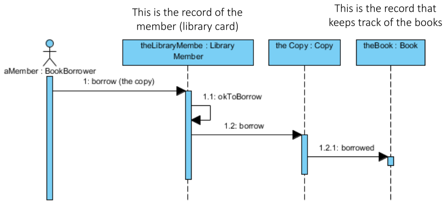
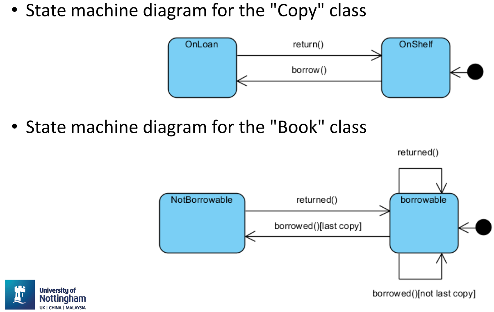
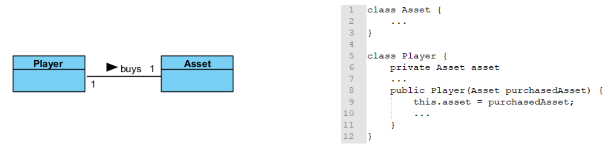
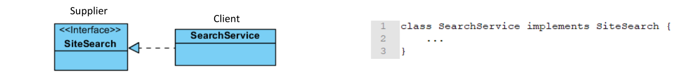

# 18. Revision

## Introduction
Core attributes of maintainable software 
- Readable code
- Strong documentation
- Consistent variable/functions conventions
- Standard code layout
- Testability

Main principles for developing software
- Maintainability benefits most from adhearing to simple guidelines
- Maintainability is not an afterthought should be addressed from the very beginning of a development project
- Some violation are worse than others; the more a software system compiles with the guidelines for more maintainable it is

Software maintenance involves - The process for managing and executing software maintenance activities is described. Also need to consider how we can reduce the effort of maintenance

Main Categories
- **Corrective maintenance** - Finding and fixing errors in the system
- **Adaptive Maintenance** - The system has to be adapted to change in the environment in which it operates
- **Perfective + Preventive Maintenance** - Users of the system have new or changed requirements. Ways identified to increase the quality or prevent future bugs.

## Basic Concepts
- **Abstraction** - Simple things like objects represent more complex underlying code and data
	- Cannot be used to instantiate objects but references to abstract classes are legal.
	- Classes can have instance methods that implement a default behaviour. May contain non-final variables
- **Encapsulation** - Ability to protect some components of the object from external access. 
	- Making public variables private
	- Hiding the implementation details of a class
	- Helps with program maintenance (doesn't affect other classes)
- **Inheritance** - Ability for a class to extend or override functionality of another class
- **Polymorphism** - The provision of a single interface to entities of different types. 
	- Compile time - Method overloading - Same name co-exists in the same class but they must have different method signatures
	- Run time - Method overriding - Same name is declared in super and sub class
- `this` - Refers to the implicit parameter inside the class
- **Constructors** - Invoked using the `new` operator
- Passing Data - Can either pass by value or pass by reference
- **Overloaded Methods** - Methods of the same class that have the same name but different numbers/types. Compiler will treat them as completely different methods
- **Static Field** - Shared by all objects of the class. Normally stored with the class code. Not initialised in constructors.
- **Non-Static Field** - Belongs to an individual object
- **Static Methods** - Access and manipulate class statics fields. Belongs to the class, not an instance of it. Cannot access instance fields or call methods of the class.
- **Instance Methods** - Can access all fields and call all methods of their class (Static and non-static).

## Java Collections Framework
- Collection is an object that represents a group of objects. This contains data structures and algorithmic operations
- **Collection** - Something that holds a dynamic collection of objects
- **Map** - Defines mapping between keys and objects
- **Iterable** - Collections are able to return an iterator object that can scan over the contents of a collection one object at a time
- **Queue** - Represents FIFO queues and LIFO stacks
- **Deque** - Represents a double ended queue
- **Set** - A collection that cannot contain duplicate elements
- **List** - An ordered sequence of elements that allows duplicate elements
- **Typesafe collection with 'Generics'** - Classes support generics by allowing a type variable to be included in their declaration; type are declared for the reference and constructor. Cannot type a collection using a primitive type
- **TreeSet Class** - Provides an implementation of the set interface that uses a tree for storage (ascending order)
- **HashMap Class** - Hash table implementation of the map interface. The implementation provides all of the optional map operations, and permits null values and the null key

## Implementation of OOP concepts in Java
**Aggregation** - Object of class B is **part of** an object of class A but the object of class B can be shared and if the object of class A is deleted, class B is not deleted

**Composition** - An object of class A **owns** an object of class B and the object of class B cannot be shared and if the object of class A is deleted, the object of class B is also deleted

**Inheritance** - Forming new classes based on existing ones. (is-a relationship)
- *superclass* - parent class being extended
- *subclass* - child class that inherits behaviour from the parent class

**Interfaces**
- Methods are implicitly abstract, cannot have implementations but rather are implemented. Is an abstract type that is used to describe a behaviour that classes must implement. Implements an interface must implement all of the non-default methods describe in the interface. Less restrictive when it comes to inheritance 

[Java Changes](03.md#java_versions)

## UML
> A specification defining a graphical language for visualising, specifying, constructing and documenting the artefacts of distributed object systems

**Advantages** - Enhances communication and ensures the right communication. Captures logical software independent. Helps to manage the complexity. Enables reuse of design

## Object Oriented Analysis
**Use Case Diagrams** - Set of actions that some system(s) should or can perform in collaboration with one or more external users of the system or systems

## Object Oriented Design
### Activity Diagrams
Graphical representations of workflows of step wise activities and actions related to an individual use case or across many use cases. Supports representation of parallel behaviour 

### Sequence Diagrams
Temporal representation of objects and their interactions

### State Machine Diagrams
Show the possible states of a single object. Only reactive objects require a state machine diagram

### Class Diagram
Shows the existence of classes and their structures and relationship in the logical view of a system

Depicted as rectangles with three compartments; class name, attributes(), operations 

Associations between classes - Associated if an instance of a class A (source) has to know about an instance of class B (target class)

### Multiplicity Indicators
|      |                                 |
| ---- | ------------------------------- |
| 1    | exactly 1                       |
| *    | unlimited number (zero or more) |
| 0..* | zero or more                    |
| 1..* | one or more                     |
| 0..1 | zero or 1                       |
| 3..7 | specified range (3-7)           | 

### Relationships
##### Association
- Reference based relationship between two classes

**Dependency**
- Created when you receive a reference to a class as part of a particular method

#### Aggregation (*is part of* relationship)
- Same as association and often seen as redundant relationship. Used when an object logically pr physically contains other; the container is called 'aggregate'; the components of the aggregate can be shared with others

#### Composition
- Relates to instance recreational responsibility 
- When class B is composed by class A, class A instance owns the creation of controls lifetime of instance of class B

#### Realisation
- Specialised abstraction relationship between two sets of model elements, one representing a specification (the supplier) and the other representing an implementation (the client) of the specification

#### Generalisation
- Directed relationship between a more general classifier (subclass) and a more specific classifier (subclass)

## Documenting Code
- Source code comments are essential for maintenance as they are key to having another person be able to understand what you have done. There are some semi-automatic services such as Doxygen and Javadoc.
- **IDEs** - Many tools are built into IDEs, and is great for helping to create maintainable code including in built testing help

**Useful Javadoc Tags**
- `@param` - explain a method parameter
- `@return` - to annotate a method return value
- `@throws`/`@exception` - for your exception handling
- `@deprecated` - bits of the code you no longer use
- `{@code}` - puts syntax in your documentation 

**Version Control**
- Allows you to recover old versions and examine source code history.
- **Repository** - Stores a file system tree. Remembers every change 
- **Concurrency Management** - Simultaneous occurrence; coincidence. Ways to deal with concurrency; lock-modify-unlock, copy-modify-merge 
- **Lock-Modify-Unlock Solution** - Serialisation. There is no protection for breaking dependencies between files, false sense of security. For all types
- **Copy-modify-merge** - For text file. Users work in parallel, concurrent changes are automatically merged, conflicts can generally be managed
- **Working Copy** - Regular directory tree, wont do anything unless told to.

## OOD in Depth
- **Object** - Set of closely related data and methods that operate on the data (or services). Knows what it is, its responsibilities and how to fulfil them. Has a role to play in the system and knows how to do it
- **Method** - Function performed by an object as a result of a valid message (Verbs)
- **Signature** - Method name, parameters and types, values returned
- **Class** - Set of objects that share same behaviour (Nouns)
- **Instance** - Member of a class

### Client/Server Model and Terminology 
- OO model is a client/server model
- Object collaborations are one way
	- Client object requests service
	- Server object receives request and provides service
	- Interactions is defined by a contract
- **Contract** - Client/Server are roles that objects play. Can take either or both roles at different times. Concepts keep track of the relationship between 2 objects at a specific time

## Software Design - Responsibilities 
- Knowledge maintained by object
- Actions an object can perform
- **System Intelligence** - What system knows, what it it can perform.
- **Class Intelligence**
	- **Server View** - What class knows, what actions it can perform
	- **Client View** - How many other classes does the class know. How much does it need to know about those server classes.
- **Centralised Intelligence**
	- Taken to extreme - One object incorporates most/all of system intelligence
	- Centralised control - Top-down design with the main program under complete control and other objects serving as simple data structure entities
	- **Advantage** - Easier to get initial understanding of overall control flow
	- **Disadvantage** - Hard-wires system behaviour. Integrates multiple design decisions into a single class. Less code/design sharing, big issue when working with teams
- **Distributed Intelligence** - Distribute it evenly as possible. Minimise number of intelligent classes, and aim is all classes are equally intelligent

**Is-a-Kind-of (Inheritance)** - Look for parent/child relationship. Shared attributes or behaviour can imply

**Is-Part-Of(Composition)** - No shared behaviour implied. Defines an object hierarchy, not a class hierarchy. Object often composed of parts and has responsibilities for those parts.

**Unassigned Responsibilities** - Difficulties in assigning  responsibilities can occur because a class is missing, or responsibility could be assigned to more than other class.