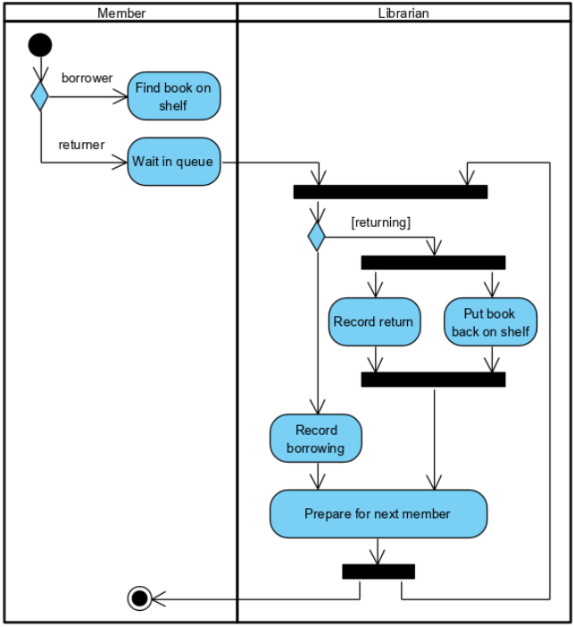
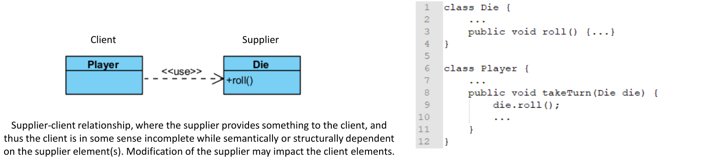
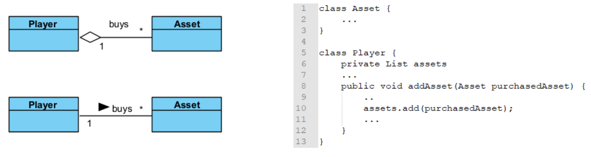
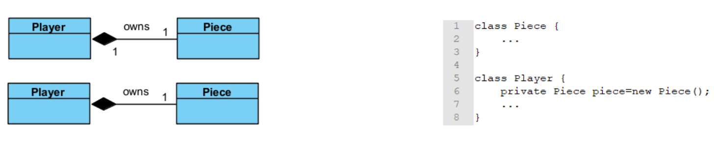
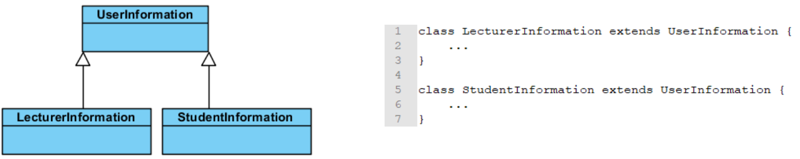

# 18. Revision

## Introduction
Core attributes of maintainable software 
- Readable code
- Strong documentation
- Consistent variable/functions conventions
- Standard code layout
- Testability

Main principles for developing software
- Maintainability benefits most from adhearing to simple guidelines
- Maintainability is not an afterthought should be addressed from the very beginning of a development project
- Some violation are worse than others; the more a software system compiles with the guidelines for more maintainable it is

Software maintenance involves - The process for managing and executing software maintenance activities is described. Also need to consider how we can reduce the effort of maintenance

Main Categories
- **Corrective maintenance** - Finding and fixing errors in the system
- **Adaptive Maintenance** - The system has to be adapted to change in the environment in which it operates
- **Perfective + Preventive Maintenance** - Users of the system have new or changed requirements. Ways identified to increase the quality or prevent future bugs.

## Basic Concepts
- **Abstraction** - Simple things like objects represent more complex underlying code and data
	- Cannot be used to instantiate objects but references to abstract classes are legal.
	- Classes can have instance methods that implement a default behaviour. May contain non-final variables
- **Encapsulation** - Ability to protect some components of the object from external access. 
	- Making public variables private
	- Hiding the implementation details of a class
	- Helps with program maintenance (doesn't affect other classes)
- **Inheritance** - Ability for a class to extend or override functionality of another class
- **Polymorphism** - The provision of a single interface to entities of different types. 
	- Compile time - Method overloading - Same name co-exists in the same class but they must have different method signatures
	- Run time - Method overriding - Same name is declared in super and sub class
- `this` - Refers to the implicit parameter inside the class
- **Constructors** - Invoked using the `new` operator
- Passing Data - Can either pass by value or pass by reference
- **Overloaded Methods** - Methods of the same class that have the same name but different numbers/types. Compiler will treat them as completely different methods
- **Static Field** - Shared by all objects of the class. Normally stored with the class code. Not initialised in constructors.
- **Non-Static Field** - Belongs to an individual object
- **Static Methods** - Access and manipulate class statics fields. Belongs to the class, not an instance of it. Cannot access instance fields or call methods of the class.
- **Instance Methods** - Can access all fields and call all methods of their class (Static and non-static).


## Java Collections Framework
- Collection is an object that represents a group of objects. This contains data structures and algorithmic operations
- **Collection** - Something that holds a dynamic collection of objects
- **Map** - Defines mapping between keys and objects
- **Iterable** - Collections are able to return an iterator object that can scan over the contents of a collection one object at a time
- **Queue** - Represents FIFO queues and LIFO stacks
- **Deque** - Represents a double ended queue
- **Set** - A collection that cannot contain duplicate elements
- **List** - An ordered sequence of elements that allows duplicate elements
- **Typesafe collection with 'Generics'** - Classes support generics by allowing a type variable to be included in their declaration; type are declared for the reference and constructor. Cannot type a collection using a primitive type
- **TreeSet Class** - Provides an implementation of the set interface that uses a tree for storage (ascending order)
- **HashMap Class** - Hash table implementation of the map interface. The implementation provides all of the optional map operations, and permits null values and the null key

## Implementation of OOP concepts in Java
**Aggregation** - Object of class B is **part of** an object of class A but the object of class B can be shared and if the object of class A is deleted, class B is not deleted


**Composition** - An object of class A **owns** an object of class B and the object of class B cannot be shared and if the object of class A is deleted, the object of class B is also deleted


**Inheritance** - Forming new classes based on existing ones. (is-a relationship)
- *superclass* - parent class being extended
- *subclass* - child class that inherits behaviour from the parent class


**Interfaces**
- Methods are implicitly abstract, cannot have implementations but rather are implemented. Is an abstract type that is used to describe a behaviour that classes must implement. Implements an interface must implement all of the non-default methods describe in the interface. Less restrictive when it comes to inheritance 

[Java Changes](03.md#java_versions)


## UML
> A specification defining a graphical language for visualising, specifying, constructing and documenting the artefacts of distributed object systems

**Advantages** - Enhances communication and ensures the right communication. Captures logical software independent. Helps to manage the complexity. Enables reuse of design

## Object Oriented Analysis
**Use Case Diagrams** - Set of actions that some system(s) should or can perform in collaboration with one or more external users of the system or systems

## Object Oriented Design
### Activity Diagrams
Graphical representations of workflows of step wise activities and actions related to an individual use case or across many use cases. Supports representation of parallel behaviour 


### Sequence Diagrams
Temporal representation of objects and their interactions


### State Machine Diagrams
Show the possible states of a single object. Only reactive objects require a state machine diagram


### Class Diagram
Shows the existence of classes and their structures and relationship in the logical view of a system

Depicted as rectangles with three compartments; class name, attributes(), operations 

Associations between classes - Associated if an instance of a class A (source) has to know about an instance of class B (target class)

### Multiplicity Indicators
|      |                                 |
| ---- | ------------------------------- |
| 1    | exactly 1                       |
| *    | unlimited number (zero or more) |
| 0..* | zero or more                    |
| 1..* | one or more                     |
| 0..1 | zero or 1                       |
| 3..7 | specified range (3-7)           | 

### Relationships
##### Association
- Reference based relationship between two classes


**Dependency**
- Created when you receive a reference to a class as part of a particular method



#### Aggregation (*is part of* relationship)
- Same as association and often seen as redundant relationship. Used when an object logically pr physically contains other; the container is called 'aggregate'; the components of the aggregate can be shared with others



#### Composition
- Relates to instance recreational responsibility 
- When class B is composed by class A, class A instance owns the creation of controls lifetime of instance of class B



#### Realisation
- Specialised abstraction relationship between two sets of model elements, one representing a specification (the supplier) and the other representing an implementation (the client) of the specification


#### Generalisation
- Directed relationship between a more general classifier (subclass) and a more specific classifier (subclass)



## Documenting Code
- Source code comments are essential for maintenance as they are key to having another person be able to understand what you have done. There are some semi-automatic services such as Doxygen and Javadoc.
- **IDEs** - Many tools are built into IDEs, and is great for helping to create maintainable code including in built testing help

**Useful Javadoc Tags**
- `@param` - explain a method parameter
- `@return` - to annotate a method return value
- `@throws`/`@exception` - for your exception handling
- `@deprecated` - bits of the code you no longer use
- `{@code}` - puts syntax in your documentation 

**Version Control**
- Allows you to recover old versions and examine source code history.
- **Repository** - Stores a file system tree. Remembers every change 
- **Concurrency Management** - Simultaneous occurrence; coincidence. Ways to deal with concurrency; lock-modify-unlock, copy-modify-merge 
- **Lock-Modify-Unlock Solution** - Serialisation. There is no protection for breaking dependencies between files, false sense of security. For all types
- **Copy-modify-merge** - For text file. Users work in parallel, concurrent changes are automatically merged, conflicts can generally be managed
- **Working Copy** - Regular directory tree, wont do anything unless told to.

## OOD in Depth
- **Object** - Set of closely related data and methods that operate on the data (or services). Knows what it is, its responsibilities and how to fulfil them. Has a role to play in the system and knows how to do it
- **Method** - Function performed by an object as a result of a valid message (Verbs)
- **Signature** - Method name, parameters and types, values returned
- **Class** - Set of objects that share same behaviour (Nouns)
- **Instance** - Member of a class

### Client/Server Model and Terminology 
- OO model is a client/server model
- Object collaborations are one way
	- Client object requests service
	- Server object receives request and provides service
	- Interactions is defined by a contract
- **Contract** - Client/Server are roles that objects play. Can take either or both roles at different times. Concepts keep track of the relationship between 2 objects at a specific time


## Software Design - Responsibilities 
- Knowledge maintained by object
- Actions an object can perform
- **System Intelligence** - What system knows, what it it can perform.
- **Class Intelligence**
	- **Server View** - What class knows, what actions it can perform
	- **Client View** - How many other classes does the class know. How much does it need to know about those server classes.
- **Centralised Intelligence**
	- Taken to extreme - One object incorporates most/all of system intelligence
	- Centralised control - Top-down design with the main program under complete control and other objects serving as simple data structure entities
	- **Advantage** - Easier to get initial understanding of overall control flow
	- **Disadvantage** - Hard-wires system behaviour. Integrates multiple design decisions into a single class. Less code/design sharing, big issue when working with teams
- **Distributed Intelligence** - Distribute it evenly as possible. Minimise number of intelligent classes, and aim is all classes are equally intelligent

**Is-a-Kind-of (Inheritance)** - Look for parent/child relationship. Shared attributes or behaviour can imply

**Is-Part-Of(Composition)** - No shared behaviour implied. Defines an object hierarchy, not a class hierarchy. Object often composed of parts and has responsibilities for those parts.

**Unassigned Responsibilities** - Difficulties in assigning  responsibilities can occur because a class is missing, or responsibility could be assigned to more than other class.

## Collaborations

**Composite Objects** - Each component has a different role to play in composite(responsible for parts). Provides services to composite, but don't know about it. Composite collaborations with its components 

**Container Objects** - Elements in a container are functionally identical, all serve same role. Containers may need to collaborate with their elements

**Recording Collaborations** - Write collaborating server classes. If client responsibility needs 2 collaborations with same server class, write twice. If responsibility requires collaboration with another instance of same (or parent) class, includes it

## Software Hierarchies 
- **Hierarchy Graphics** - Extend notation slightly to explicitly identify abstract classes. (Fill in top left corner of a box of an abstract class)
- **Multiple Inheritance** - Can also be included in a hierarchy graph
- **Venn Diagrams** - Can represent responsibilities of a class as a set, so shared responsibilities show up in a venn diagram.

**Guidelines**
1. Model*is-kind-of* or *is-type-of* hierarchies
2. Factor common responsibilities as high as possible
3. Don't allow abstract classes to inherit from concrete ones
4. Eliminate non-functional classes

**Is-kind-of Hierarchy** - Class A is derived from B, only if supports all its responsibilities

**Abstract Classes in Hierarchy** 
- Abstract class behaviour - Implementation-independent
- Concrete class behaviour - implementation-dependent
- Characterisation is violated if an abstract class inherits from a concrete one

Eliminate Classes - Classes that add no new functionality are normally eliminated. Could have no new responsibilities, but still add functionality. 

## Subsystems
- Initial design - classes, responsibilities, collaborations
- Secondary stage - analyse hierarchies, identify contract
- New goals - simplify patterns of communication, identify subsystems, design good interface to subsystems and classes

- **Subsystems** - Groups of classes that collaborate amount themselves to support a set of contracts
- **From outside** - The classes work closely together to provide a clearly defined unit of functionality
- **From inside** - Classes can have some complex interrelationships of collaborations

- **Superclass** - Groups a set of classes with identical responsibilities

- **Subsystem** - Group of classes with different responsibilities that can work together to fulfil a greater responsibilities. Can also support contracts. Used early in design, start out a class. 
	- Contract used for collaboration becomes a subsystem contract. This delegates contact to the class that supports it
	- Subsystems are also **conceptual** - they don't exist at execution time but their classes do. Don't directly fulfil responsibilities 
	- Identifying them can be done by looking for strongly coupled classes(how much they depend on each other. 
- **Coupling** - Frequently used collaborations. A web of many collaborations among a set of classes that are connected to reset of the graph with fewer collaborations

Simplifying Interactions - Area of complexity in graph should be focus of effort. Proposed change should simplify graph

## Protocols
- **Protocols** - Final step of design first step of implementation, set of signatures to which a class responds. Goal is to produce precise and complete design
- **Make them general** - Protocol for a contract must cover the full generality of each responsibility in contract. Simple responsibility may only need one signature. General responsibility may need many signature
- **Method Names** - Need to preserve encapsulation and general class utility. Each method name should imply a unique intent, use same name everywhere for conceptual operation. Classes that fulfil same responsibility should inherit it
- **Reasonable Defaults** - Classes can be reused if protocols are designed to reflect their different uses more accurately 
- **Parameters** - Order of parameters is based on probability that client will want to specify parameters
- **Return Values** - Do not just return `void` methods. Instead specify `Boolean` by default. `true` for success and `false` if error occurs.
- **Hierarchy Graphs** - Single page system overview is highly desirable, includes all hierarchy 'roots' on this page and all subsystems, include all first level children. 

## Software Design Patterns
1. Name - Usable handle to describe a design problem
2. Problem - When to apply a pattern
3. Solution - Describes the elements that make up the design and the relaitonship
4. Consequences - Describes the result and trade-offs of applying the pattern

Purpose - Reflects what the pattern does
Scope - Specifies whether the pattern applies to classes or objects

### Creational Patterns
- Abstract factory  - Interface to create related objects without declaring the concrete class
- Builder - The same construction process can create different representations
- Factory Method - Defers instantiation to sub classes
- Prototype - Create new objects by copying the prototype
- Singleton - Ensures that one and only one instance of a class is created

### Structural Patterns
- Adaptor - Provides compatible interfaces for classes that couldn't work together otherwise
- Bridge - Decoupling of abstraction and implementation so that the two can be independent
- Composite - Put objects into a tree structure to represent the hierarchies
- Decorator - Lets individual instances have addition of dynamically adding new function
- Facade - Providing a unified interface to a set of interfaces
- Flyweight - Use sharing to support large numbers of complex objects
- Proxy - Provide a placeholder for another object to access its controls

### Behavioural Patterns
- Chain of responsibility - Give more than one object the change to handle a request
- Command - Encapsulate a request as an object
- Interpreter - Convert problems expressed in natural langue into a representation
- Iterator - Access to objects without exposing underlying representation
- Mediator - Promotes loose coupling by preventing objects from referring to each other
- Memento - Capture and display an objects internal state
- Observer - Define a one to many relationship so that when one object changes state, all its dependants are notified.
- State - Allow an object to alter its behaviour when its internal state changes
- Strategy - Define and encapsulate a family of algorithm. Let the algorithm vary independently of who is using it
- Template Method - Define the skeleton of an algorithm, and let sub classes redefine certain steps without changing the structure of the algorithm
- Visitor - Define a new operation without changing the classes


**Singleton** - Instance of a class exist in the system. Ensure a class only has one instance, and provide a single point of access to it. 
- **Benefits** - Controlled access to sole instance, reduced namespace, can transform into concrete factory. 
- **Challenges** - Concurrent requests, threading.

**Factory Patterns** - Abstract and encapsulates the object instantiation process. Can save you from awkward dependencies in OOD by letting you define an interface for creating an object.
**Abstract Factories** - Factory of factories. Used when you need an interface for creating related objects without specifying their classes. Declare an interface for operations that create abstract products
**Concrete Factory** - Implements operations to create concrete products
**Abstract Product** - Declares an interface for a type of product objects
**Product** - Defines a product to be created by the corresponding concrete factory; implements the abstract product interface
**Client** - Uses the interfaces declared by the abstract factory and abstract product classes


**Adaptor Pattern (Structural)**
- Pattern involves a single class which is responsible to join functionalities of independent or incompatible interfaces
	- Class adaptor - Relies on multiple inheritance
	- Object adaptor - Relies on object composition

**Observer Pattern**
- Used when there is one-to-many relationship between objects such as if one object is modified, its dependent objects are to be notified automatically. 

### MVC
- **Model(Data Interface)** - Communicates with data source to read and write data. Catches relevant notifications and updates
- **View (Visual Representation of Data)** - Requests model for data and prevents it in a user-friendly visual display. Tells controller what happened
- **Controller (User Interface)** - Listens to the user in order to request data or state in the GUI and notify the model or view accordingly. Inform the model what to do
- **Benefits** - Organisation of code, ease of development, and flexibility

## Build Tools
- Maven - Follows a lifecycle using phases, with each life cycle. Validate -> Compile -> Test -> Package -> Install -> Eploy
	- **Default** - Your normal life cycle
	- **Clean** - issued during the mvn cleanup command
	- **Site** - issued during the mvn site command
	- **POM** - Uses project objects model which contains config
- **Gradle** - Replaces XML in favour for *groovy*. Can implement control flow. More cleanly accomplishes required tasks of a typical development project, from compilation through testing and development


## GUIS
### Peers GUI guidance
1. Keep it simple
2. Create consistency and use common elements
3. Be purposeful in page layout
4. Strategically use colour and texture
5. Use typography to create hierarchy and clarity
6. Make sure that the system communicates whats happening
7. Think about the defaults


**Stage** - Think of it as an application windows, depends on OS
**Scene** - Equivalent to a content pane

**Lambda** - Short blocks of code which take in parameters and return a value
From:
```java
btn.setOnAction(new EventHandler<ActionEvent>() {
	@Override
	public void handle(ActionEvent event) {
		System.out.println("Bye!");
		System.exit(0);
	}
})
```
To:
```java
btn.setOnAction(e->{
	System.out.println("Bye!");
	System.exit(0);
})
```

[Built-in Layout Panes](14.md)


## Open Source Software
- JAR File - Post-compilation
- API - Pre-compilation
Open source software is free software that uses a license approved by the Open Source Imitative from their list of approved open source licenses

### Software Licence
- Apache Licence 2.0 > Permissive Licence
- BSD 3-Clause "New" or "Revised" licence > Permissive licence
- GNU General Public Licence (GPL) > CopyLeft licence
- MIT Licence > Permissive Licence
- Mozilla Public Licence 2.0 > Permissive Licence 