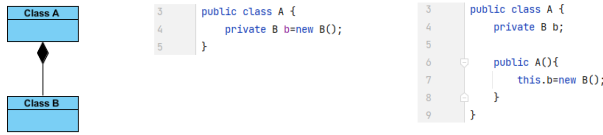

# 2. OO and Java Programming Refresher (2)
_10/10/21_

## Java collections framework
- A collection is an object that represents a group of objects
- Java Collections Framework contains data structures (Arrays, lists, maps etc)
- Java Collection Framework contains algorithmic operations (searching, sorting)

- **Collection**: Something that holds a dynamic collection of objects (Represents a group of objects/elements)
- **Map**: Defines mapping between keys and objects (Maps keys to values; no duplication)
- **Iterable**: Collections are able to return an iterator object that can scan over the contents of a collection one object at a time. (Represents an iterator object)
- **Queue**: Represents FIFO queues or LIFO stacks
- **Deque**: Represents a double ended queue
- **Set**: A collection that cannot contain duplicate elements
- **List**: An ordered sequence of elements that allows duplicate elements.

Classes that implement the collection interfaces typically have names in the form of `<Implementation style><Interface>`

- Non typesafe collections (**DO NOT USE**) - Collection constructors are not able to specify the type of objects the collection is intended to contain
- Typesafe collections with 'Generics' - Classes support generics by allowing a type variable to be included in their declaration; type are declared for the reference and constructor. Cannot type a collection using a primitive type (int -> Integer)

### TreeSet Class
Provides an implementation of the Set interface that uses a tree for storage. Objects are stored in sorted, ascending order.

### HashMap Class
HashMap is a Hash table implementation of the Map interface. This implementation provides all of the optional map operations, and permits null values and the null key

## Implementation of object oriented concepts in java
### Aggregation
An object of class B **is part of** an object of class A (semantically) but the object of class B can be shared and if the object of class A is deleted, the object of class B is not deleted.

### Composition
An object of class A **owns** an object of class B and the object of class B cannot be shared and if the object of class A is deleted, the object of class B is also deleted

### Inheritance
Forming new classes based on existing ones
Superclass: Parent class being extended
Subclass: Child class that inherits behaviour from the parent class.
"Is-A" relationship
### Polymorphism
- Polymorphism is an object oriented concept
- Method overloading and method overriding are two forms of polymorphism
- **Method overloading**: Methods with the same name co-exists in the same class but they must have different method signatures. Resolved during compile time
- **Method overriding**: Methods with the same name is declared in super and sub class. Resolved during runtime
### Abstract Methods and Classes
Abstract classes cannot be used to instantiate objects but references to abstract classes are legal
Classes can have instance methods that implement a default behaviour. May contain non-final variables
### Interfaces
- Methods are implicitly abstract and most cannot have implementations. Variables declared are by default static and final
- Interface is an abstract type that is used to describe a behaviour that classes must implement. May only contain method signature and constant declarations
- Cannot be instantiated, but rather are implemented
- A class that implements an interface must implement all of the non-default methods described in the interface, or be an abstract class.
- They are less restrictive when it comes to inheritance