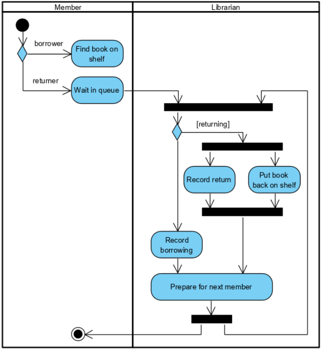
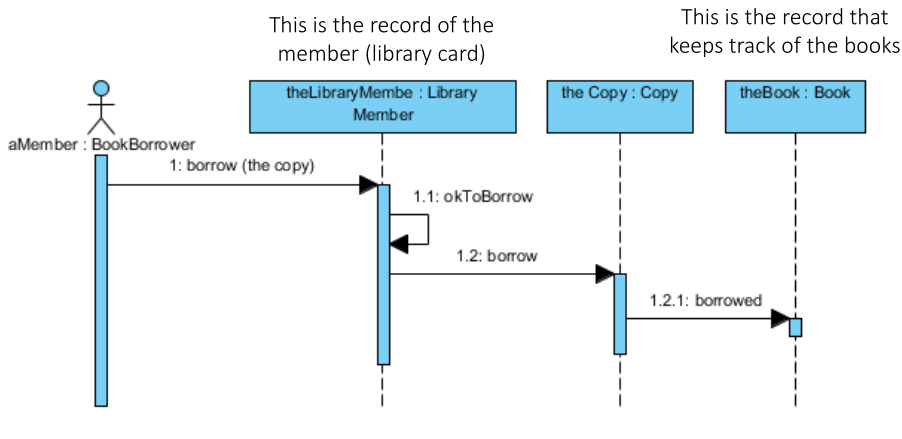
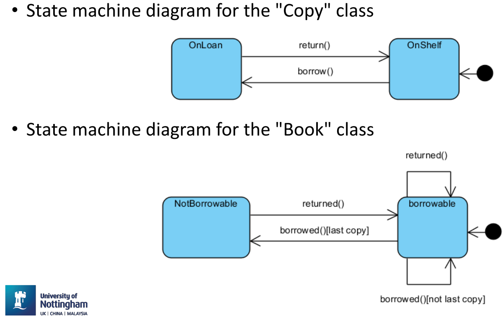
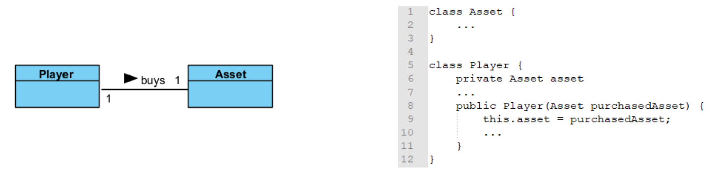
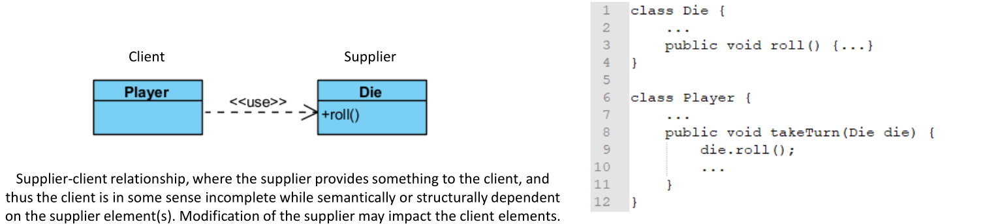
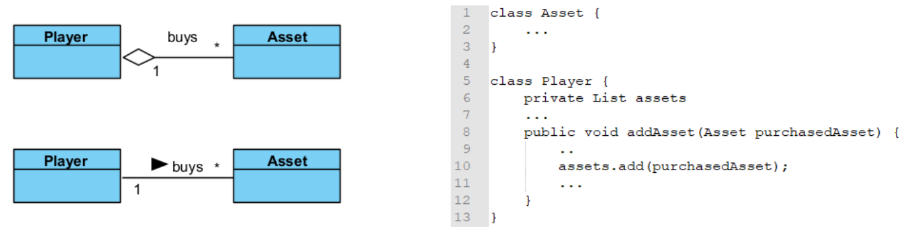
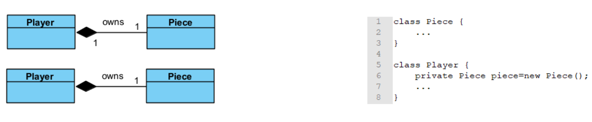
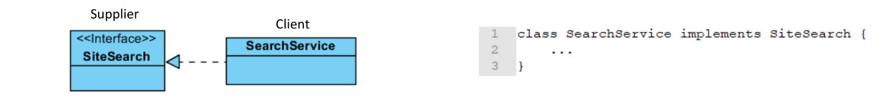
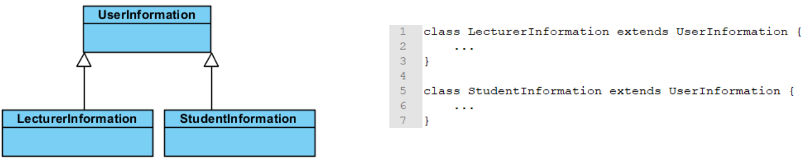

# 4.  Object Oriented Analysis & Design with UML

## Unified Modelling Language (UML)
> A specification defining a graphical language for visualising, specifying, constructing, and documenting the artefacts of distributed object systems

....

## Object Oriented Analysis
### Use Case Diagrams
- They describe a set of actions that some system(s) should or can perform in collaboration with one or more external users of the system or systems.
- No attempt to represent an order or a number of executions.
- Components:
	- Actors - Interface with the system, can be people or other systems
	- Use cases - Based on user stories, represent what the actor wants your system to do for them
	- Subject - Classifier representing a business, software system, physical system or device under analysis
	- Relationships - Between use case and actor. Association indicates which actor initiates which use case. Between two use cases

`<<inlcude>>` - Used when multiple use cases share a piece of same functionality which is placed in a separate use case. Arrow  points to the more specific use case
`<<extends>>` - Used when activities might be performed as part of another activity but are not mandatory for a use case to run successfully. 

- Base Path (Optimistic Flow) - Happy day scenario
- Alternative Paths (pragmatic flows) - Every other possible way the system can be (ob)used. Includes perfectly normal alternative use, but also errors and failures 

## Object Oriented Design
### Activity Diagrams
- Graphical representations of workflows of step wise activities and actions related to an individual use case or across many use cases
- Support representation of parallel behaviour

### Sequence Diagrams
Are a temporal representation of objects and their interactions
#### Components:
- Participant: Object or actors that act in the sequence diagram
- Vertical line (lifeline): Represent time as seen by the object
- Arrow from senders lifeline to receivers lifeline
	- General: Message, denoting an event or the invocation of an operation
	- Object creation: Arrow with 'new' written above it
	- Object deletion: An X at bottom of lifeline
- Sequence fragment: Let you show loops, branches, and other alternatives

### State Machine Diagrams
Show the possible states of a single object, the events or messages that cause a transition from one state to another, and the action that result from the state change. Only reactive objects require a state machine diagram!
#### Components
- State: A condition during the life of an object when it satisfies some condition, performs some action, or waits for an event. Special states:
	- Start State: Each state diagram must have one and only one start state
	- Stop State: An object can have multiple stop states
- Transition: Denotes the transition between states or to the same state (self-transition)
	- Trigger: The cause of the transition (signal, event, passage of time)
	- Guard: Condition which must be true in order for the trigger to cause the transition
	- Effect: Action invoked directly on the object that owns the state machine as a result of the transition,

### Class Diagrams
Shows the existence of classes and their structures and relationship in the logical view of a system
#### Components
- Classes
- Class relationships; Associations, dependencies, aggregations, compositions, realisations, generalisations
- Multiplicity indicators

#### Representation
Depicted as rectangles with three compartments:
- Class name
- Attributes: Describe the data contained in an object of the class
- Operations: Define the ways in which objects interact

Other symbols:
|     |           |
| --- | --------- |
| +   | public    |
| #   | protected |
| -   | private   |
| /   | derived   |
| $   | static          |

Associations between classes - Associated if an instance of class A (source) has to know about an instance of class B (target class) or vice verca

#### Multiplicity indicators
Number of links between each instance of the source class and targe class
|      |                                 |
| ---- | ------------------------------- |
| 1    | exactly 1                       |
| *    | unlimited number (zero or more) |
| 0..* | zero or more                    |
| 1..* | one or more                     |
| 0..1 | zero or 1                       |
| 3..7 | specified range (3-7)                                |

#### Relationships
##### Association
- Reference based relationship between two classes

##### Dependency
- Created when you receive a reference to a class as part of a particular method
- Indicates that you may involve one of the APIs of the received class reference and any modification to that class may break your class as well

##### Aggregation ("is part of" relationship)
- Same as association and often seen as redundant relationship
- Used when an object logically or physically contains another; the container is called "aggregate"; the components of the aggregate can be shared with others

##### Composition
- Relates to instance creational responsibility
- When class B is composed by class A, class A instance owns the creation or controls lifetime of instance of class B

##### Realisation
- Specialised abstraction relationship between two sets of model elements, one representing a specification (the supplier) and the other representing an implementation (the client) of the specification

##### Generalisation 
- Directed relationship between a more general classifier (subclass) and a more specific classifier (subclass)

