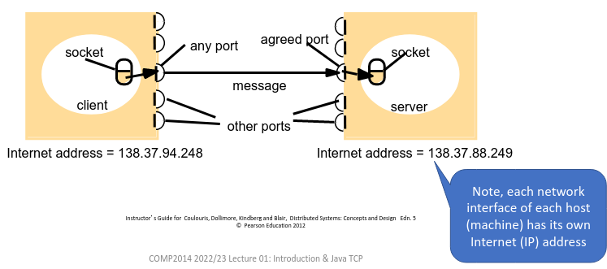

# 0. Client-Server Java
_31/01/23_
[MoodlePDF](https://moodle.nottingham.ac.uk/pluginfile.php/9349281/mod_page/content/2/01%20Client-Server%20Java.pdf)

**Distributed System** - Hardware or software components located at network computers communicate and coordinate their actions only by passing messages. They are everywhere!

Most applications are based on **sharing resources**. This is pervasive, powerful and often taken-for-granted feature of networked computer systems. 
- **Physical** - printers, disk, computers
- **Data** - resources, documents, databases, webpages
- **Computational/algorithmic** - Search engines, or machine-learning algorithms

### Services
- Distinct part of a computer system that manages a collection of related resources and presents their functionality to users and applications. 
	- Runs on a specific machine which physically hosts the managed resources
	- Provides a specific and controlled interface - usually over a network 
- Many distributed systems consist only of clients making requests to servers to access/alter the resources managed by that service

### Summary
- Distributed system is one in which *hardware or software components located at network components communicate their actions by passing messages*
- Typically distributed systems are build around sharing of resources, whether physical or informational
- Resources are typically encapsulated and selectively exposed over the network as services that are accessed by clients.
- Clients and servers are typically both OS processes, and communicate directly with each other

## Java Socket Programming
Messages are sent and received via sender and receiver queues/buffers. Sender performs a *send* operation; receiver a *receive* operation. Each endpoint is represented by a socket

### Sockets
- Provides an abstract representation of a communication endpoint within a process (TCP, UDP)
- To send and receive messages a (TCP/UDP) socket must be bound to a specific port
- A single process can have many sockets, but only one TCP server or UDP socket on a host can be bound to a given port at any time

### Message Destinations
- Send to the pair (Internet address, port number)
- If a clients identifies a server using a specific IP address then the server must always have that IP address
- If clients use names then a name service is used to translate this to network location at run time

**Address Resolution** - Every OS also provides an API for host name resolution. Internally the host will us DNS and/or other name services to look up the corresponding IP address

### Summary
- Socket represents a TCP or UDP communication end-point within a process
- A name resolution API is needed

## Java TCP programming
- `ServerSocket` - Represents a server TCP socket. Binds to a particular port
- `Socket` - Represents one end of a TCP connection
	- Created by a client with a specified server IP address and port number
	- Has a `java.io.InputStream` to receive bytes from and `java.io.OutputStream` to send bytes to

### TCP Considerations
- **Message Size** - Application reads/writes any number of bytes at a time until the connection is closed
- **Message Destination** - A server can accept connection requests from any client
- **Blocking** - Limited amount of data is buffered at sender and receiver sockets and sends will block once the sender buffer is full
- **Failure Model** - Communication is reliable short of complete failure
	- **Lost messages** are automatically re-transmitted. If not resolved within a time limit, whole connection fails
	- **Duplicate** packets are discarded and **out-of-order** packets are reordered using sequence numbers
- Uses - Everything required to transfer data reliably and/or in large amounts (HTTPS, SSH, FTP, SMTP)

### Summary
- TCP provides a reliable connection-oriented bidirectional byte-based stream service
- Java API comprises of `java.net.Socket` and `java.net.ServerSocket`
