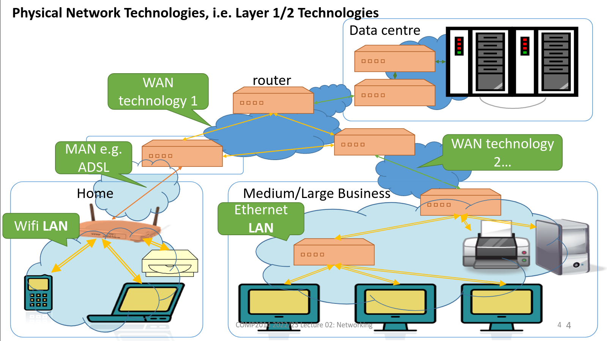
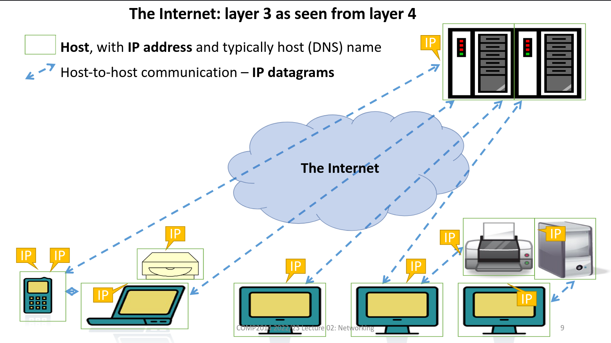
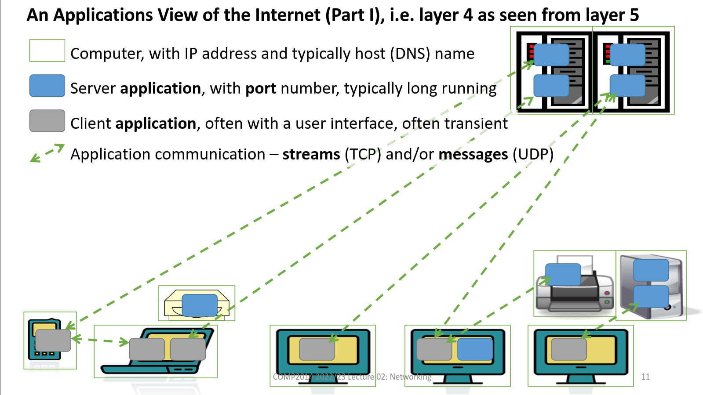
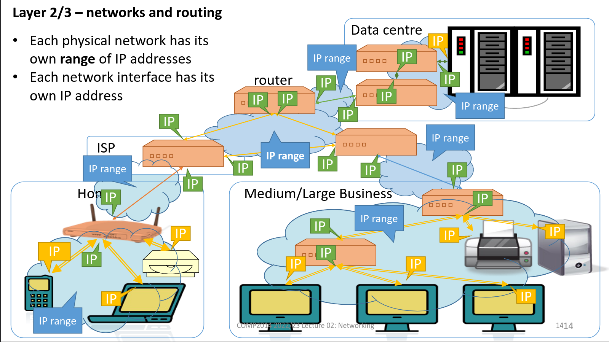
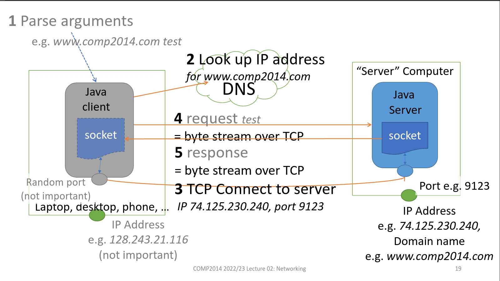
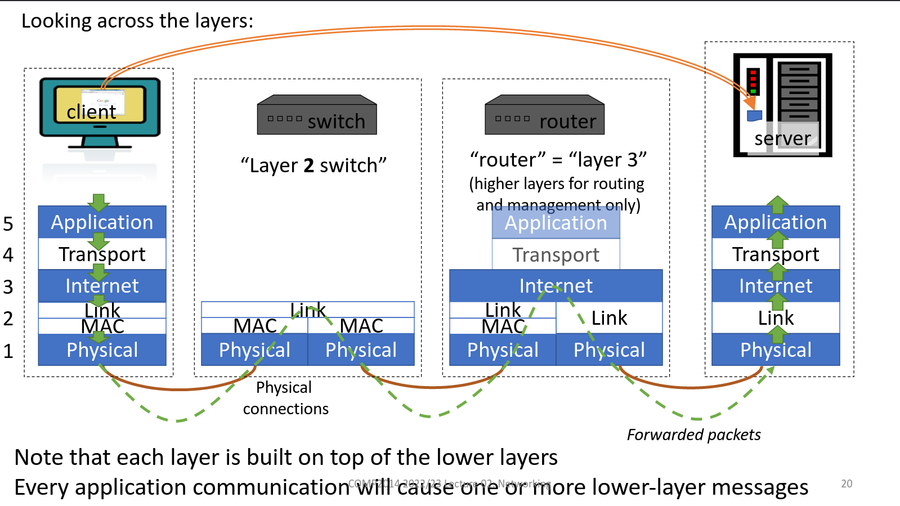
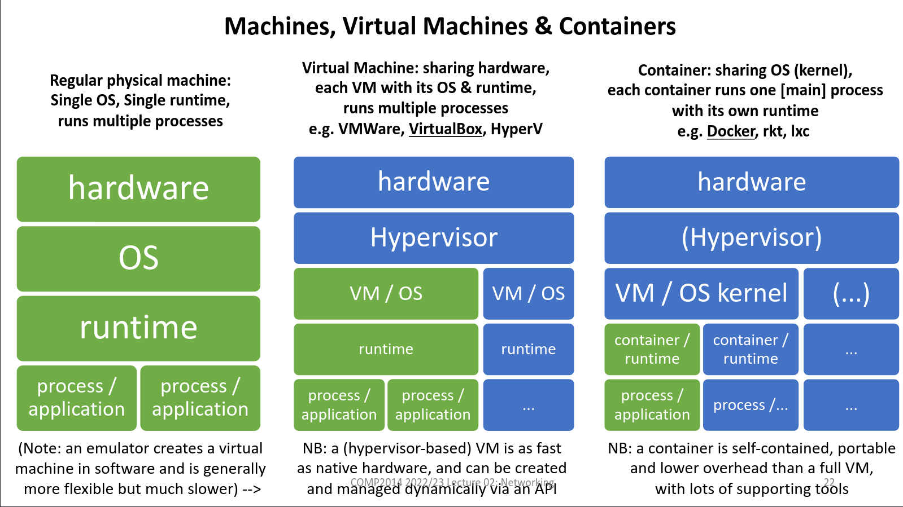
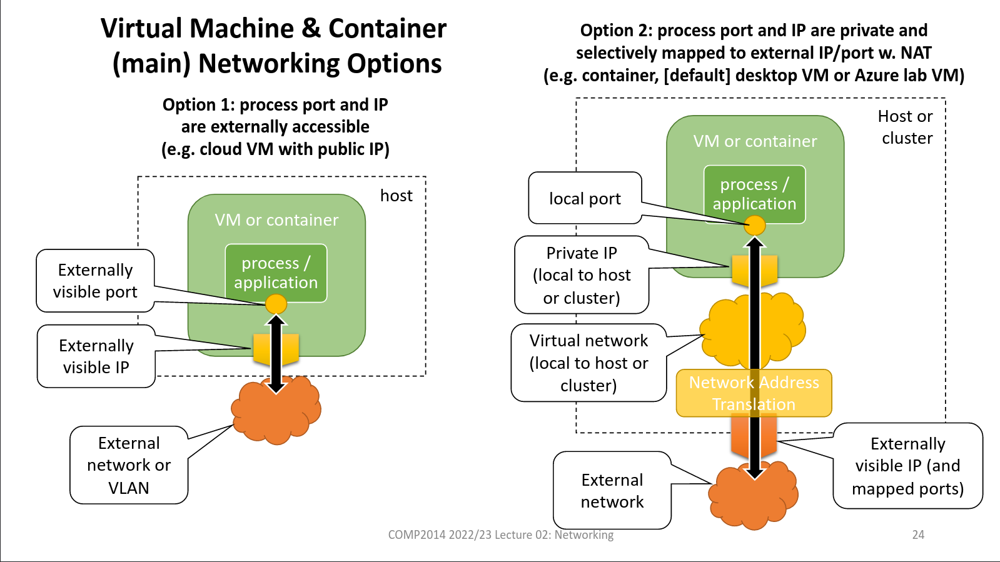

# 1.  Network (and virtualisation)
_03/02/23_
## Networking
- Networks are complex and use the layering pattern:
	- *lower* layers provide services that *higher* layers build on
- We'll focus on the Internet and the layered model that it uses

|     | Internet Model         |
| --- | ---------------------- |
| 5   | Application            |
| 4   | Transport (TCP/UDP)    |
| 3   | Internet (IP)          |
| 2   | Network interface/Link |
| 1   | Physical               |

|     | ISO Model    |
| --- | ------------ |
| 7   | Application  |
| 6   | Presentation |
| 5   | Session      |
| 4   | Transport    |
| 3   | Network      |
| 2   | Data Link    |
| 1   | Physical     |
|     |              |

### Layer1/2
- Each network can use a different technology, uses different bandwidth, latency and reliability.
- One computer can connect to several different networks
- Each network interface typically has its own layer 2 network address, often called a MAC(Medium Access Control) address.
- Some networks allow a single message to be physically sent to all machines on that network

## The Internet: IP, TCP and UDP
### Internet 
1. Illusion of a single network provided to users and applications. 
2. Underlying physical structure with routers interconnecting networks.i

- Based on specific layer 3 and layer 4 protocols plus supporting layer 5 protocols (DNS, routing)
- Provides a unifying pointer for almost any network application.
	- Doesn't care what technologies/protocols it is built on (layers 1 and 2)
	- Doesn't care what applications it is used for (layer 5)

### Typical Network Protocol Stack

| Layer | Name                     | Common Protocol(s)          | Scope                           |
| ----- | ------------------------ | --------------------------- | ------------------------------- |
| 5     | Application              | HTTP, DNS(DHCP) ((routing)) | Application-specific            |
| 4     | Transport                | TCP, UDP                    | Generic packets and streams     |
| 3     | Internet                 | IP(ICMP, ARP)               | Global Communication            |
| 2     | Network Interface (Link) | 802.11 - Ethernet, WiFi     | Single hop (link) communication |
| 1     | Physical                 | Ethernet PHY, ADSL          | Signals & physics               |
|       |                          |                             |                                 |

### The Internet model
- Every networked machine is a node or host (has one or more IP addresses)
- Any machine can send a packet of data to any other machine (aka a datagram)
- Packets may be lost, delayed, corrupted or duplicated, although there is some checking for corrupted data. (Termed a best effort service)

### TCP and UDP: Streams and Messages
- Applications don't use IP directly. Use either TCP or UDP
- TCP - Reliable, bidirectional connection-oriented service for stream of bytes
- UDP - Best effort connectionless service for messages = packets of bytes. Uses IP directly and normally 1-1.

## Routing and Configuration

### Routing and Forwarding
- Routers have interface on two or more networks and forward packets from one network to the next
- Have **routing tables** - identify for each destination IP address which interface/host to sent it to next
- Host and routers work together to deliver each packet to its destination

### Host Configuration
- Every host needs to know
	- Own IP address and the range on the network
	- IP addresses of other routers(gateway) and the IP of the DNS
- Often discovered when the machine connects to a local network by using DHCP (Dynamic Host Configuration Protocol).This provides the information
- Servers may be statically configured

### Router Configuration
- Partly configured statically with IP address for each of its network interfaces and a range for each directly connected network
- Routers use routing protocols to exchange information with other routers

## Java TCP Infographics

## Virtual machines, containers, the cloud and SSH

**Hypervisor** allows efficient virtualisation of a single computer to create multiple isolated Virtual Machines (VM).

**The Cloud** - Computing in remote data centres. Many services are available:
- Infrastructure as a Service (IaaS) - Virtual machines, virtual disks
- Containers as a Service (CaaS) - Container hosting
- Platform as a Service (PaaS) - Language-specific application hosting
- Serverless - Auto scaling application or function hosting
- Software as a Service - End user applications (Office 365)

**SSH** - Network protocol allowing secure remote access. Creates an interactive shell.

**Low-level Network Security** 
- Physical Layer, 1, deals with signals and direct physical communication. 
- Network Interface (Link) Layer, 2, deals with single hop (link) communication. May have its own MAC addresses