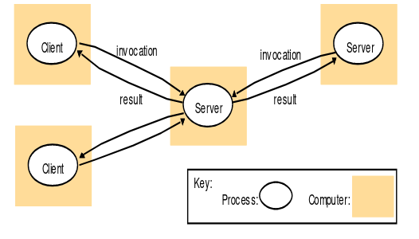
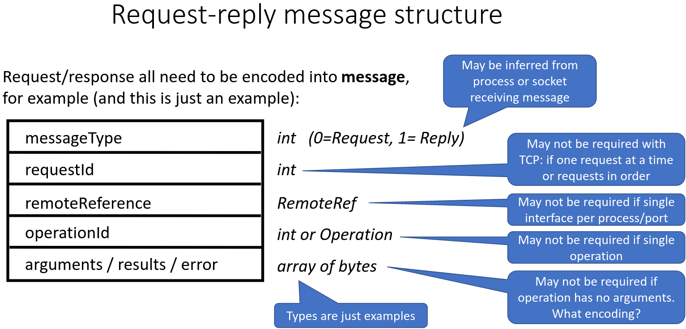

# 2. Request-Reply and Java UDP
_07/02/23_

[MoodlePDF](https://moodle.nottingham.ac.uk/pluginfile.php/9364061/mod_page/content/1/03%20Request-Reply%20and%20UDP.pdf)
## Introduction
- Network protocol - Set of rules on how to communicate. If everyone follows the same rules then effective communication is achieved
- Distributed System Challenges - Common challenges consist of
	- **Heterogeneity** - coping with system component variability
	- **Failure Handing** - Coping with partial failure
	- **Concurrency** - Correctness and performance with concurrency
	- Openness - To extension or reproduction
	- Security - Protection form threats
	- Transparency - Selective abstraction
	- Quality of Service - Performance & other non-functional characteristics

### Heterogeneity
- All the parts of a distributed system has to work together, even if they are different
- Will mean using common protocols, interfaces and encoding 
- E.g. Java Data IO Streams

### Failure Handling
- Can fail in complicated ways, (different parts can fail at different times)
- Coping with failure typically requires some level of redundancy, and specific means detecting and responding to partial failures
- E,g, simple TCP server

### Concurrency
- The different processes in a distributed system normally run concurrently
- This may requires additional checks and communication to ensure global consistency
- Use alternative approaches with weaker consistency
- E.g. The example TCP server is multi-threaded so that it can serve multiple independent clients concurrently
## Request-reply Protocols
Typical pattern for **client-server** interaction. Request and response are messages carried by selected inter process communication mechanism (TCP, UDP)

- Within the client, the server needs to be identified by a remote reference; IP, port, optional additional process-internal identifiers.
- Server may support several different operations
- Client and server must agree on how arguments are encoded
- Client normally blocks until the response is received. Protocols can be reply-less(one-way) or asynchronous (reply is read by the client and later operated on)

UDP Request - Only know if its been successful if you receive a response. Don't know if the response or reply got lost etc. Can set a timer to resend out request incase it got lost.

### Implementation
- **Message Identifiers** - Each request is given a unique ID. Useful to help match responses to requests at the client
- **Failure Model** - Can suffer from communication omission faults and process omission faults. 
- **Timeouts** - Client typically uses a timeout to detect a *missing* reply. Client will re-transmit the request if time exceeds limit.
- **Duplicate request messages** - Can be detected in the server from the duplicate message identifier.  If response has already been sent then the response will need to be sent again.
- **History** - With *idempotent* operations performing the operation twice makes no difference. Yet sometimes the server should not execute a duplicate request. Results get held in history.

**Idempotent/Idempotence** - Making multiple identical requests that have the same effect as making a single request. 

### TCP vs UDP
| TCP                             | UDP                         |
| ------------------------------- | --------------------------- |
| Establish connection first      | No connection overhead      |
| Request/reply = stream of bytes | Request/reply = 1 message   |
| No size limit                   | Few KB                      |
| Reliably delivered in order     | May be lost or out of order |
| HTTP, SMTP                      | DNS, DHCP                   |

## Java UDP Programming
- `DatagramPacket` - Representing a UDP datagram
- `DatagramSocket` - Representing a UDP socket

### UDP Considerations
- **Message Size** - Hard limit of 65508 bytes, but often 8k or less. Larger sizes are broken up into fragments
- **Blocking** - Receive normally blocks until a message is received. Socket timeout can be specified
- **Receive from any** - Normally a socket will accept messages from any sender
- **Failure Model** - Best effort, checksum used to check for corruption, out of order packets etc
- **Uses of UDP** - Small messages and very simple interactions (DNS). Also supports Multicast communicaiton
	- Avoids overheads of TCP
## Java Data Encoding
TCP - Sequence of bytes
UDP - Array of bytes

**Marshalling** - Process of converting program data to network form

**Unmarshalling** - The converse

JSON - Cross-language UTF-8 text-based encoding including maps and arrays
XML - Cross-language text-based encoding with HTML-like markup