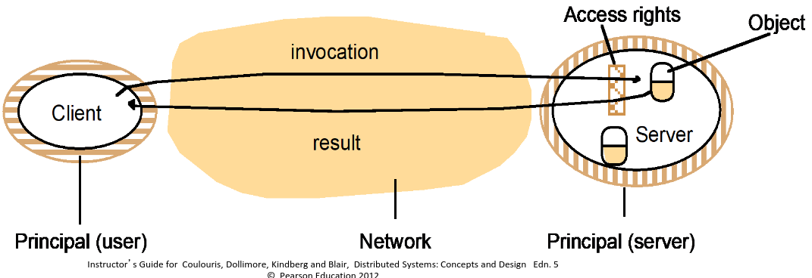
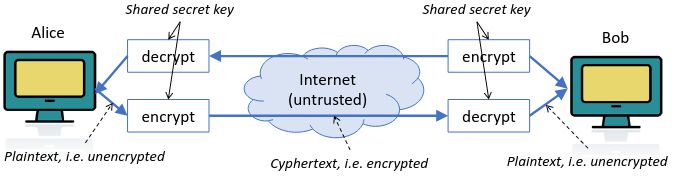

# 3. (Network) Security
_10/02/23_

[MoodlePDF](https://moodle.nottingham.ac.uk/pluginfile.php/9364073/mod_page/content/1/04%20Security.pdf)
## Security Models and (Network) Threats
> The security of a distributed system can be achieved by **securing** the **processes** and the **channels** used for their interactions and by **protecting** the **objects** that they encapsulate against unauthorised access.

### Protecting Objects
- Server manages a collection of objects on behalf of some users
- Users run client programs which send invocation requests to the server to perform to perform operations on the objects

- **Access rights** - specify who is allowed to perform the operations of an object
- Each request is associated with a principal 
- Server is responsible for enforcing the access rights associated with each object & verifying the identity of the principal behind each request
- Client may check the identity of the principal behind the server
- Server and peer processes expose their interfaces, exposing them to attack from other process

### Network threat model
To model network security threats we postulate an enemy that is:
- Capable of sending any message to any process and
- **reading** or **copying** any message sent between a pair of processes
- May be able to send messages using our identity
## Network exploits & attacks
- **Wiretapping/Eavesdropping** - Making a copy of a packet as they traverse a network in order to obtain information
- **Replay** - Sending packets captured from a previous session
- **Packet Interception** - Removing a packet from internet which allows substitution and man-in-the-middle attacks
- **Address or Name Spoofing** - Impersonating a trusted host in order to intercept packets or have malicious packets accepted for processing
- **Denial of Service(DoS)** - Flooding a site with packets to prevent the site from successfully conducting normal business
- **Distributed Denial of Service (DDoS)** - Attacker coordinates a large set of hosts throughout the Internet they each send a stream of packets to the same server(botnet)
- **Mobile Code** - Sending malicious code to be run on another machine
- **Trojan** - Provides illegitimate access to the machine
## Encryption and VPNs
- Cryptography is a fundamental tool in security
- Sender applies encryption to scramble the bits, such that only the intended recipient can unscramble them
### Private-key (symmetric) encryption
- Private key, the key must be kept a secret. Each pair of communicating entities share  a single key that serves as both an encryption key and decryption key i.e. symmetric

### Public-key (asymmetric) encryption
- A public key system assigns each entity a pair of keys
	- Private key is secret
	- Public key is published along with the name of the user
- Either key can be used to encrypt it, but the other key is needed to decrypt it
### Private Networks
A company leases dedicated data circuits between each sites. Very hard for a third party to eavesdrop. Only your company would have access, and its a dedicated hardwired. However very expensive.
### Virtual Private Networks (VPNs)
- Uses encryption to provide secure access to an organisations intranet from remote sites
- Can cross across the internet safely uses encryption
- Personal VPNs are used to to connect into company's organisation. Done through software or through router.
## Firewalls and NAT
- **Routers** - Forrward packets towards their destination without changing them
### Firewalls
- **Firewalls** - Is essentially a router. It is placed between an organisation and the internet for protection. This examines each packet and decides whether to forward the packet or discard it
- Organisational firewall defines a secure perimeter that prevents outsiders from interfering with the organisations computers.
- Machine can also have its own firewall
- A manager configures the packet filter by specifying which packets can pass in each direction
- Typically based on IP addresses and application port numbers
- May also examine payload (called Deep Packet Inspection or Application-Layer firewall) (layer 5/ HTTP URLs)

### NAT
Network Address Translation (NAT) - Devices change the local IP addresses and ports when they pass on packets
- This is usually part of a router - used in most home routers and corporate networks.
- Will use private IPs inside the network (10/192/172)