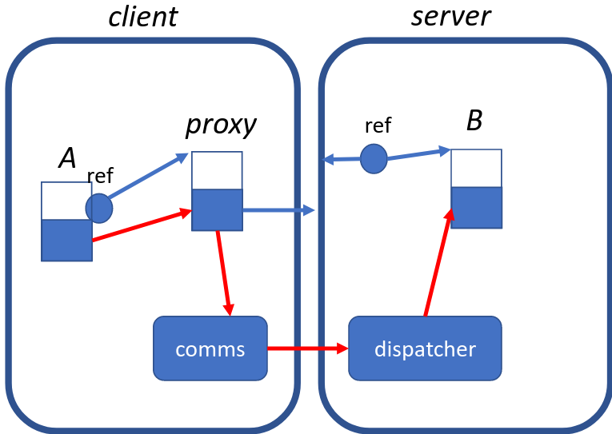

# 4. RPCs & RMI
_14/02/23_

[MoodlePDF](https://moodle.nottingham.ac.uk/pluginfile.php/9375263/mod_page/content/2/05%20RPC%20and%20RMI.pdf)
## Remote Procedure Calls
- Concept that programmers should be able to invoke remote operations in the same way as local procedure calls
- The starting point is the programmers perspective
- Three key considerations; Interfaces, Semantics, Transparency

### Programming with Interfaces
- Many languages support modularisation with programmer-defined interfaces. Defines a public contract
- Code external to the module can only use things in the interface. Need to understand the interface, not the implementation
- A module can be replaced by another with the same interface and nothing else needs to be changed

### Local vs Remote procedure calls
- Different modules may be running in different processes but can still have defined interfaces
- Not normally possible for code in one process to access variables in another process. Single machine blocks of shared memory can be created to share variables between processes
- **Call by reference** parameter passing is not possible between processes over networks
- A reference or pointer is not meaningful in another process
	- Reference = an address in local process memory
- Parameters need to be clearly identifiable as passed **to** the procedure **(in)**, returned **from** it **(out)** or **both (inout)**

**Interface definition languages (IDLs)** - Interfaces defined using a language built-in interface.

### CORBA IDL Example
```
// In file Person.idl  
struct Person {  
	string name;  
	string place;  
	long year;  
};  
interface PersonList {  
	readonly attribute string listname;  
	void addPerson(in Person p);  
	void getPerson(in string name, out Person p);  
	long number();  
};
```

### RPC call semantics
- Local procedure call semantics are always exactly one
- Remote procedure calls can have different semantics
	- **Maybe** semantics - executed once or not at all
	- **At-least-once** semantics - the caller receives a result or an exception is raised
	- **At-most-once** semantics - the caller receives a result or an exception is raised

### Transparency 
- RPCs are a good example of access (and location) transparency
- In practice is often limited. Remote operations can **fail** in more and different ways. Also typically slower
- Most RPC systems will strongly resemble local procedure calls but with some additional elements

## Remote Method Invocation
- Applies the concept of RPC to distributed objects
- Same as RPC in terms of interfaces, call semantics and transparency
- Also allows object-oriented concepts to be used
- Also allows references to objects to passed over the network, giving more options for parameter passing

### Distributed Objects
- Since each object encapsulates its own state, different objects in the same system can be hosted by different processes
- Adopting the client-server paradigm, invoking a method on an object in another process is a RMI
- A remote object reference represents a particular object anywhere with a distributed system
- A remote interface specifies which of an object methods can be invoked remotely

### Implementing RMI
Remote reference to *B* must identify both the process and the specific object. If passed to another process will create a proxy object in that process


Object *A* (in the client) makes a local method invocation on the proxy. The process hosting the original object has a shared dispatcher for the objects it hosts


## Java RMI
- Java-specific RMI middle-ware, and specific to the Java language.
- Many similarities with other distributed object systems (COBRA)

Remote interfaces in Java RMI - Defines using Javas `interface` mechanism. However has to extend `java.rmi.remote` and throw a `RemoteException`. Arguments and return values must be serialisable 

### Serialisable vs Remote
- Primitive types - converted to a standard external representation and sent to the other processes
- Instances which implement `java.io.Serializable` - converted to a standard external representation (send a copy)
- Instances which implement `java.rmi.Remote` - Causes a new remote reference to be created and sent (send a remote reference)

Implementing a Remote Object - Each remote interfaces needs an implementation that will be run in the server process. Implementation extends `java.rmi.server.UnicastRemoteObject` and constructor throws `java.rmi.RemoteException`

### RMI Registry
- RMI provides a standard broker application called the rmiregistry
- Remote objects are identified using URL-like strings
- Before a remote object can be found its hosting process must register it using `bind` or `rebind`
- A client can then `list` registered objects and/or obtain a remote reference to a registered object with lookup