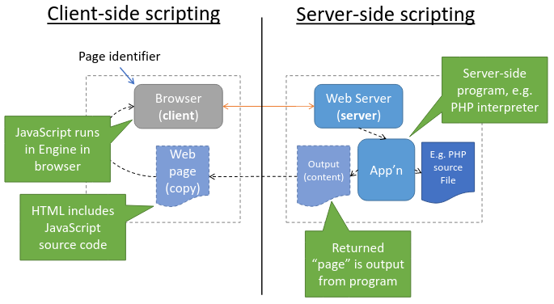

# 7.  WWW and HTPP
_28/02/23_

[MoodlePDF](https://moodle.nottingham.ac.uk/pluginfile.php/9398780/mod_page/content/1/09%20WWW%20and%20HTTP.pdf)

## The Word Wide Web and URLs
- WWW - Is a distributed system for publishing and accessing resources across the internet
- It is a client server system, web browsers are the commonest client
- Based on a request-response protocol (HTTP)

### Web Protocols
- HyperText Transfer Protocol (HTTP) - A transfer protocol that specifies how a browser interacts with a web server
- Uniform Resource Locator (URL) - Representation standard that specifies the format of web page identifiers
- HyperText Markup Language (HTML) - A representation standard that specifies the contents and layout of a web page

### Browser: Handling a URL
1. Divides the URL into protocol, computer name & port, document name, parameters
2. Use the protocol to decide which protocol to use
3. Use the computer name and protocol port to form a TCP connection to the server on which the page resides
4. Use the computer name, document name and parameters to request a specific page from the server using HTTP
5. Displays the content (or error) received from the server

### Browser: URLs and Navigation
- Each tab in a browser is displaying the content retrieved from one URL
- URL can be changed by entering new url, hyperlink or code
- AJAX can also be used to make a http request in the background

## HTTP
- Primarily transfer protocol that a browser uses to interact with a web server.
- HTTP is a request-response protocol 

### Methods
- **GET** - Requests a document; server sends a copy of the document
- **HEAD** - Request status information; server sends status (headers) only for the request document
- **POST** - Sends data to a server
- **PUT** - Server replaces the data
- **DELETE** - Request document be deleted

### Response
- 200 - OK
- 400 - Bad Request
- 403 - Forbidden
- 404 - Not Found
- 301 - Moved
- 307 - Redirect

## HTML & Scripting
- Representation standard that specifies the syntax of a web page for display in a browser

**Client-side scripting** - Embedded JavaScript which is run in the browser. Handle user input events, make HTTP requests, dynamically update the HTML.

**Server-side scripting** - HTML the server receives could be static or dynamically generated. (generated on-the-fly by running code on the server to handle)

