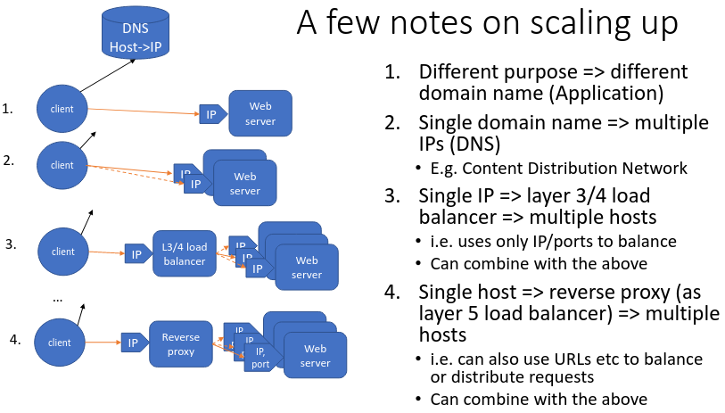

# 8.  HTTP Servers and APIs
_03/03/23_

[MoodlePDF](https://moodle.nottingham.ac.uk/pluginfile.php/9398826/mod_page/content/1/10%20HTTP%20Servers%20and%20APIs.pdf)

## HTTP Servers
- HTTP servers normally run on well-defined ports
- http (80), https(443)
- So all TCP connection requests to a host will (initially) arrive at the same process
- So TCP port numbers (layer 4) are NOT normally useful for distinguishing between services using HTTP on a single host
- Each server will require typically explicit configuration

### Routing Requests
- Server can handle each request differently depending on its:
- URL domain (host) name
- URL path
- Identified file type/extension
- Client IP address
- HTTP Headers
### Handling Requests
- **Static file** serving - the web server uses the URL path to identify a file which is copied back as the response body
- **CGI** - the server executes a program (identified by the URL) in a separate process to handle the request
- **Dynamically loadable module** - the server loads a runtime engine to execute a file in a scripting language
- **Reverse proxy** - the original server becomes an HTTP client to pass the request onto another web server
- **Custom web server** written using a language-specific web server framework - the web server includes the code to handle specific requests

## HTTP APIs
- HTTP is often used as a standard transport mechanism for program-to-program interaction
- Normally defined in terms of permitted combinations of
	- URL -> services and operation or resource (REST)
	- HTTP method
	- Authentication requirements
	- Request data
	- Response data
	- Error responses

### Defining HTTP APIs
- Usually language-independent 
- Can be defined; manual documentation, automatically from the server implementation, machine-readable interface definition/specification

### Types of HTTP API
- Form-/query-style
- REST (REpresentational State Transfer)
- RPC (Remote Procedure Call)
- Can be a mixture of both

### HTML Form- or Query-Style Operations
- URL defines the server and operation (path)
- HTTP method is GET (normal navigation or data requests) or POST (operations with side effects)
- Arguments are a list of names and text variables
	- In the URL query (GET)
	- In the request body (form POST), encoded either
- Response body is machine readable results
- Errors may be signalled by HTTP status and/or response body

### REST - Representational State Transfer
- URL identifies a specific resource (database record)
- HTTP method identifies operation to perform
- For GET the response body (result) is an external data representation of the identified resource
- For PUT/POST the only argument - the request body is also a new representation of the identified resource
- Errors are signalled by HTTP status whenever possible

### Remote Procedure Call (RPC)
- URL typically identifies a specific service
- HTTP method is normally POST
- Body of request encodes a list of arguments, and a specific operation name is not specified by URL
- Response body encodes status and results of operation
- Errors normally signalled within the response body