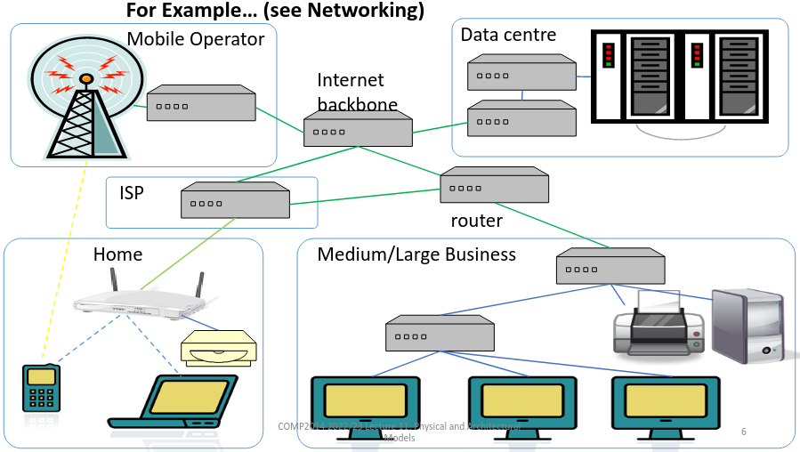
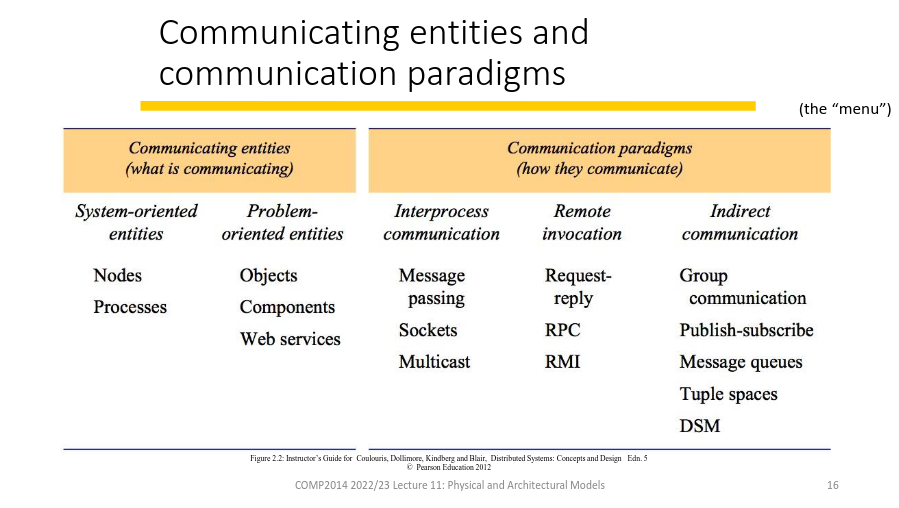
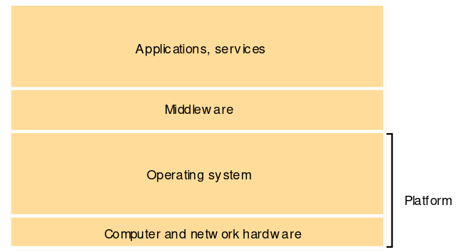
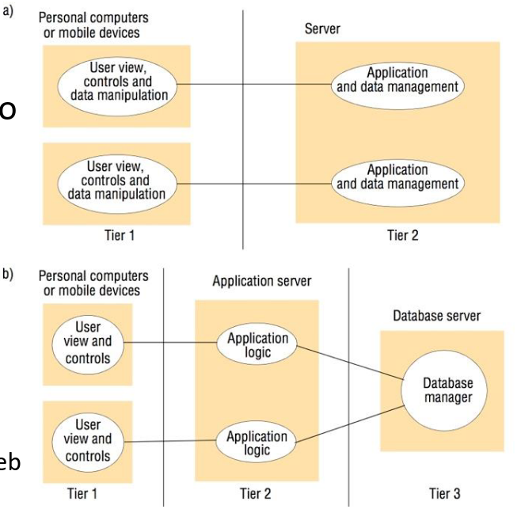

# 9. Physical and Architectural Models
_07/03/23_

[MoodlePDF](https://moodle.nottingham.ac.uk/pluginfile.php/9410761/mod_page/content/1/11%20Physical%20and%20Architectural%20Models.pdf)

- **Physical** models - Hardware components and networks
- **Architectural** models - Computation and communication tasks and their relationships
- **Fundamental** models - Abstract, specialised models
	- **Interaction** models
	- **Failure** models
	- **Security** models
## Physical Models

### Generations of distributed systems
- **Early** - Late 1970s/early 1980s, 10-100 nodes on a local area network
- **Internet Scale** - 1990s/early 2000s, many nodes but mainly desktop/server computers
- **Contemporary** - Late 2000s+, plus mobile devices, ubiquitous computing/IoT (embedded devices) and cloud computing

## Architectural Models
### 1. Communicating entities
From a system perspective
- Communicating entities are usually processess managed by operating system
- Simple computing nodes may have no operating system

From a programming perspective
- Objects: as in Object-Oriented programming, present well-defined interfaces made up of methods
- Components: Have interfaces similar to objects, also describe their dependencies
- Web Services: With interfaces defined in terms of WWW technologies and standards

### 2. Communication Paradigms
From system perspective
- Message-passing primitives
- Sockets interface for messages and streams (UDP, TCPIP)
- Multicast (1-M) physical communication
- Direct Communication = Message exchange between specific identified (and addressed) entities
	- Remote invocation - direct imperative-style message exchange
- Request-reply protocols - Client server stype (HTTP)
- Remote Procedure Call (RPC) and Remote Method Invocation (RMI)
	- make remote communication like local code execution
- Internet Communication - where a message is *not* addressed to one specific entity 

### 3. Roles and Responsibilities
Client Server
- Cleint initaites requests 
- Server handles requests against the resources that it manages and responds with a result
- A server can be a client for other servers

Peer-to-peer
- No distinction between entities in the network - every node or peer is essentially the same
- Each node typically runs the same program, and manages some local resources

### 4. Placement
Can affect: performance, reliability, security, scalability
#### Common strategies
- Mapping of a service of multiple servers - several processes on different machines can work together to provide a single logical service (WWW, DNS)
- Caching - Temporarily storing recently used data closer to where it was
- Mobile Code - Moving code to another process to run rather than moving data
- Mobile agents - Moving complete running processes to another node

## Architectural Patterns
Ways of organising distributed systems that are found to be useful in many different systems

### Layering
- Partitioned into a number of layers, with a given layer making use of the services offered by the layer below
- E.g. network protocol stacks
- 

### Tiered Architectures
Functions of the system are divided into distinct layers or tiers
- Each of which is comprised of specific processes
e.g. 
- Two-tier client server system, distributed printing, thin-client/remote desktop
- Three-tier web system, with separate (dedicated) database server, web (application) servers and clients (browsers)

### Some more patterns
- [Caching](#4.Placement)
- **Proxy** - An object (or service) presents the same interface as a remote service but more locally, and passes on requests (perhaps with some added functionality)
- **Broker** - A common point where service providers can register their existence so that clients can find them

### Middleware
A common software layer, above the operating system but common to many applications, that supports particular communication paradigm(s)
Tailored to mix and match