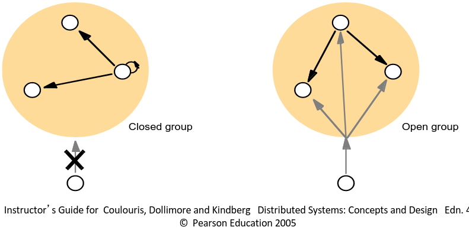
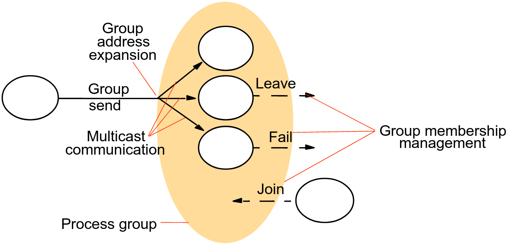
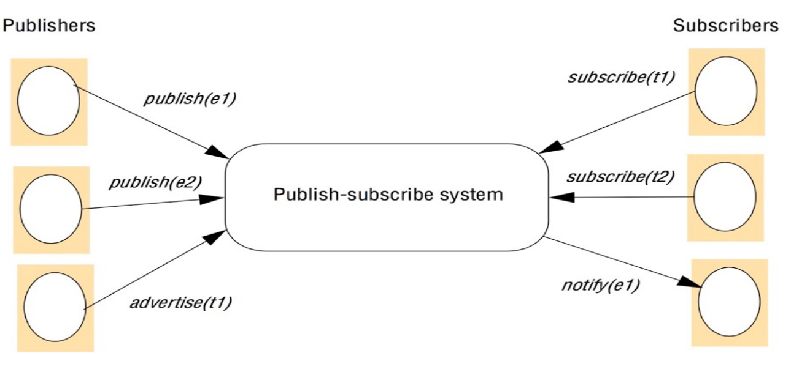
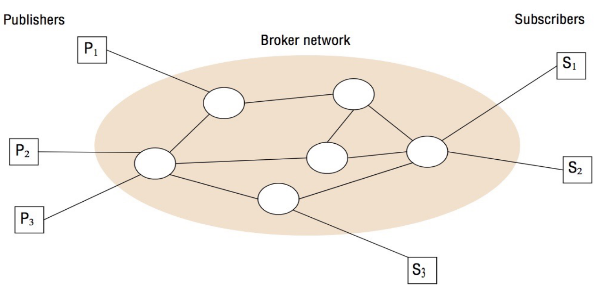

# 10. Indirect Communication (1)
_10/03/23_

## Indirect Communication
> Communication between entities in a distributed system through an intermediary with no direct coupling between the send and the receiver(s)

**Space Uncoupling** - The sender does not (need to) know the identity of the receiver(s) and vice versa. E.g. partitions can be replaced, updated, replicated, migrated
**Time Uncoupling** - The sender(s) and receiver(s) can have independent lifetimes. E.g. in a volatile environment 

Asynchronous message passing = "synchronisation uncoupling"

### Indirect communication paradigms
- A range of paradigms where; a message is *not* addressed to one specific entity, but, is sent to many entities and/or is sent via some intermediary

## Group Communication
- An application-level abstraction of multicast communication (may be implemented over IP Multicast but doesn't have to be)
- Typical applications: 
	- Reliable distribution to large numbers of clients(finance)
	- Collaborative applications
	- Fault-tolerance
	- System monitoring and management

**Group programming model** - There are groups that processes can join or leave. A message sent to a group is delivered to all members of that group

### Options
Closed and open groups (Non-members cannot send to closed groups)

- **Overlapping** and **non-overlapping** groups - Non-overlapping => each process can be a member of at most one group at any moment
- **Synchronous** and **asynchronous** communication - Synchronous *group* communication => does a sender blocks until *all* group members have received the message/replied

### Implementation Issues
#### Reliability
For a group communication extends that for direct communication:
- Integrity - The message received is the same as the one sent, and no messages are delivered twice
- Validity - Any outgoing message is eventually delivered
- Plus Agreement - If the message is delivered to one process, then it is delivered to all processes in the group
#### Ordering
Ordering constrains are imposed on delivered messages; typically a trade-off -> stricter ordering constrains => longer delays and more messages
- FIFO - Messages from one sender are delivered in the same order in which they were sent
- Casual order - If one message happens before another then it is delivered first
- Total order - All messages are delivered in the same order in every process
#### Group Membership Management
- Group membership is fundamental. System must be able to map groups to members
- Normally requires an explicit management interface
- For reliable communication there must also be failure detection
	- Member crashes - must be removed from the group
	- Network partitions - group partitions on half of it fails
- The group may provide notification of group changes

## Publish-Subscribe
(Distributed event-based systems)

- Publishers publish structured events
- Subscribers express interest in particular events
- An event service matches published events to subscriptions, notifying subscribers accordingly
- Optionally, publishers may also advertise that they produce certain types of event

### Applications
- Financial information systems
- Live feeds of realtime data
- Cooperative work with events of shared interest
- Ubiquitous computing
- Monitoring applications

### Pub-sub characteristics and options
- **Heterogeneity** - Publishers and subscribers can be created with different technologies and completed independently of each other
- **Asynchronicity** - Publishing an event is almost always asynchronous
- **Delivery guarantees** - Systems can vary in reliability and ordering of events

### Subscription (filter) model
How subscriptions are expressed
- **Channel-based** - Each event is published to a specific channel | subscribers subscribe to channels
- **Topic-based** - Each event has a topic (or subject) | subscribers identify topic(s) of interest
- **Content-based** - Each event has structured content | subscribers specify patterns to be matched by each event
- Type-based - Events are type | subscribers specify types of interest
- Objects of interest - events are linked to a specific object | subscribers specify the objects of interest
- Semantic filtering - events are described using a formal ontology
- Complex event processing - subscriptions are based on more than on event

### Centralised vs Distributed implementations
- A centralised event service - relatively easy to construct. The event service becomes a bottleneck
- A distributed event service - more complex, but more scalable

### Event routing in a distributed event system
- **Flooding** - every event is sent to every event broker
- **Filtering** - Event brokers share subscription information and forward events to where valid subscriptions exist
	- Advertisements from publishers may help to filter subscription information for forwarding 
- **Rendezvous** - There is a way to identify particular event brokers to handle matching events and subscriptions