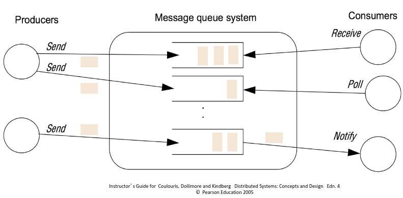
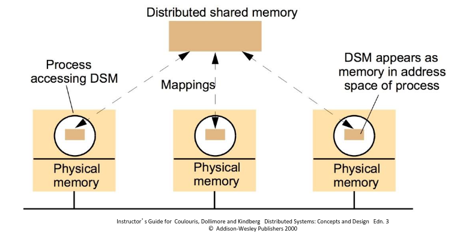

# 11. Indirect Communication (2)
_14/03/23_

[MoodlePDF](https://moodle.nottingham.ac.uk/pluginfile.php/9418539/mod_page/content/4/13%20Indirect%20Communication%202.pdf?time=1678721057822)
## Message Queues
- Message queues (MQ) support 1-1 communication. (1-M of multicast & pub-sub)
- Space uncoupled - messages are sent via message queues
- Time uncoupled - message queues exist independently of message producers and consumers
- Also known as message-oriented middleware (MOM)
- Commonly used for integrating back-office systems

### Message Queue Operations
- **Send** - add a message to a queue. Typically to the tail of the queue, can be configured
- **Receive** - Take a message from a queue. Typically head, can be configured
- **Poll** - Check head of queue without taking the message
- **Notify** - Inform a potential consumer that a message is available

### Implementation Notes
- Messages typically comprises of:
	- Destination - identifying the queue
	- Metadata or header - priority, delivery mode
	- Body - payload or content of message
- Message queues are typically persistent and reliable

Java Messaging Service (JMS) is a common API specification

## Distributed Shared Memory
- DSM systems emulate shared memory between processes on different computers
- The DSM system sends messages between nodes to maintain a consistent view of memory
- Much slower than local shared memory
- Typically requires additional disciplines such as use of locks

## Tuple Spaces
- Several processes can share a single tuple space
	- Similar to distributed shared memory
- All values are tuples
- Tuples can be written to (write), read from (read) or taken from (take = read and delete) the tuple space
- Reads and takes are done by pattern matching

### Characteristics
- Like message queues, tuple spaces are both space uncoupled and time uncoupled
- (many) Tuple spaces can also support transactions
	- automatically group a sequence of read/take.write operations

JavaSpaces is a tool for tuple space communication part of JINI. Strictly is an object space

## Example: Redis
- Is an in-memory data structure store, used as a database, cache, and message broker
- Provides data structures
- Each data-structure is identified by a key