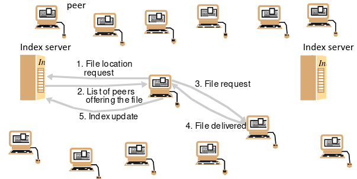
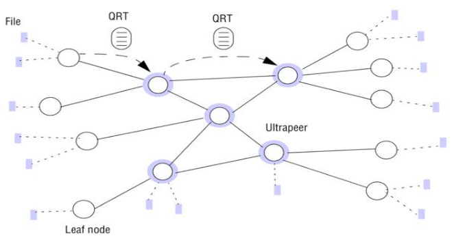
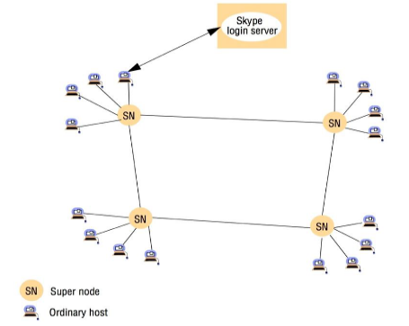

# 12. Overlay Networks and Peer-to-Peer
_21/03/23_

[MoodlePDF](https://moodle.nottingham.ac.uk/pluginfile.php/9422863/mod_page/content/1/15%20Overlay%20networks%20and%20P2P.pdf)

## Overlay Networks
- The internet = generic universal communication service
- Overlay network = virtual network
	- On top of an existing network
- Multiple overlay networks can exist on an existing network

### Types of overlay network
- Tailored to a specific application or service
	- Distributed hash tables
	- Peer-to-peer file sharing
	- Content distribution networks
- Tailored for challenging network environments
	- Wireless ad hoc networks
	- Delay/disruption tolerant networks
- Offering additional network features
	- (Wide area) Multicast, e.g. MBone
	- Resilience
	- Security, e.g. VPNs, TOR

### Overlay routing vs IP routing
| IP                                | Overlay Network                           |
| --------------------------------- | ----------------------------------------- |
| Includes every node               | Includes specific nodes/processes         |
| Uses IP addresses                 | Defines own addresses                     |
| Fixed address assignment to nodes | Addresses may be assigned to objects/data |
| No replication                    | Often replicated                          |
| Stable network topology           | Often volatile network                    |
| Fixed (next hop) routing          | Overlay-defined routing                   |
| Simple local join (DHCP,etc)      | Overlay network specific join             |
| Must trust whole network          | Need not trust whole network              |
| No anonymity for address owners   | Can have anonymity for address owners                                          |

### Overlay networks and p2p
Overlay network is effectively another communication paradigm
- P2P system can be seen as
	- Set of (equivalent) process
	- Communicating via a dedicated application-specific overlay network
- The overlay network provides the communication services needed by the p2p application

## Peer-to-Peer
- Client-server approach - The server(s) are owned and managed by single service provider
- P2P aims to be completely decentralised

### Application
- File sharing
- Teleconferencing
- Multiplayer (LAN) gaming
- P2P middlewear

### Characteristics of P2P systems
- Each user(node) contributes resources
- All nodes have the same functional capabilities and responsibilities
- Correct operation does not depend on any centrally administered system

### Typical P2P Goals
- Global scalability
- Load balancing
- Optimisation for local interactions between neighbouring peers
- Accommodating to highly dynamic host availability 
- Security of data in an environment with heterogeneous trust
- Anonymity, deniability and resistance to censorship

### Overlay networks and P2P
- A p2p system can be seen as
	- Set of equivalent processes
	- Communicating via a dedicated application-specific overlay network

## P2P Examples
- Napster - Centralised indexes of P2P music sharing
- 
- Gnutella - 2nd gen P2P file sharing. Two tier systems where some nodes are elected ultrapeers.
	- Ultrapeers - form the core network. Global IP,  highly inter-connected
	- Leaf - connecting to ultrapeers
- 
- Skype - Hybrid system, centralised servers for log-in/payment
	- Supernodes - Dynamically selected ordinary hosts with suitable network access
	- Ordinary Hosts - After initial login are directed to a super node
- 
- Distributed hash tables (DHT) - Network maintains a set of values (files). Each value associated with a unique key (GUID)
	- Peers can add/remove/get

### P2P Middleware - Pastry
- Provides a flexible P2P facility on which applications can be built
	- Add/remove resources
	- Route requests to resources
	- Join/leave overlay network
- Distributed hash table
- Distributed object location and routing