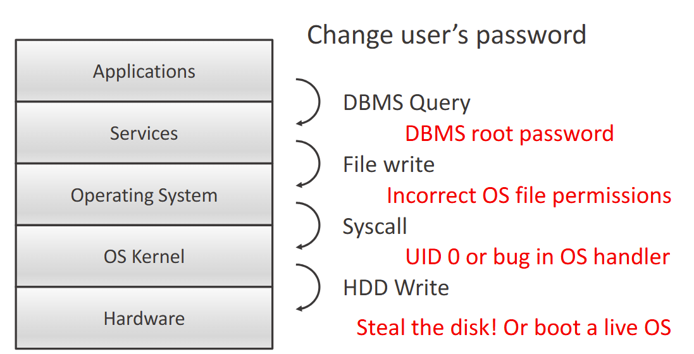

# Foundations

## Defining Security

Security = Protection of assets
Security Policy = Concise document explaining the needs

Computer security is usually defined as three key areas (CIA)
- Confidentiality - Prevention of unauthorised **disclosure** of information
	- Privacy - medical records etc
- Integrity - Prevention of unauthorised **modification** of information
	- Changing database records
- Availability - Prevention of unauthorised **withholding** of information or resource
	- Prevent DoS attacks

Accountability - Users should be held responsible for their actions, audit trails must be kept
Non-repudiation - Provides an un-forgeable evidence that someone did something, mostly a legal concept. Applies to physical security (key cards)

> Security-unaware users have specific security requirements but no security expertise

Trade-offs of computer security come down to the threats and specific situation

## Security Design
- Approach should be systematic, disciplined and well planned 
- From the inception/design of a system
- If added afterwards, could lead to disaster

Good design focuses on 4 principles:

### Focus of Control

- Data - Permitted manipulation of data e.g consistency check
- Operations - Permitted invocations e.g. transfermoney()
- Users - Permissions for specific users
### Complexity vs. Assurance
>Would we prefer a simple approach with high assurance? Or a feature-rich environment?

Feature-rich security systems and high assurance do not match easily e.g Linux vs Windows permissions
### Centralised or Decentralised Controls
> Should defining and enforcing security be performed by a central entity, or be left to individual components in a system

Central Entity - A possible bottleneck
Distributed So9lution - More efficient, but harder to manage
### Layered Security
We can visualise our security model in layers
Each layer protects a boundary, and relies on the security of the layers below

Applications > Services > OS > Kernel > Hardware

#### Attack the layer below:
