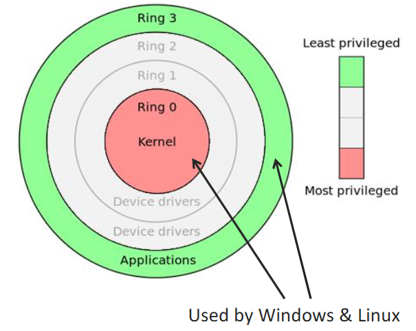

# Reference Monitors

## Reference Monitor
> An access control concept that refers to an abstract machine that mediates all access to objects by subjects

- Must be tamper proof/resistant
- Must always be invoked when access to an object is required
- Must be small enough to be verifiable/subject to analysis to ensure correctness 

Can be placed anywhere within a system - Hardware, OS kernel, OS, service layer

Lower is better - Can assure a higher degree of security, simple structures to implement. Reduced performance overheads. Fewer layer below attack possibilities. However, access control decisions are far removed from applications
## OS Integrity
Arbitrates access requests
Is itself a resource that must be accessed

> Users must not be able to modify the operating systems

Modes of operation - Defines which actions are permitted in which mode e.g. system calls, machine instructions, I/O
Controlled Invocation - Allow us to execute privileged instructions safety, before returning to user code.

### Modes of Operation
- Distinguish between computations done on behalf of:
	- The OS
	- The User
- A status flag within the CPU allows the OS to operate in different mode

### Controlled Invocation
- Many functions are held at kernel level, but are quite reasonably called from within user level code
	- Network and File IO
	- Memory allocation
	- Privileged instructions
- Need a mechanism to transfer between kernel mode (ring 0) and user mode (ring 3)

Interrupts - Called various things. Handled by an interrupt handler which resolves the issue and returns to the original code
Given an interrupt, the CPU will switch execution to the location given in an interrupt descriptor table

### Descriptors and Selectors
- Descriptors hold information on crucial system objects like kernel structure locations
- Descriptors are held in descriptor tables - Contain a Descriptor Privilege Level (DPL)
- Descriptors are indexed by selectors - Loaded when required
- The CPU protects the kernel by checking the Current Privilege Level (CPL) when a selector is loaded

### Interrupt Gates
- The code segment (CS) register in x86 CPUs has 2 bits reserved for the (CPL)
- Descriptors that have a privilege level higher than where they point are called gates
- Since these descriptors are created by the kernel, they offer a secure means of entry into ring 0
## Privilege Elevation
x86 Linux initialises its IDT to handle syscalls at vector 0x80
Modern Kernels - Intel introduced the sysenter and sysexit operations with the Pentium II - much less overhead 
Patching the Kernel - If you can run customer PL 0 code (compromised driver?). you can insert your own handler - Rootkit

### Process and Threads
- A process is a program being executed
- Important unit of control:
	- Exists in its own address space
	- Communicates with other processes via the OS
	- Separation for security
- A Thread is a strand of execution within a process
	- Share a common address space
## Memory Protection
Segmentation - divides data into logical units
- Good for security
- Challenging memory management
- Not used much in modern OSs
Paging - divides memory into pages of equal size
- Efficient memory management
- Less good for access control
- Extremely common in modern OSs

### Page Tables 
- All processes see an individual linear address space
- Page tables map from a linear address space to the physical address space
## Meltdown and Spectre
### Meltdown
- In most OS, the entire kernel is stored in the upper address space
- Pages in this area are flagged as supervisor, and cannot be accessed outside of ring 0
- Meltdown is an exploit that allows us to read this privileged memory
	- Do this using a side-channel
- Attempts to read a value from kernel memory
	- Read from kernel
	- Mask out a single bit
	- Access user memory at that location

### Side-Channels and Cache Timing
Intel CPUs, its common to speculatively evaluate code prior to reaching it
- Conditionals
- Significant speed up
- No harm done! Changes are rolled back
- But, the cache isn't rolled back

### Spectre
Very similar to meltdown
- Speculative evaluation to side-step application bounds check
- Mask out a single bit
- Access suer memory at that location