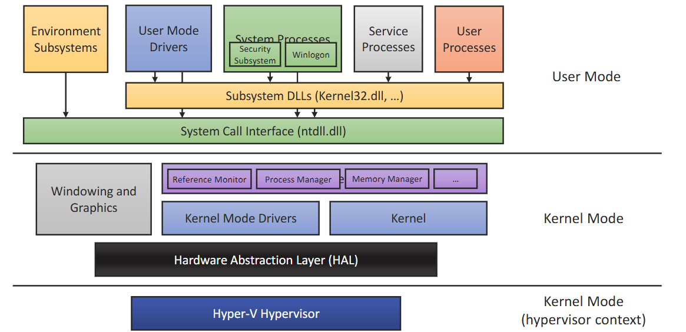

# Windows

## Security Subsystem
- Runs in user mode
- Logon process (winlogon, LogonUI)
- Local security authority (LSA)
	- Checks User Accounts
	- Provides access token
	- Responsible for auditing
- Security Account Manager (SAM)
	- Maintains user account database used by LSA
	- Encrypts/hashes passwords

## Windows 
- Predominantly uses Access Control Lists, and has done since Windows NT 
- Extends the usual read, write and execute with:
	- Take ownership
	- Change permissions
	- Delete
- 32-bit access masks (cf. Unix 9-bit)
- A higher degree of control, with the associated complexity increase!
## Access Control Matrix
Access rights are defined individually for each combination of subject and object
- Quite an abstract concept, but would allow for very fine grained control
- Not practical
Treats more than just files, also; registry keys, active directory objects, groups
Inheritance is implemented - files can inherit ACLs from parent directories

## Local/Domain Principals
- LSA creates a local principals - principal = MACHINE\principal
- Domain principals administered on DC by domain admins

### Groups
- Collection of SIDs
- Can itself be an SID
- Can thus be nested
- Are not nest-able on local machines
- Managed by a domain controller within Active Directory

## Objects
Passive entities in access operations
In windows:
- Executive objects (process, threads, etc.)
- Private objects (files, directories)
Securable objects have a security descriptor
- Built-in securable objects managed by the OS
- Private objects managed by application software

## Access Tokens
- Security credentials for a login session stored in access token
- Identifies the user, the user's groups, and the user's privileges

## Subjects
- Process and threads
- New processes get a copy of the parent access token, possibly modified
- Individual access tokens are immutable, and can live beyond policy changes (TOCTTOU issue)

## User Account Control
- After vista, admin users do not use an administrative access token by default
- Two tokens, one heavily restricted and used by default
- Prompt allows a user to spawn a process with the other token

## Domains
- Single sign-on for network resources
- Centralised security administration
- Domain Controller (DC)
	- Handles user accounts and access control
	- Trusted 3rd party for authentication
- Multiple DCs allow for decentralisation

## Interactive Logon
- Allows users to auth
- Begins with the Secure Attention Sequence - `Crtl` + `Alt` + `Delete`
- Logon process differs slightly for local and domain auth
Logon Process contains:
- Winlogon - process responsible for authenticating users
- Graphical Identification and Authentication (GINA)
- Local Security Authority (LSA)
- An authentication package (NTLM and Kerberos)
- Security Account Manager (SAM)
- Since vista, Credential Providers are allowed