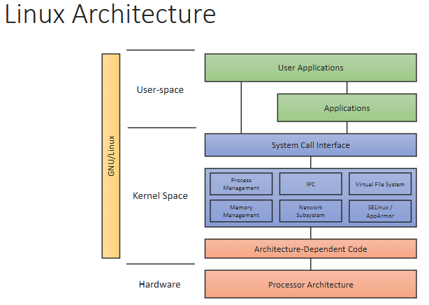
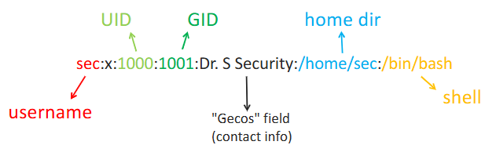

# Unix and Linux

## Authentication
- Lets us verify who we are to a system
- Need a mechanism to enforce access control
- Subject/Principal - an active entity
- Object - resource being accessed
- Access operation
- Reference Monitor - grants or denies access

## Principals vs. Subjects
Principal
> An entity that can be granted access to objects or can make statements affecting access control decisions
- User identity in an OS
- Used when discussing security policies
Subject
> An active entity within an IT system
- Process running under a user identitity
- Used when discussing operational systems and enforcing policies

## Objects
Files or resources - Memory, printers, directories
Two options for focusing control:
- What a subject is allowed to do
- What may be done to an object
Unix
- In Unix, everything is a file
- Files really represent resources
- Organised in a tree structure, with alterations depending on the file system
- Indoes store permissions information
- Every resource has an owner and group

## General Model
`Read` - Simply viewing (confidentiality)
`Write` - Includes changing, appending, deleting (Integrity)
`Execute` - Can run a file without knowing its contents

## Ownership 
**Discretionary** - Owner can be defined for each resource. Owner controls who gets access
**Mandatory** - There could be a system-wide policy. Most OS support the concept of ownership

## Unix
- Simplifies access control by considering only the owner, group and others
	- User is the current owner
	- Group is a named group entity
	- Everyone else
- Unix offers `Read`, `Write` and `Execute` access controls

## Groups
- Users with similar access rights can be collected into groups
- Groups are given permissions to access objects

## UID/GID
- Username in Unix/Linux are soft aliases, your UID is what determines permissions
- Stored in `/etc/passwd`
	- Stores accounts, not just passwords
	- 
- Root has a special UID: 0 

## Shadow File
- Store password hashes in a shadow file, only readable by root users
- Stores the hashed passwords needed to authenticate users

## All things `Root`
- Most powerful user
- UID is 0, actually hardcoded into the linux kernel at multiple points
- Write protect `/etc/passwd` and `/etc/group`
- Separate superuser duties
- Never use root as a normal user
- Audit `su` and `sudo` usage

## Inodes
- Store the metadata for files
- Each file name links to an inode, which stores security information

## Permissions
- Every resource has permission bits - held in the inode metadata
- Permissions for the user/group/others

## Octal
Octal representation (bit-wise, really)
- Bit 3: read (0x4, octal/decimal)
- Bit 2: write (0x2, octal/decimal)
- Bit 1: execute (0x1, octal/decimal)
- Permissions are changed using `chmod`, usually by passing three octal values

## Directories
Directory permissions are slightly different to files:
- `r` - List files within the directory
- `w` - add or remove files
- `x` - traverse directory, open files in the directory

## SUID
- Set UID: set the effective user to be the file owner when executed
- Necessary to allow non-privileged access to privileged actions e.g. password
- Dangerous

## Linux Security Modules
- Since 2.6, Linux provides the ability to hook into security calls
- Adds the ability to perform more complex Mandatory Access Control after standard Unix DAC
- DAC check happens irrespective of whether SM is operational

## SELinux
- Began as a collaboration between the NSA and Redhat - now entirely redhad
- Allows mandatory (centralised) access control, role-based and multi-level security
- Objects are processes have contexts that allow SELinux to make access control decisions
- Defines its own users, which are mapped to the Linux users
- Many users and user process map to `unconfined_u`
	- This means SELinux doesnt apply to them by default
	- But it can, you just need a committed administrator

## AppArmor
- Installed as standard
- Usually used to enforce policies on services and daemons