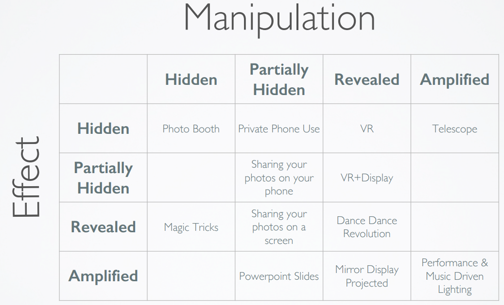
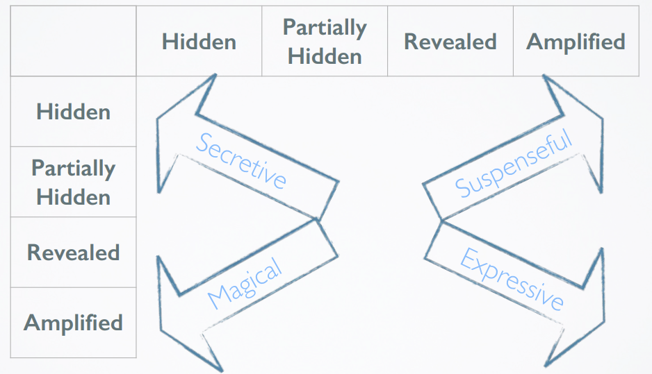

# Same time same place - Using technologies when together

### Device privacy & sharing
- Most people are not happy sharing their phone.
- Main concerns are over messages, accidental deletion, losing it or breaking it

We want a way to show people technology but retain control. What you do is hidden, but what they see is big. 

2 dimensions
1. How the performer interacts with (manipulates) the interface
2. How the spectators see the effect

The model of Performer and Spectators is missing when they interact such as in class voting, t2s

### Summary
- The design of devices to be used is STSP
- Is best thought of as a privacy situation
- Between the user, the technology, and the audience