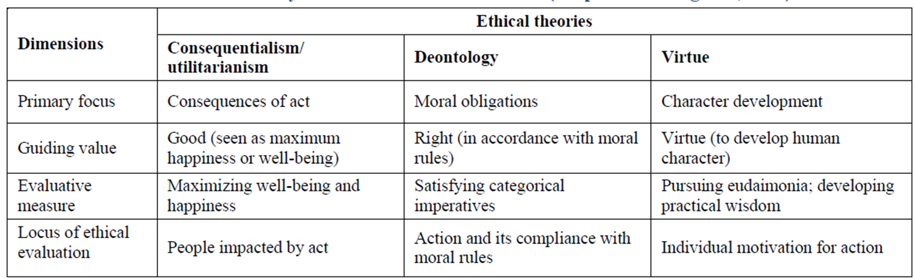
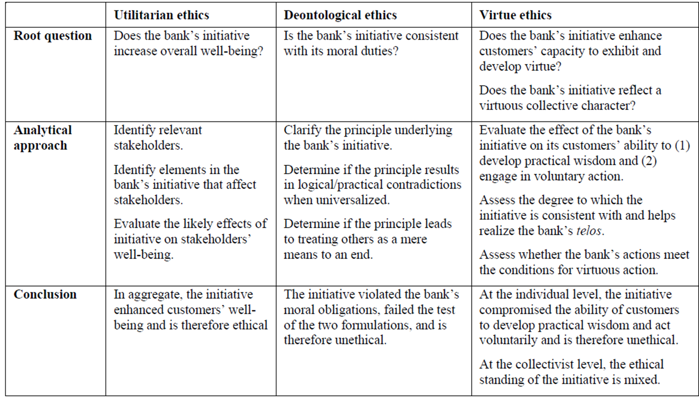

# Application of ethical theories

## Aristotle's Ethics
- Good is that at which all things aims
- The proper function or excellence of a things is its *arete* (virtue)
- The human arete or virtue is activity of the soul in accordance with virtue (over a lifetime)

### Happiness: The Self-sufficient end
- Most of the ends (goals) we seek are instrumental steps towards some ultimate goal.
- Aristotle identifies happiness as that which we seek as a goal that is an end in itself
- Happiness comes from developing a good character
- A good character comes from the development of good habits

### Human Virtue
- It can not be simply living and growing - trees do that as well
- It can not be related to characteristics we share with animals
- The quality that seems distinctively human is the use of reason. 
- Humans can have two kinds of virtue
	- Intellectual Virtues - Relate to our professions
	- Moral Virtues - Common to all humans

### Good Character
- Virtuous thoughts lead to good acts
- Virtuous acts (following the mean) can lead to good habits
- Good habits make for a good character
- A good character can be happy

### Deontology

| Strengths                               | Weaknesses                                      |
| --------------------------------------- | ----------------------------------------------- |
| Clear moral guidelines                  | Rigidity and lack of flexibility                |
| Respect for human dignity               | Lack of attention to context                    |
| Accountability and moral responsibility | Lack of attention to outcomes                   |
| Universalizability and thus consistency | Possible conflicting duties                     |
|                                         | Applicability in global, multicultural contexts |
### Teleology

| Strengths                           | Weaknesses                                          |
| ----------------------------------- | --------------------------------------------------- |
| Focus on practical outcomes         | Difficulties of measuring consequences              |
| Flexibility and adaptability        | Can be justified to harm minorities                 |
| Innovation and progress orientation | Ignores intrinsic rights and duties (human rights)  |
| Promotes collective wellbeing       | Short term versus long term consequences            |
| Decision making under uncertainty   | Definition of wellbeing, utility, pain and pleasure |

### Virtue Ethics

| Strengths                               | Weaknesses                                                   |
| --------------------------------------- | ------------------------------------------------------------ |
| Focus on moral character and integrity  | Lacks specific guidelines                                    |
| Encourages long-term thinking           | Virtues can be interpreted differently in different contexts |
| Promotes human-centric tech development | Focus on individuals, not sociotechnical ecosystems          |
| Adaptable to complex situations         | Can be slow to respond                                       |
|                                         | Difficult to apply to organisations                          |

### Application of ethical theories to cases

### Therac 25
- Machine which killed people by mistake
- Can rectify ethical concerns by: legislation, regulation, professionalism, standards and social pressure