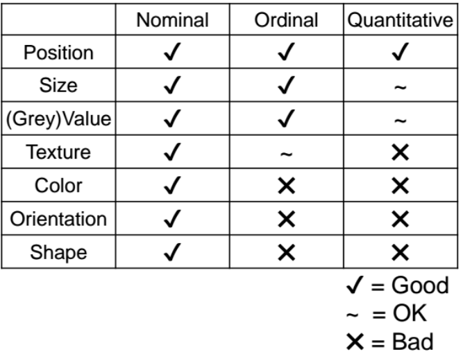

# Data and Image + R Fundamentals

### Key Values of Visualisations
- Record information
- Communicate information to others
- Analyse data to support reasoning

### Data Models
- Formal descriptions
- Characterize data through three components
	- Objects (Item of interest)
		- Students, course, semesters
	- Attributes (properties of data)
		- Name, age, id, data, score
	- Relations (how two or more objects relate)
		- Student takes course, course during semester

**N** - Nominal (labels or Categories)
- Operations $=, \ne$ 
- e.g. maths, art(course)

**O** - Ordered
- Operations  $=, \ne, <, >$ 
- e.g. A, A-, B+, B (Grade)

**Q** - Interval (Location of zero arbitrary)
- Operations  $=, \ne, <, >, -$ 
- Can measure distances or spans
- e.g. (3.23, -1.2) (GPS)

**Q** - Ration (Zero fixed)
- Operations  $=, \ne, <, >, -, \%$ 
- Can measure ratios or portions
- e.g. 20, 19, 22, 21 (age)

### Data Processing
- Data cleaning and filtering
	- For quality control
	- Remove (outlier, missing data)
	- Modify (conversion of format)
- Data adjustment
	- Depends on your task and questions to answer
	- Relational algebra
		- Aggregation, mean, sort, projection
	- Reformatting and Integration

### Data Cleaning and Filtering
- Missing Data - no measurements, redacted
- Erroneous Values - misspelling, outliers
- Type Conversion - zip code to lat-lon
- Entity Resolution - different values for the same thing
- Data Integration - effort/errors when combining data

### Dimensions and Measures
Dimensions (Independent Variables)
- Discrete variables describing data (N,O)
- Categories, data, binned questions
Measures (Dependent Variable)
- Data values that can be aggregated
- Numbers to be analysed
- Aggregate as sum, count, avg, std. dev

### Visual Language
- Is a sign language
- Images perceived as a set of signs
- Sender encodes information in signs
- Receiver decodes information from signs

### Bertins Levels of Organisation

## Data Manipulations
- `dplyr` - A grammar of data visualisation
- Very intuitive, fast, easy for those migrating from SQL
- When written well, code is like a recipe
- Code the way you think

Takes the `%>%` operator and uses it to great effect to manipulate data frames, 5 basic 'verbs' that works with 90% of data
- `filter()`
- `arrange()`
- `select()`
- `mutate()`
- `summarise()`
- 