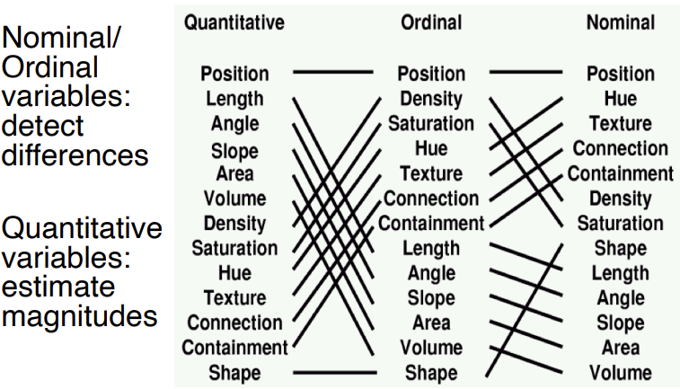

# Design & Graphs + R Advanced

## Design Criteria
### Choosing Visual Encodings
- Assume k visual encodings and n data attributes. Need to pick the best encoding among a combinatorial set of possibilities of size $(n+1)^k$
- Principle of consistency - Properties of the image should match the properties of the data
- Principle of Importance Ordering - Encode the most important information in the most effective way

### Design Criteria to Follow
- **Expressiveness** - Tell the truth
- **Effectiveness** - Use proper encoding

### Mackinlay's Design Algorithm
APT (A Presentation Tool)
- User formally specifies data model and type
- APT searches over design space
- Output the "most effective" visualisation

Limitations:
- Does not cover many visualisation techniques
	- Networks, maps, 3d etc
- Does not consider interaction
- Does not consider semantics/conventions
- Assume single visualisation as output

## Graphs
- 1 - Univariate data
- 2 - Bivariate data
- 3 - Trivariate data
- >3 - Hypervariate data

## Data Processing 
- Need to clear data, and quality 