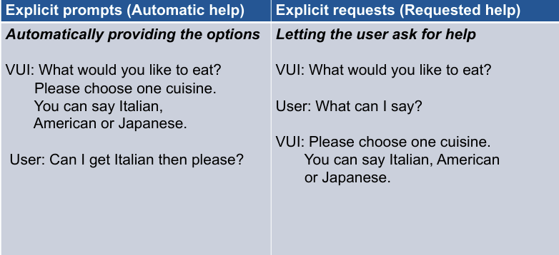

# Discoverability and Response Design

## Initiating Interaction
- Discoverability challenge
	- Difficulty for users to find and execute available functions in a user interface
	- The invisibility and ephemerality of speech exacerbate this challenge with voice interfaces
Discoverability support

Some Takeaways
- Automatic strategy was significantly better than the baseline in all measures
- Performance in the requested strategy varied
- Adopt explicit prompts for new devices, voices or periodically to encourage experimentation
- Ease off to explicit requests after initial use

## Designing the response