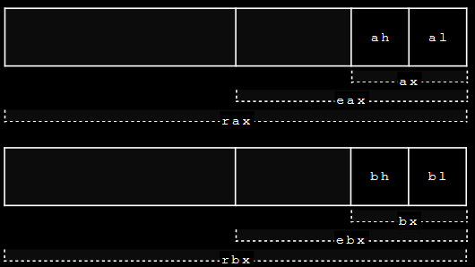
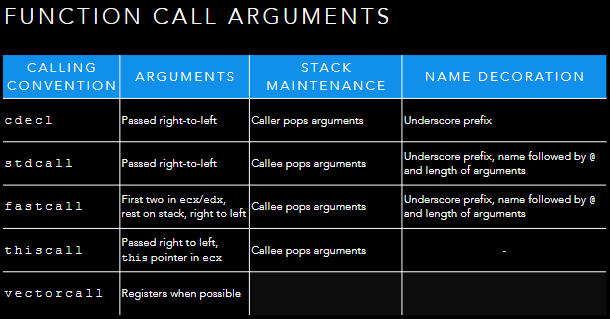

# Introduction to x86
## Introduction
Can look into the assembly and be able to decode the program into what it does. However doesn't work in the real world as x86 adds on a lot more. Various ways to jump to different areas within the program.

SMID make it quick to process images

Basic analysis helps us triage, but to fully understand how it works we need to disassemble it. Reading programs rather than writing them.
Disassembling - Reverse-engineering the malwares code to understand what it does

### Disassembly
- Turning the opcodes back into the assembly language mnemonics. Easier to get a computer doing it
- Need to generate labels so we know where any branches and subroutine calls go to

### Assembly Syntax
Two types of syntax for x86, intel and AT&T.
Usual to use Intel for windows world and AT&T for Unix world. 
Intel has two operands. Instruction then two operand

### Machine Code
Machine code is what the CPU executes and is represented as a series of binary opcodes.
Types of machine code consists of:
- Basic operations - Maths, comparison, Boolean algebra
- Memory access
- Flow control (jumps and branches)
- Subroutines

High level languages have more features, however, the compiler will generate the same set of machine code instructions each time.
## History of x86

Majority of malware written for x86 as most popular
CISC CPU and Little endian

> It is well-know that the x86 instruction set is baroque, overcomplicated, and redundantly redundant.

8080 - First used in a PC, 8-bit data bus version of the 8086. 16-bit CPU
80286 - added protected mode
80386 - 32-bit version
AMD Opteron - 64-bit version
### x86 Memory Model
Segmented Memory - Address accessed built up from the value in a segment register, and the address specified in the instruction
These days, most OS use a flat memory model

### x86 Registers
- Eight 32-bit general purpose registers
- Status Register - EFLAGS
- Instruction Pointer - EIP
- ESP - Stack pointer
- EBP - Base of the stack pointer

`al` = 8bit
`ax` = 16bit
`eax` = 32bit
`rax` = 64bit

### CISC Architecture
- x86 has a register-memory architecture - instructions can operate on a register or directly on memory
- Often more than one way to do things
- Lots of instructions for doing interesting things

### x86 Opcode Structure
- Opcodes can vary in length from 1-15 bytes long
- Difficult to fetch from memory, since length is not known till you are three or four bytes into decoding it
- `eip` points to the first byte of the next instruction, updates as instructions `read`

When storing memory, will do it as LSB
Can do everything using the `move` operand

Instructions can run in memory or on the registers

## Function Calls
- x86 supports calling subroutines
- Does this using the `call` instruction
- Address of next instruction can be specified
	- Relative (to the current instruction)
	- Absolute
	- Indirectly (the address appointed to by...)
- Once the destination address is calculated `call` will then
	- Current instruction pointer (`eip`/`rip`) pushed onto the stack
	- Instruction pointer set to address of start of subroutine
- Can return from a subroutine from the stack
	- Pops the old instruction pointer from the stack
	- Places it into `eip`/`rip` so next instruction carries on after `call`
	- Optionally, can then add an offset to the stack pointer

### The Stack
- `ret` - fetches the return address off the stack
- Stack is also used for local variables and arrays
- If malware can control where `ret` returns to, it can cause a program to do 'something new'
- Often used as a vector for initially executing malware code
- Two mechanisms used
	- Cause the stack to be overwritten with the code we want to execute
	- Return-oriented programming

### Function Call Arguments
- Place arguments on the stack
- Caller and callee need to agree on the arguments passed
- Return values passed in `eax`/`rax`

Most C compilers will compile a function prologue at the start of the program
- Pushed the current value of `ebp`
- Sets `ebp` to the value of `esp`
- Allocate space for local variables on the stack (using `sub`)
- Preserve registers

- At the end of the function, an equivalent epilogue is generated to restore the stack/registers
- Side-effect of this is that `ebp` can be used to trace back up the call stack