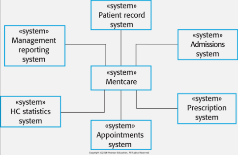
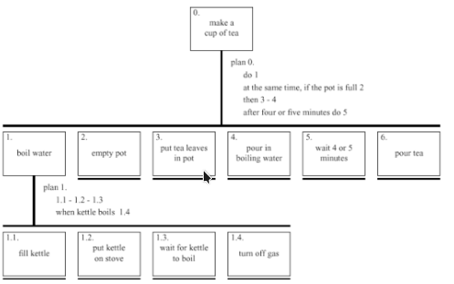

> Work models jhelp you take the next leab in understandning from knowing the **work of individual** stakeholders to understandning the fundamental structure of **work for a whole stakeholder population**
# What are requirement models for?
## Requirements Models
- Synthesising all the requirements you collected into key requiremnts
- You start making diagrams that represent how requirements relate
- Then you have a comprehensive set of intergrated requirements
- Representaiton of how something works
- Different representaiton convey different useful benefits
- Models are selective representations to portray an important aspect

## Most important thing
1. What do you want to show
2. Which diagram or model is best for this

# Context Diagrams
Identify number of systems will have to interact with
Want to show how all these systems inter-relate

- Shows related systems
- Often part of Non-Functional requirements

- Defines the boundaries of the system
- Represent key systems that need to be deployed
- And the relationship to the other systems

# Task Analysis
- For identifying sub tasks
- Still not good for process, nor decision points

# UML Diagrams
- Used to be 3 popular approaches to producing models, 1990 got unified then got UML 2 with 13 different diagrams

5 Key diagram tyoes
- Behaviour Diagrams
	- Use case diagram
	- Activity Diagrams
	- Sequence Diagrams
- Structure Diagrams
	- Class Diagrams
	- State Diagrams

## Activity Diagrams
- Used to elaborate workflows for key activities
- Explains the process, decision points, wait points and parallel points
- Usually to define one Use Case in more detail
- May tie together several use cases for one bigger process

## Sequence Diagrams
- Good for sharing information between people and systems
- Series of messages between key components
- Can be used to specify function calls in java 

## Class Diagrams
- Specify the classes in oops code
- A lot like a Entity relationship diagram, done well, more like a specification 

## State Diagrams
- All the states that something can be in
- And what actions can change it

# Scenarios
- Must define a setting or context
- Must define one or more actors or users
- Must define goals or objectives 
- Must describe a plot
	- Describes how a user, in a context, achieves a goal
- Written text descriptions
